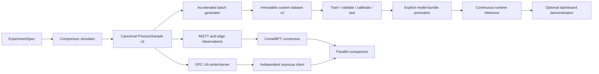

# Evidência Reprodutível para o Fingerprint Físico-Operacional: Pesquisa Técnica Abrangente

**Date:** 2026-07-29
**Author:** Emilio
**Research Type:** technical

---

## Research Overview

Esta pesquisa auditou o protótipo em execução, seus contratos, datasets,
artefatos de treinamento, integração SCADA/OPC UA e documentação acadêmica.
Também confrontou as decisões locais com fontes oficiais dos datasets, padrões
OPC UA, documentação das bibliotecas usadas e referências de segurança OT. O
objetivo final não é ampliar indiscriminadamente o protótipo, mas construir uma
cadeia de evidência pequena, gratuita, reproduzível e defensável.

A conclusão é concentrar a evidência físico-operacional no custom dataset v2 e
no HAI 20.07; implementar um cliente OPC UA realmente independente; preservar
ADFA-LD e LID-DS como trilha auxiliar HIDS; e executar pelo menos um cenário
oficial real do LID-DS 2021, sem tratar fixtures como resultado. A síntese
executiva abaixo resume a decisão; as seções seguintes documentam stack,
integração, arquitetura, implementação, riscos e gates.

---

## Executive Summary

O protótipo já demonstra uma cadeia funcional de simulação, consenso,
persistência e classificação, mas a evidência acadêmica precisa separar três
coisas que hoje aparecem próximas demais: a variável física gerada, a leitura
SCADA/OPC independente e a decisão do modelo. A correção central é construir um
custom dataset v2 com ground truth controlado, split sem leakage, scaler e
threshold independentes, e depois provar que um cliente OPC UA externo leu uma
fonte que não foi projetada a partir do próprio consenso.

HAI 20.07 foi selecionado como o único novo benchmark industrial: possui dados
temporais públicos de um testbed ICS/HIL, variáveis físicas correlacionadas e
download direto. SWaT e WADI permanecem fora do escopo por custo operacional de
acesso/licença para este projeto. ADFA-LD e LID-DS não validam o fingerprint
físico; eles permanecem como benchmarks HIDS de syscalls. No LID, a ausência era
local, não pública: o repositório dos autores oferece LID-DS 2021, e o plano
agora exige executar um subconjunto oficial real, inicialmente
`CVE-2017-7529`, com hashes e proveniência
([HAI oficial](https://github.com/icsdataset/hai),
[LID-DS oficial](https://github.com/LID-DS/LID-DS)).

**Principais decisões técnicas**

- preservar o caminho v1 por flags e golden tests;
- gerar custom v2 em batch acelerado usando o mesmo núcleo determinístico do
  live;
- separar treino, validação, calibração, teste normal e teste anômalo;
- separar OPC UA Server e Client e validar `StatusCode` e timestamps;
- adotar HAI 20.07, sem compartilhar modelo ou threshold com o custom;
- executar LID oficial real e reclassificar fixtures como teste;
- comparar protocolos e métricas dentro de cada domínio, sem ranking global de
  losses ou scores incompatíveis;
- deixar o dashboard como demonstração posterior aos resultados.

**Recomendação estratégica**

O caminho acadêmico crítico é:

```text
baseline
  -> custom dataset v2
  -> fingerprint calibrado
  -> OPC UA independente
  -> HAI 20.07
  -> LID official-scenario subset
  -> tabela e índice de evidências
```

O dashboard não é gate de validade científica. Ele apenas apresenta um bundle
já promovido e uma anomalia controlada cujos dados, parâmetros e resultados
foram previamente persistidos.

## Table of Contents

1. [Technical Research Scope Confirmation](#technical-research-scope-confirmation)
2. [Technology Stack Analysis](#technology-stack-analysis)
3. [Integration Patterns Analysis](#integration-patterns-analysis)
4. [Architectural Patterns and Design](#architectural-patterns-and-design)
5. [Implementation Approaches and Technology Adoption](#implementation-approaches-and-technology-adoption)
6. [Technical Research Recommendations](#technical-research-recommendations)
7. [Research Synthesis and Strategic Conclusions](#research-synthesis-and-strategic-conclusions)
8. [Technical Research Conclusion](#technical-research-conclusion)

## Technical Research Scope Confirmation

**Research Topic:** SWaT, WADI, HAI 1.0, and ICS dataset integration for the
parallel-truth fingerprint prototype

**Research Goals:** Select the two easiest public datasets to implement that
best match the physical-operational data already generated by the prototype,
using local papers and verified public sources.

**Technical Research Scope:**

- Architecture Analysis - design patterns, frameworks, system architecture
- Implementation Approaches - development methodologies, coding patterns
- Technology Stack - languages, frameworks, tools, platforms
- Integration Patterns - APIs, protocols, interoperability
- Performance Considerations - scalability, optimization, patterns

**Research Methodology:**

- Current web data with rigorous source verification
- Multi-source validation for critical technical claims
- Confidence level framework for uncertain information
- Comprehensive technical coverage with architecture-specific insights

**Scope Confirmed:** 2026-07-29

## Technology Stack Analysis

Esta etapa avalia a pilha tecnológica necessária, sem selecionar ainda os dois
datasets finais. A análise cruzou os quatro papers locais com páginas oficiais
dos mantenedores, repositórios primários e documentação oficial das bibliotecas.

**Cobertura da pesquisa:** linguagem e ML, ingestão e normalização, formatos de
armazenamento, ferramentas de desenvolvimento, execução local e restrições de
distribuição. A confiança é alta para a pilha existente e para SWaT, HAI 20.07 e
Morris--Gao. Para WADI, a frequência deve ser confirmada nos timestamps do
pacote efetivamente recebido, pois a página oficial atual não a declara.

### Programming Languages

**Python deve permanecer como linguagem principal.** O projeto já requer Python
`>=3.14` e usa NumPy, `asyncua`, MinIO, Keras 3 e PyTorch
([`pyproject.toml`](../../../pyproject.toml), linhas 4--9). O contrato
`BenchmarkAdapter` já converte cada benchmark para sequências numéricas
multivariadas com rótulos e proveniência
([`benchmarks/base.py`](../../../src/parallel_truth_fingerprint/lstm_service/offline_training/benchmarks/base.py),
linhas 9--40). Isso reduz o trabalho dos novos datasets a ingestão,
normalização temporal e formação de janelas.

**Go deve permanecer restrito ao consenso/ABCI.** Não há benefício técnico em
levar parsing ou treinamento de datasets para Go. Da mesma forma, Java/WEKA só
seria justificável para reproduzir o experimento histórico da coleção
Morris--Gao; não deve se tornar dependência do pipeline principal.

**Desempenho e escala.** O contrato atual materializa todo o dataset como
`tuple`, o que é inadequado para arquivos com centenas de milhares ou milhões de
linhas. A ingestão deverá ser vetorizada e feita em blocos, com `float32` na
camada de tensores. A documentação do pandas recomenda seleção de colunas,
tipos menores e processamento em chunks para dados maiores que a memória
([pandas: scaling to large datasets](https://pandas.pydata.org/docs/user_guide/scale.html)).

_Linguagem dominante:_ Python.

_Linguagens auxiliares:_ Go apenas na fronteira CometBFT; Java/WEKA apenas para
reprodução opcional do benchmark Morris--Gao.

_Evolução recomendada:_ ampliar a camada offline em Python, sem criar uma nova
pilha de execução.

_Características de desempenho:_ leitura em chunks, seleção explícita de
colunas, arrays NumPy `float32` e ausência de cópias integrais desnecessárias.

_Fontes:_ [documentação do módulo CSV do Python](https://docs.python.org/3/library/csv.html),
[documentação `pandas.read_csv`](https://pandas.pydata.org/docs/reference/api/pandas.read_csv.html).

### Development Frameworks and Libraries

**Núcleo a preservar:**

- NumPy para arrays, janelas e artefatos NPZ;
- Keras 3 com backend PyTorch para LSTM/GRU e autoencoders;
- `asyncua` para servidor e cliente OPC UA;
- SDK MinIO para objetos, manifests e modelos;
- biblioteca padrão e a suíte `unittest` já existente.

Keras 3 aceita arrays NumPy e DataFrames e oferece a mesma API sobre o backend
PyTorch, portanto não é necessário migrar o modelo para outro framework
([Keras 3](https://keras.io/keras_3/)). O `asyncua` já oferece cliente, servidor,
sessões, leitura, escrita e subscriptions assíncronas; a tecnologia necessária
para o round-trip OPC UA já está presente
([FreeOpcUa/opcua-asyncio](https://github.com/FreeOpcUa/opcua-asyncio)).

**Extensão offline comum proposta:** um extra de dependências isolado para
`pandas` e `pyarrow`. Pandas simplifica timestamps, tipos, valores ausentes e
leitura em chunks; PyArrow fornece a camada Parquet tipada e comprimida. Essas
dependências não devem ser impostas ao runtime mínimo.

**Extensões condicionais:**

- `scipy.io.arff` ou `liac-arff`, além de encoding categórico, apenas se a
  coleção Morris--Gao for selecionada;
- `openpyxl` apenas se a versão de SWaT efetivamente recebida vier em XLSX;
- scikit-learn é útil para `ColumnTransformer`, encoding e scalers, mas não é
  obrigatório para os datasets puramente numéricos; média, desvio e parâmetros
  persistidos podem continuar sob controle do próprio projeto em NumPy;
- a implementação oficial eTaPR pode ser incorporada como ferramenta de
  avaliação para HAI, depois de revisão de licença e contrato
  ([eTaPR oficial](https://github.com/wshw4ng/eTaPR)).

**Compatibilidade tecnológica dos candidatos:**

| Candidato | Forma primária verificada | Impacto na pilha |
|---|---|---|
| SWaT | Historian e tráfego de rede; 51 sensores/atuadores; série de processo a 1 Hz; CSV no paper original | Adaptador tabular direto. Historian e rede devem permanecer modalidades distintas. A versão do pacote deve ser fixada. |
| WADI | Dois CSVs oficiais atualizados; 123 sensores/atuadores; 14 dias normais e 2 com 15 ataques | Adaptador tabular direto, mas frequência, lacunas e colunas devem ser validadas no pacote recebido. |
| HAI 20.07 | Quatro arquivos `CSV.gz`; 59 pontos SCADA a cada segundo; quatro campos de label; 38 ataques | Adaptador tabular direto e download automatizável. Tem pressão, temperatura e rotação semanticamente próximas do protótipo. |
| Morris--Gao ICS | Quatro ARFFs derivados de dois testbeds; cada linha é uma transação Modbus consulta--resposta, sem cadência física uniforme | Exige parser ARFF, encoding categórico e uma definição de janela por evento; não entra diretamente como série SCADA regular. |

Os fatos de SWaT e WADI são sustentados pelas páginas oficiais
[SWaT.A1](https://www.sutd.edu.sg/itrust/itrust-labs/datasets/dataset-characteristics/swat/)
e
[WaDi.A1/A2](https://www.sutd.edu.sg/itrust/itrust-labs/datasets/dataset-characteristics/wadi/).
O repositório oficial HAI declara CSVs contínuos, HAI 20.07 como correção do
HAI 1.0 e download direto
([HAI](https://github.com/icsdataset/hai),
[arquivos HAI 20.07](https://github.com/icsdataset/hai/tree/master/hai-20.07)).
O paper Morris--Gao confirma quatro datasets com tráfego, controle e medições de
28 ataques contra dois sistemas Modbus
([Springer/DOI](https://link.springer.com/chapter/10.1007/978-3-662-45355-1_5)).

_Frameworks principais:_ NumPy + Keras 3/PyTorch + `asyncua` + MinIO.

_Bibliotecas especializadas:_ pandas/PyArrow como extra offline; ARFF e
encoding somente se exigidos pelo dataset escolhido.

_Tendência de evolução:_ adaptadores específicos convergindo para um contrato
temporal comum, sem forçar um schema físico universal.

_Maturidade do ecossistema:_ alta para CSV, Parquet, NumPy e redes recorrentes;
o risco está no contrato científico e no versionamento, não na disponibilidade
de bibliotecas.

_Fontes:_ [Keras 3](https://keras.io/keras_3/),
[Apache Parquet](https://parquet.apache.org/),
[opcua-asyncio](https://github.com/FreeOpcUa/opcua-asyncio).

### Database and Storage Technologies

**Arquitetura de dados recomendada em três camadas:**

1. arquivo bruto imutável, exatamente como recebido;
2. tabela temporal canônica em Parquet;
3. tensor derivado em NPZ, acompanhado por manifest JSON.

Parquet é colunar, tipado e voltado a armazenamento e leitura eficientes
([Apache Parquet](https://parquet.apache.org/)); pandas permite gravação
com compressão e backends PyArrow/Fastparquet
([`DataFrame.to_parquet`](https://pandas.pydata.org/docs/reference/api/pandas.DataFrame.to_parquet.html)).
NPZ continua apropriado para o tensor consumido por NumPy/Keras e já é usado
pelo projeto. A documentação NumPy confirma que NPZ preserva múltiplos arrays,
shape e dtype
([NumPy I/O](https://numpy.org/doc/stable/user/absolute_beginners.html#how-to-save-and-load-numpy-objects)).

O manifest versionado deve registrar, no mínimo:

- dataset, versão, origem, citação, licença/termos e hashes dos arquivos;
- nomes, ordem, tipos, unidades e grupos semânticos das features;
- timestamp, cadência observada e IDs de execução/cenário;
- labels de timestep e janela;
- política de janela, stride e agregação do label;
- split temporal/por grupo;
- scaler/preprocessing e partição usada para ajustá-lo;
- ausências, duplicatas, lacunas, descartes e alertas de qualidade.

O tensor derivado deve suportar `X [N,T,F]`, `y_window`, `y_timestep`
opcional, máscara de ausência, `window_id`, `group_id`, início e fim. Não se
deve obrigar SWaT, WADI, HAI, Morris--Gao e o dataset customizado a compartilhar
as mesmas features; o envelope é comum, os schemas físicos são específicos.

**MinIO deve continuar como registro de evidências**, com o filesystem local
como implementação de testes. O `compose.local.yml` atual usa
`minio/minio:latest` e não monta `/data`
([`compose.local.yml`](../../../compose.local.yml), linhas 11--21). Para
reprodutibilidade acadêmica, o planejamento posterior deve fixar a imagem,
adicionar volume persistente e healthcheck. A documentação MinIO mostra que o
volume ligado a `/data` é o mecanismo que preserva os objetos entre reinícios
([MinIO em container](https://min.io/docs/minio/container/index.html)).

**Tecnologias não necessárias neste escopo:** banco relacional, banco NoSQL,
Redis/cache em memória e data warehouse. O volume, a consulta e o uso offline
não justificam uma nova base operacional; MinIO + Parquet + JSON + NPZ cobrem
proveniência, inspeção e treinamento.

_Banco relacional:_ não recomendado.

_NoSQL:_ não recomendado; MinIO é object storage, não banco de documentos.

_In-memory database:_ não necessária; usar memória apenas por chunk/lote.

_Data warehouse:_ não necessário para um protótipo acadêmico local.

_Fontes:_ [Apache Parquet](https://parquet.apache.org/),
[pandas e datasets maiores](https://pandas.pydata.org/docs/user_guide/scale.html),
[MinIO container deployment](https://min.io/docs/minio/container/index.html).

### Development Tools and Platforms

O repositório já possui `uv.lock`, testes unitários, smoke tests reais
opt-in, Docker Compose, MinIO, MQTT e CometBFT. Essa base deve ser preservada.
Não há necessidade de migrar a suíte para outro framework; os novos adapters
devem fornecer fixtures pequenas e redistribuíveis e testes de contrato para:

- detecção inequívoca de versão/schema;
- parsing de timestamp, labels, contínuas e discretas;
- frequência, monotonicidade, duplicatas e lacunas;
- fronteiras de arquivo, run e cenário;
- split temporal sem janelas sobrepostas entre partições;
- scaler ajustado apenas no treino e serialização exata;
- hashes e proveniência reproduzíveis;
- consumo em chunks sem materialização integral.

Os datasets SWaT e WADI são gratuitos mediante formulário institucional, podem
levar até três dias úteis para liberação e não podem ser compartilhados
([formulário oficial](https://www.sutd.edu.sg/itrust/request-for-datasets/),
[termos oficiais](https://www.sutd.edu.sg/itrust/itrust-labs/datasets/terms-of-usage/)).
Logo, seus dados brutos não podem entrar no Git, imagem Docker ou CI pública.
Os testes devem usar fixtures sintéticas que reproduzam apenas o schema.

HAI é baixável pelo GitHub, mas há divergência entre `CC BY-SA 4.0` no texto do
README e `CC BY 4.0` no bloco de metadados. A licença aplicável aos derivados
deve ser confirmada antes de redistribuí-los. A coleção Morris--Gao também não
expõe licença clara na página oficial.

_IDE/editor:_ indiferente; nenhuma ferramenta específica é requisito.

_Versionamento:_ Git para código e manifests; hashes de conteúdo para dados.

_Build e ambiente:_ manter `uv.lock` como lock da pilha Python.

_Testes:_ manter `unittest` e smoke/integration gates separados; usar fixtures
sintéticas para fontes restritas.

_Fontes:_ [pytest/unittest interoperability e práticas de teste](https://docs.pytest.org/en/stable/),
[SUTD dataset terms](https://www.sutd.edu.sg/itrust/itrust-labs/datasets/terms-of-usage/).

### Cloud Infrastructure and Deployment

O alvo permanece **local/offline e reproduzível**. Docker Compose já define
serviços locais e é suficiente para organizar MQTT, MinIO, consenso e, no
planejamento futuro, processos OPC UA separados. A documentação Docker define
Compose como ferramenta para serviços, redes e volumes em um único YAML
([Docker Compose](https://docs.docker.com/compose/)).

Para o round-trip OPC UA, `asyncua` deve ser mantido, mas o runtime precisa
atravessar uma sessão de cliente real até um servidor em processo/serviço
separado. Hoje existe um servidor `asyncua`, porém o fluxo oficial atual chama
`update_from_consensused_state` em memória e não lê o endpoint; portanto,
possuir a biblioteca não constitui integração OPC UA.

**Não são necessários:** AWS, Azure, GCP, Kubernetes, serverless, CDN ou edge
deployment. Introduzi-los aumentaria o custo operacional sem fortalecer a prova
acadêmica. A única mudança de plataforma necessária é tornar o ambiente local
persistente, fixado por versão e verificável por healthchecks.

_Cloud providers:_ nenhum requerido.

_Containers:_ Docker Compose local, com imagens fixadas e volumes persistentes.

_Serverless:_ não aplicável.

_CDN/edge:_ não aplicável.

_Fontes:_ [Docker Compose](https://docs.docker.com/compose/),
[MinIO Docker/Podman](https://min.io/docs/minio/container/index.html),
[asyncua client/server](https://github.com/FreeOpcUa/opcua-asyncio).

### Technology Adoption Trends

A direção técnica dominante para este projeto deve ser **adapter específico +
envelope canônico + avaliação temporal**:

- preservar os arquivos brutos e a versão exata;
- converter cada fonte para uma tabela temporal canônica;
- manter modalidades físicas e de rede separadas;
- formar janelas somente depois do split temporal/por execução;
- ajustar scaler apenas no treino e persistir seus parâmetros;
- congelar schema, scaler, modelo e threshold por execução;
- avaliar ataques como eventos, além das métricas por ponto;
- registrar contribuição por feature/sensor para sustentar a interpretação do
  fingerprint;
- reutilizar o mesmo envelope para o dataset customizado, sem alegar que
  schemas de equipamentos diferentes são equivalentes.

No caso HAI, os mantenedores recomendam métrica temporal eTaPR
([repositório HAI](https://github.com/icsdataset/hai)). No caso Morris--Gao,
os próprios mantenedores alertam que padrões acidentais permitem classificação
irrealisticamente fácil
([coleção oficial](https://sites.google.com/a/uah.edu/tommy-morris-uah/ics-data-sets)).
Assim, acurácia alta isolada não pode ser tratada como evidência científica.

**Implicação provisória, sem seleção final:** SWaT, WADI e HAI encaixam-se
naturalmente no caminho de telemetria multivariada; Morris--Gao pertence
principalmente à trilha de IDS por protocolo e requer uma representação
temporal adicional. A proximidade semântica de pressão/compressor em
Morris--Gao não elimina essa diferença de modalidade.

_Padrão de migração:_ estender o contrato offline atual; não reescrever o
runtime nem trocar de linguagem/framework.

_Tecnologias emergentes relevantes:_ métricas orientadas a evento,
explainability por sensor e contratos de proveniência reproduzíveis.

_Legado a evitar:_ split aleatório de janelas temporais, scaler ajustado no
dataset inteiro, imagens `latest`, dados sem versão e métricas sem contexto.

_Tendência da comunidade:_ benchmarks industriais multivariados e avaliação
temporal com artefatos reproduzíveis, não apenas classificação por linha.

_Fontes:_ [HAI/eTaPR](https://github.com/icsdataset/hai),
[SWaT paper](https://link.springer.com/chapter/10.1007/978-3-319-71368-7_8),
[Morris--Gao paper](https://link.springer.com/chapter/10.1007/978-3-662-45355-1_5).

### Cross-Technology Assessment and Research Gaps

**Conclusão desta etapa:** a pilha existente é suficiente como núcleo. As
adições justificadas são pandas/PyArrow como extra offline, persistência
MinIO real e um contrato temporal mais rico. Parser ARFF, encoding categórico
e Java/WEKA só devem entrar se Morris--Gao for escolhido.

**Gaps ainda abertos para as próximas etapas:**

- os arquivos brutos SWaT/WADI ainda não estão no repositório e dependem de
  solicitação institucional;
- a versão exata e a cadência de WADI devem ser validadas no pacote recebido;
- a licença HAI precisa ser reconciliada antes de redistribuição;
- os links oficiais Morris--Gao estão instáveis, não declaram licença clara e
  os dados têm vieses oficialmente documentados;
- o desenho de APIs, schemas, splits, métricas e gates será definido nas etapas
  seguintes, depois de aprovação desta análise tecnológica.

Nenhum dataset foi selecionado nesta etapa e nenhuma implementação foi
autorizada.

### Decision Constraints Confirmed After Technology Stack Analysis

Em 2026-07-29, o pesquisador confirmou as seguintes restrições eliminatórias
para a futura seleção:

- custo financeiro zero;
- nenhuma espera por aprovação ou liberação de licença/acesso;
- nenhuma dependência de negociação institucional para iniciar os testes;
- preservação integral do comportamento que já funciona no projeto;
- evolução por adapters e caminhos opt-in, sem regressão do runtime atual;
- preferência preliminar por HAI, por possuir download público direto.

Consequentemente, facilidade técnica isolada não basta: disponibilidade
imediata e termos de uso verificáveis passam a fazer parte do gate de seleção.
SWaT e WADI não poderão compor a primeira implementação se dependerem do fluxo
de solicitação institucional vigente. A situação de licença e redistribuição de
qualquer candidato deverá ser registrada, mas a pesquisa pode utilizar dados
publicamente baixáveis sem esperar autorização individual.

## Integration Patterns Analysis

Esta etapa define como conectar OPC UA, datasets industriais, MinIO, treinamento
e dashboard sem substituir os caminhos que já funcionam. Ela ainda **não
seleciona os dois datasets finais**.

A auditoria do runtime confirmou a lacuna central:
`FakeOpcUaScadaService` declara que consome o estado consensuado
([`opcua_service.py`](../../../src/parallel_truth_fingerprint/scada/opcua_service.py),
linhas 40--48), `run_local_demo.py` chama
`update_from_consensused_state(...)` e entrega o resultado diretamente à
comparação
([`run_local_demo.py`](../../../scripts/run_local_demo.py), linhas 747--762).
Embora exista um servidor `asyncua`, o caminho ativo não inicia uma sessão de
cliente nem consulta o endpoint. A correção precisa criar uma fronteira remota
real e uma origem SCADA anterior ao consenso.

### API Design Patterns

**Padrão recomendado: ports and adapters, sem nova API HTTP interna.** A lógica
de comparação deve depender de contratos Python pequenos, não diretamente de
`asyncua`:

- `PlantSnapshotPublisher`: publica no ramo SCADA um snapshot originado pelo
  simulador antes do consenso;
- `ScadaSnapshotReader`: consulta um snapshot remoto, com identidade, valores,
  qualidade, timestamps, latência e diagnóstico;
- `ScadaSnapshotRead`: resultado tipado aceito pela comparação somente quando
  completo, atual e coerente;
- implementação `OpcUaScadaSnapshotClient` para o modo de evidência e adapter
  em memória somente para testes/compatibilidade explícita.

O wrapper síncrono de `asyncua` é o encaixe menos invasivo para o runtime atual,
que é síncrono. A biblioteca oferece cliente, servidor, sessão, leitura,
escrita, subscriptions e segurança
([opcua-asyncio](https://github.com/FreeOpcUa/opcua-asyncio/tree/v1.1.8)).
Sua API também permite ler vários atributos em uma chamada e retornar
`DataValue`, não apenas escalares
([asyncua Client API](https://opcua-asyncio.readthedocs.io/en/latest/api/asyncua.client.html)).

**Compatibilidade obrigatória:** o modo legado permanece disponível por
configuração e continua exercitado por testes. O modo OPC UA de evidência não
pode fazer fallback automático para a projeção em memória; uma falha remota
deve aparecer como indisponibilidade, nunca como `match`.

Para os datasets, o contrato existente deve ser preservado. `BenchmarkAdapter`
já exige carga determinística, tensor `N,T,F`, labels e proveniência e proíbe
escrita ou rede implícita
([`benchmarks/base.py`](../../../src/parallel_truth_fingerprint/lstm_service/offline_training/benchmarks/base.py),
linhas 9--40). O padrão aditivo recomendado é:

1. aquisição explícita por CLI ou caminho local informado pelo pesquisador;
2. inspeção, validação de versão/schema e hash;
3. canonicalização e publicação de manifest;
4. formação de janelas com split temporal/por execução;
5. adapter já existente carregando o artefato validado para o treinamento.

O download não deve ocorrer dentro de `load()`. HAI 20.07 pode ser obtido
diretamente do repositório público, sem pedido individual
([HAI repository](https://github.com/icsdataset/hai/tree/master/hai-20.07)).
Para uma execução reproduzível, a aquisição deve fixar o repositório no commit
`2a814cebc9a66b06c9e5cd545e2d72e65d383737`, registrar os Git blob SHAs e
calcular SHA-256 local dos quatro arquivos; `master` não é uma versão de
evidência
([HAI pinned repository state](https://github.com/icsdataset/hai/commit/2a814cebc9a66b06c9e5cd545e2d72e65d383737)).
SWaT e WADI continuam dependendo do fluxo institucional vigente e, portanto,
não satisfazem o requisito de início imediato
([SUTD request form](https://www.sutd.edu.sg/itrust/request-for-datasets/)).

Como o runner legado sempre cria seu próprio split, o caminho industrial deve
adicionar um resultado particionado, por exemplo `PartitionedBenchmarkData`,
com `train/validation/test` explícitos. Um dispatcher mantém `BenchmarkData` e
o split atual exatamente como estão para ADFA-LD, LID-DS e dummy, usando o novo
contrato apenas para adapters industriais. Isso evita quebrar resultados já
reproduzíveis.

**APIs descartadas:** GraphQL, gRPC e uma nova API REST entre os componentes não
resolvem nenhuma lacuna desta arquitetura. O REST local existente do dashboard
pode receber campos aditivos de status e evidência, mas não deve transportar
arquivos brutos ou tensores.

### Communication Protocols

O fluxo online recomendado separa duas observações do mesmo fenômeno simulado:

```text
                         +-> edges -> MQTT -> CometBFT -> valid state ----+
PlantSnapshot -----------+                                                +-> comparison
                         +-> OPC UA writer -> OPC UA server -> UA client -+
```

O `PlantSnapshot` nasce antes da aquisição dos edges e antes do consenso. O
ramo SCADA pode observar a mesma planta simulada, porém jamais pode receber
`ConsensusedValidState` ou `EdgeLocalReplicatedState` como fonte. Depois do
consenso, a persistência registra a relação
`consensus_round_id <-> scada_snapshot_id`; não se deve inventar um
`round_id` antes de a rodada existir.

**OPC UA Binary sobre TCP** será o protocolo do round-trip de laboratório. O
servidor deve rodar em outro processo/container, o produtor deve escrever via
cliente OPC UA e o runtime deve ler via uma sessão cliente separada. Isso
exercita socket, canal, sessão, address space e serviço `Read`, em vez de apenas
referências Python em memória.

O address space deve usar NodeIds string estáveis e resolver o índice do
namespace pela URI em cada conexão. Deve publicar, no mínimo:

- `schema_version`;
- `snapshot_id`;
- `snapshot_revision`;
- `source_timestamp`;
- `producer_id`;
- `scenario_mode`;
- `temperature`, `pressure` e `rpm`;
- variáveis comportamentais somente quando realmente originadas antes do
  consenso e com schema explícito.

Uma leitura multi-node reduz round-trips, mas não constitui transação de
domínio. Para impedir snapshot parcialmente atualizado, usar um guard de
revisão:

1. ler `snapshot_revision` A;
2. ler todos os nós como `DataValue` em uma chamada agrupada;
3. ler `snapshot_revision` B;
4. aceitar somente quando A e B forem iguais, representarem estado concluído e
   o `snapshot_id` corresponder ao ciclo esperado.

A OPC Foundation define o serviço `Read` para um ou mais atributos/nós
([OPC UA Read Service](https://reference.opcfoundation.org/specs/OPC-10000-4/5.11));
a API `asyncua.read_attributes(...)` retorna uma lista de `DataValue`
([asyncua Client API](https://opcua-asyncio.readthedocs.io/en/latest/api/asyncua.client.html)).

**MQTT permanece inalterado** como transporte publish/subscribe das observações
online dos edges. O padrão suporta desacoplamento e três níveis de QoS
([MQTT 5.0](https://docs.oasis-open.org/mqtt/mqtt/v5.0/mqtt-v5.0.html)).
Não há justificativa para publicar linhas de CSV, ARFF, Parquet ou NPZ no
broker. Se no futuro o QoS for elevado para `at least once`, os eventos
precisarão de identidade e deduplicação; isso não é requisito para integrar os
datasets nesta mudança.

**CometBFT permanece restrito às rodadas operacionais.** Dataset público,
manifest, treinamento e modelo não devem entrar no consenso. MinIO recebe os
objetos bulk e JSON de evidência; o dashboard apenas consulta os resumos já
persistidos.

**Subscriptions OPC UA são opcionais.** Como o ciclo é de 30 segundos, uma
leitura agrupada explícita por ciclo produz evidência de consulta mais simples.
Uma subscription pode monitorar revisão/saúde no futuro, sem substituir o
`Read` correlacionado.

### Data Formats and Standards

OPC UA `DataValue` precisa ser preservado até o gate de qualidade. Ele contém
valor, `StatusCode`, `SourceTimestamp` e `ServerTimestamp`. A especificação
exige que o cliente verifique ao menos a severidade antes de usar o valor:
`Good` indica boa qualidade, `Uncertain` não garante qualidade e `Bad` torna o
valor inutilizável
([OPC UA DataValue](https://reference.opcfoundation.org/specs/OPC-10000-4/7.11)).

O envelope JSON da evidência OPC UA deve conter:

- endpoint, namespace URI, NodeIds e schema;
- `snapshot_id`, revisões A/B e correlação com ciclo/rodada;
- valor, status e timestamps por nó;
- instante da leitura, idade máxima observada e latência;
- número de tentativas e estado final;
- modo de transporte e política de segurança;
- decisão da comparação e motivo de qualquer bloqueio.

Os formatos da trilha offline permanecem específicos por estágio:

| Estágio | Formato | Uso |
|---|---|---|
| bruto HAI | `.csv.gz` | preservação exata dos quatro arquivos oficiais |
| bruto Morris--Gao | `.arff` | preservação dos atributos e classes originais |
| tabela canônica | Parquet | tipos, colunas e leitura por chunks |
| tensor | NPZ | `X[N,T,F]`, labels, máscaras e identidades de janela |
| manifest/evidência | JSON versionado | schema, hash, split, linhagem e diagnóstico |
| modelo | `.keras` + JSON | modelo, scaler, threshold, schema e métricas |

SciPy lê atributos ARFF numéricos e nominais e representa ausências como NaN,
mas não suporta `date`, `string` ou ARFF esparso; um adapter Morris--Gao deve
falhar explicitamente se a fixture real não estiver dentro desse subconjunto
([SciPy `loadarff`](https://docs.scipy.org/doc/scipy/reference/generated/scipy.io.arff.loadarff.html)).
Nos arquivos Morris--Gao auditados, gas contém 26 features mais a classe e
water contém 23 features mais a classe. São registros densos de transações
Modbus: o campo `time` representa duração/intervalo da transação, não timestamp
absoluto. Logo, `timestamp` canônico deve ser nulo e `sample_index` deve
preservar a ordem original; códigos de endereço, função e modo devem ser
tratados como categorias, não grandezas físicas contínuas.
Não há necessidade de Protobuf, MessagePack ou XML para os artefatos internos.

### System Interoperability Approaches

A integração deve reutilizar as fronteiras existentes:

```text
public/raw file
    -> explicit acquisition + SHA-256
    -> dataset-specific parser
    -> canonical table + manifest v2
    -> temporal/group split
    -> windows NPZ
    -> existing BenchmarkAdapter/trainer
    -> existing training history + dashboard summary
```

Os modelos são **isolados por dataset, versão, feature schema, scaler e
threshold**. Um modelo HAI, Morris--Gao, ADFA-LD ou LID-DS não pode ser
promovido automaticamente como modelo do fingerprint físico customizado, pois
as features e modalidades não são intercambiáveis. A interoperabilidade ocorre
no envelope de evidências e métricas, não pela falsa equivalência dos sensores.

O treinamento atual aplica split estratificado aleatório 80/20 depois de
carregar as sequências
([`training/run.py`](../../../src/parallel_truth_fingerprint/lstm_service/offline_training/training/run.py),
linhas 73--79). Isso não é interoperável com janelas temporais industriais
sobrepostas: pode colocar observações quase idênticas em treino e teste. O
runner precisa aceitar o split oficial, temporal ou por grupo entregue pelo
adapter antes de qualquer treinamento industrial, mantendo o ramo legado
inalterado.

HAI 20.07 representa aproximadamente 1,08 milhão de segundos de telemetria.
Materializar todas as janelas como tuplas Python, como faz o contrato atual,
pode multiplicar memória pelo tamanho da janela. O adapter industrial precisa
ler CSV.gz por chunks, escrever arrays/tabela canônica de forma incremental e
oferecer batches, memmap ou janelas materializadas com stride controlado. Essa
mudança pertence somente ao dispatcher v2 e não altera adapters legados.

Regras específicas de fronteira:

- HAI: `train1/train2` permanecem no domínio de treino; validação vem de bloco
  cronológico separado; `test1/test2` permanecem exclusivamente teste;
- nenhuma janela HAI atravessa arquivo, gap ou quebra de cadência;
- Morris--Gao: somente arquivos completos podem preservar a ordem observada;
  os subsets aleatórios de 10% servem apenas a smoke test de parser, nunca a
  avaliação temporal;
- scaler e encoder são ajustados exclusivamente na partição de treino.

O manifest v2 será aditivo. Artefatos sem `schema_version` continuam tratados
como o contrato customizado atual; campos antigos, prefixos e histórico não
serão renomeados. As integrações públicas entram por CLI/flag explícita e não
disparam treinamento dentro do loop online.

**Atomicidade de artefatos:** o código atual grava o manifest antes do NPZ
([`dataset_artifacts.py`](../../../src/parallel_truth_fingerprint/lstm_service/dataset_artifacts.py),
linhas 76--79 e 118--127), o que pode deixar um manifest apontando para objeto
ausente. A publicação corrigida deve gravar objetos imutáveis/content-addressed,
validar tamanho e SHA-256 e publicar por último um manifest
`status=complete`. A API MinIO suporta upload com metadata e retorna ETag e
version ID
([MinIO Python API](https://docs.min.io/aistor/developers/sdk/python/api/)).

**Sem regressão:**

- modo e contratos atuais permanecem testados;
- novos campos do dashboard são aditivos;
- histórico já existente não é sobrescrito;
- falha da importação offline não derruba o runtime;
- o modo OPC UA real é ativado explicitamente durante a transição;
- em modo OPC UA real, não existe fallback silencioso para a projeção circular.

### Microservices Integration Patterns

Somente uma nova separação de processo é cientificamente necessária: o servidor
OPC UA. O restante deve continuar modular no monólito/runtime local e em CLIs
offline:

- `opcua-server`: address space e estado SCADA;
- runtime: simulador, edges, consenso, cliente OPC UA, comparação e dashboard;
- importador offline: aquisição explícita, validação, canonicalização e janelas;
- MinIO/Mosquitto/CometBFT: serviços já existentes.

Docker Compose resolve nomes de serviço na rede padrão. `depends_on` organiza
ordem, mas não espera prontidão; `condition: service_healthy` com `healthcheck`
é o padrão adequado
([Docker Compose startup order](https://docs.docker.com/compose/how-tos/startup-order/)).
O cliente deve ainda possuir timeout, poucas tentativas com backoff limitado e
recriação explícita da sessão, pois a documentação de `opcua-asyncio` não
promete reconexão automática.

Não criar um microserviço por dataset. Também não são justificados API gateway,
service mesh, ESB, Kafka/RabbitMQ, Kubernetes, Saga, CQRS ou event sourcing. O
manifest publicado por último resolve a unidade de publicação offline sem uma
transação distribuída. Um supervisor simples com retry/status resolve a
disponibilidade OPC UA sem introduzir um framework de circuit breaker.

### Event-Driven Integration

O fluxo online continua event-driven apenas onde já é vantajoso:

- observações dos edges são publicadas por MQTT;
- o consenso fecha uma rodada operacional;
- o dashboard observa artefatos e estado do runtime.

O snapshot do simulador deve ser bifurcado, com a mesma identidade de ciclo,
para os edges e para o escritor OPC UA antes do consenso. Idempotência é
controlada por `snapshot_id`, `cycle_correlation_id`, `round_id` e hashes de
artefato. Mensagem duplicada não pode criar duas janelas, dois manifests
completos ou duas promoções.

Dataset público é carga batch, não stream. A unidade idempotente de importação é
`dataset + versão + hashes + adapter_version + preprocessing_config`. Repetir a
mesma importação deve reutilizar ou reproduzir o mesmo artefato, nunca gerar
silenciosamente outro split.

Falhas precisam ser isoladas:

- OPC UA ausente, stale, incoerente ou com qualidade ruim bloqueia apenas o
  downstream dependente e produz diagnóstico;
- MQTT/consenso continuam com os gates existentes;
- importação/treino offline falho não interfere no dashboard ativo;
- MinIO só expõe dataset derivado depois do manifest completo.

### Integration Security Patterns

O escopo é laboratório local, mas a evidência deve registrar claramente o modo
de segurança:

- bind padrão OPC UA em `127.0.0.1` ou rede privada do Compose;
- cliente de leitura e identidade do escritor separadas;
- runtime sem permissão de escrita nos nós SCADA;
- certificados, chaves e credenciais fora do Git;
- preferir `SignAndEncrypt` com certificados de aplicação e trust list;
- `SecurityMode=None` permitido somente por flag explícita para laboratório
  isolado, sem senha trafegando e sem alegação de segurança de produção.

A especificação OPC UA oferece `None`, `Sign` e `SignAndEncrypt`, mas determina
que o profile `None` não fornece segurança e deve estar desabilitado por padrão
quando perfis seguros estiverem disponíveis
([OPC UA Security Model](https://reference.opcfoundation.org/specs/OPC-10000-2/4)).
Certificados locais/autogerados não exigem licença paga; segurança industrial
com RBAC completo, PKI corporativa ou hardware seguro permanece fora do escopo
acadêmico atual.

Para dados:

- aceitar apenas caminhos locais explicitamente permitidos;
- verificar SHA-256 antes de parsing e registrar a URL/origem;
- não usar pickle nem `allow_pickle=True`;
- manter credenciais MinIO em ambiente, nunca no manifest;
- não incluir dados restritos em Git, imagem ou fixture;
- registrar licença/termos e citações no manifest;
- sanitizar nomes de objetos para impedir traversal ou sobrescrita de prefixos.

O HAI tem download público direto. O README declara CC BY-SA 4.0, enquanto o
bloco de metadata declara CC BY 4.0; o manifest deve adotar conservadoramente
CC BY-SA 4.0 para uso/derivados até eventual correção dos mantenedores, sem
impedir pesquisa local imediata
([HAI license and metadata](https://github.com/icsdataset/hai#license)).
SWaT/WADI não podem ser redistribuídos e dependem de autorização institucional
([SUTD terms](https://www.sutd.edu.sg/itrust/itrust-labs/datasets/terms-of-usage/)).
Morris--Gao possui links diretos sem conta, mas os arquivos são servidos por
HTTP, não possuem checksum publicado e a página oficial não declara licença
específica dos dados. A aquisição pode ser imediata para inspeção local, porém
o plano não pode redistribuir os arquivos ou afirmar licença inexistente; deve
registrar URL, tamanho, Last-Modified/ETag quando disponíveis e SHA-256 local
([Morris--Gao official collection](https://sites.google.com/a/uah.edu/tommy-morris-uah/ics-data-sets)).

OAuth, JWT, API keys públicas, WAF e gateway não são necessários porque não será
criada uma API pública. MinIO e OPC UA continuam em rede local com privilégio
mínimo.

### Integration Failure Semantics and Evidence Gates

No modo de evidência OPC UA, os seguintes estados são distintos e persistidos:
`healthy`, `retrying`, `unavailable`, `stale`, `bad_quality`,
`incoherent_snapshot` e `schema_mismatch`.

Regras fail-closed:

- `Good`, revisão estável, schema esperado, snapshot correto e
  `SourceTimestamp` dentro da idade máxima: comparar;
- `Uncertain` ou `Bad`: bloquear evidência por padrão;
- timeout, nó ausente, valor parcial ou sessão quebrada: bloquear;
- snapshot stale ou de outro ciclo: bloquear;
- qualquer fallback para `update_from_consensused_state()`: proibido no modo
  OPC UA real.

Os testes de aceitação futuros devem provar:

- servidor e cliente em processos distintos usando TCP real;
- produtor anterior ao consenso e cliente independente;
- match normal por OPC UA e divergência detectada por offset/freeze/replay;
- retry/rejeição de revisão concorrente;
- rejeição de `Bad`, `Uncertain`, stale, schema incorreto e ciclo incorreto;
- reinício do servidor e recriação limitada da sessão;
- resolução de namespace por URI;
- preservação integral do modo atual com as flags novas desligadas;
- adapters antigos e históricos v1 ainda legíveis;
- split industrial sem vazamento e manifest publicado somente após o bulk.

### Required Recovery of the Live Custom Fingerprint

O fingerprint customizado live é uma terceira trilha obrigatória desta mudança,
ao lado do OPC UA real e dos datasets públicos. Ele **não deve ser removido nem
tratado como código morto/depreciado**. Há evidência persistida de que o
autoencoder já treinou, foi reutilizado, calculou score e classificou anomalias.
No cenário replay, por exemplo, o score `595955.4375` superou o threshold
`370241.3846982759` e a classificação foi `anomalous`
([`fresh-strong-fingerprint-20260403.log`](../../../logs/fresh-strong-fingerprint-20260403.log),
linhas 1905--1925). O mesmo log também contém uma janela live classificada como
anômala
([`fresh-strong-fingerprint-20260403.log`](../../../logs/fresh-strong-fingerprint-20260403.log),
linhas 4185--4204). Essa segunda janela foi formada por artefatos do histórico
normal, portanto é evidência de que o detector emite anomalias, mas também é um
provável falso positivo que a nova calibração deverá medir e reduzir.

A correção necessária não é “fazer o pipeline existir”; ele já existe. É
transformar uma detecção experimental em evidência científica calibrada,
reproduzível e independente da projeção SCADA circular.

**Problemas confirmados no caminho atual:**

- o lifecycle ignora os defaults mais razoáveis do trainer e força
  `epochs=1`, `batch_size=1` e `latent_units=4`
  ([`lifecycle.py`](../../../src/parallel_truth_fingerprint/lstm_service/lifecycle.py),
  linhas 106--117);
- as 27 features incluem grandezas em escalas muito diferentes, mas o trainer
  converte os valores brutos diretamente para `float32` e ajusta o autoencoder
  sem scaler ou validação
  ([`dataset_builder.py`](../../../src/parallel_truth_fingerprint/lstm_service/dataset_builder.py),
  linhas 121--146;
  [`trainer.py`](../../../src/parallel_truth_fingerprint/lstm_service/trainer.py),
  linhas 52--73);
- o threshold é recalculado durante a inferência com os erros do próprio dataset
  usado para treino, usando média + 3 desvios, em vez de ser calibrado numa
  partição normal independente e congelado no modelo
  ([`inference.py`](../../../src/parallel_truth_fingerprint/lstm_service/inference.py),
  linhas 67--84 e 149--175);
- depois que o primeiro modelo existe, o lifecycle o reutiliza mesmo quando o
  histórico cresce e não possui política de retreino/promoção
  ([`lifecycle.py`](../../../src/parallel_truth_fingerprint/lstm_service/lifecycle.py),
  linhas 84--87 e 146--183);
- `sequence_length=2` é apenas o default atual, não uma janela validada para a
  dinâmica física do compressor
  ([`runtime.py`](../../../src/parallel_truth_fingerprint/config/runtime.py),
  linhas 25 e 69--71);
- `rate_of_change_dtdt` atualmente é calculado como `PV_atual - PV_anterior`,
  sem divisão pelo tempo observado. A feature muda de significado quando a
  cadência muda de 10 s para 30 s e precisa usar timestamps/unidade explícita
  ([`acquisition.py`](../../../src/parallel_truth_fingerprint/edge_nodes/common/acquisition.py),
  linhas 174--185);
- o nível `meaningful_fingerprint_valid` atualmente depende apenas de pisos de
  quantidade; não comprova separação de dados, regimes operacionais, falso
  positivo ou detecção de eventos;
- replay/freeze já produzem comportamento observável, mas hoje atravessam a
  implementação SCADA derivada do consenso. A evidência forte só existirá
  quando os cenários forem injetados e lidos pelo round-trip OPC UA independente.

Isso também explica por que uma `final_loss` bruta muito alta não prova, por si
só, que o modelo falhou: MSE sobre RPM, pressão, temperatura, corrente, taxas e
flags não normalizadas é dominada pelas features de maior magnitude. O número
atual não é comparável entre runs e precisa ser substituído por loss sobre dados
escalados, acompanhado de validação e contribuição por feature.

**Status honesto durante a migração:**

- v1 existente: `experimental_live_fingerprint_baseline`;
- v2 treinado e calibrado, antes dos testes de cenário:
  `candidate_custom_fingerprint`;
- v2 que passa todos os gates congelados:
  `academically_validated_custom_fingerprint`.

Assim, remove-se o rótulo amplo de “deprecated” sem promover prematuramente uma
prova ainda incompleta. Artefatos v1 continuam legíveis e servem como baseline;
nenhum modelo ou histórico existente será sobrescrito.

**Mudanças MUST-FIX antes de repetir o treinamento:**

| Área | Correção obrigatória |
|---|---|
| Fonte | Treinar somente com ciclos que passaram consenso e OPC UA independente; cenário anômalo nunca entra no treino normal |
| Partições | Separar por tempo/run: normal-train, normal-validation, normal-calibration, normal-test e anomaly-test; nenhuma janela sobreposta cruza partições |
| Preprocessing | Ajustar scaler somente no normal-train; persistir parâmetros, ordem/schema, unidades e tratamento das flags |
| Treino | Tornar epochs, batch, latent units, seed e sequence length configuráveis; usar normal-validation/early stopping e registrar curva de loss |
| Janela | Avaliar comprimentos compatíveis com ciclo de 30 s e dinâmica observada; não manter `2` apenas por legado |
| Threshold | Calibrar no normal-calibration, congelar antes do anomaly-test e persistir método/valor; média+3σ fica somente como baseline comparável |
| Reuso | Detectar modelo stale quando dataset, schema, scaler, cadência ou configuração mudarem; treinar candidato novo e promover somente após gates |
| Score | Persistir score total normalizado e contribuição por feature/sensor para explicar por que uma janela foi marcada |
| Artefatos | Versionar dataset/scaler/model/threshold/evaluation e publicar ponteiro champion por último, sem sobrescrever v1 |
| Dashboard | Mostrar versão, status científico, fonte, scaler, threshold, cenário esperado/observado e métricas; “model_available” não equivale a “validado” |

O treinamento normal-only continua conceitualmente correto para um
autoencoder. As anomalias controladas são usadas para **teste**, não para
contaminar o ajuste do fingerprint normal.

**Matriz mínima de alteração controlada:**

- offset em degraus, com severidades predefinidas;
- drift/rampa lenta que permaneça inicialmente dentro das faixas individuais;
- freeze de um sensor;
- replay/stale com identidade e timestamp preservados;
- quebra de correlação entre pressão, temperatura e RPM mantendo valores
  isoladamente plausíveis;
- controle normal sem injeção, nas mesmas condições e duração.

Cada cenário deve ter `scenario_id`, seed, início/fim, sensores-alvo,
severidade, ground truth por timestep/evento e origem OPC UA. O teste deve medir,
no mínimo:

- falso positivo em normal-test e falsos positivos por hora;
- precision, recall e F1 por janela;
- recall por evento;
- atraso até a primeira detecção;
- duração do alerta e recuperação depois do evento;
- resultados por tipo/severidade e contribuição dos sensores;
- média e dispersão em múltiplas seeds/runs.

Gates iniciais recomendados para a futura especificação de teste:

- FPR de janelas normais no máximo 5%;
- no máximo um falso evento por hora de normal-test;
- detecção em pelo menos 4 de 5 repetições de cada cenário/severidade;
- nenhuma contaminação ou janela compartilhada entre partições;
- transientes normais declarados permanecem normais;
- gates determinísticos de stale, qualidade e correlação OPC UA rejeitam 100%
  das entradas inválidas em no máximo um ciclo.

Esses gates OPC UA não contam como acerto do autoencoder: eles provam integridade
de transporte. A métrica do fingerprint deve vir de perturbações do processo
simulado anteriores ao consenso, observadas pelos dois ramos, ou de um conjunto
de avaliação comportamental explicitamente separado. Os targets numéricos,
baseline e duração dos testes devem ser congelados no plano de teste antes da
avaliação final. Não se deve escolher threshold ou hiperparâmetros olhando o
anomaly-test.

Os datasets públicos complementam esta trilha: HAI e o segundo candidato
avaliam generalização em dados industriais externos; não substituem a prova de
que o fingerprint customizado do compressor reage a alterações controladas no
próprio protótipo.

### Cross-Integration Assessment and Open Questions

**Conclusão desta etapa:** o projeto não precisa de nova plataforma. Precisa
de um ramo OPC UA realmente independente, um cliente que consuma `DataValue`,
um fingerprint customizado v2 calibrado e revalidado, um envelope
temporal/proveniente para datasets e um runner capaz de respeitar splits
temporais. MQTT, CometBFT, MinIO, adapters, treinamento e dashboard podem ser
preservados.

**Disponibilidade sem seleção final:**

- HAI 20.07 possui acesso público direto, arquivos CSV.gz e licença declarada;
- SWaT/WADI não atendem ao requisito de início imediato enquanto o formulário
  institucional for obrigatório;
- Morris--Gao oferece links públicos em ARFF, mas a estabilidade do download,
  HTTP sem proteção, a ausência de licença/checksum explícitos, a ausência de
  timestamp físico e os vieses documentados ainda precisam entrar na decisão;
- nenhum dataset foi selecionado nesta etapa.

## Architectural Patterns and Design

### Dataset Selection Decision and Evidence Architecture

Após a análise de integração e a decisão explícita do projeto, **HAI 20.07 é o
único novo dataset industrial selecionado**. SWaT e WADI ficam excluídos desta
mudança por dependerem de solicitação institucional e espera; Morris--Gao fica
excluído por não fornecer a mesma qualidade temporal, física, de licença e de
proveniência exigida. A seleção não remove ADFA-LD nem LID-DS 2021: ambos
permanecem na trilha HIDS já existente.

O repositório oficial identifica HAI 20.07 como a versão corrigida de HAI 1.0,
com CSVs temporalmente contínuos, 59 pontos SCADA, arquivos normais e de ataque,
38 ataques e labels explícitos. Também recomenda avaliação temporal por evento
com eTaPR. Esses atributos sustentam a escolha sob as restrições de custo zero,
download direto e proximidade com séries multivariadas industriais
([HAI official repository](https://github.com/icsdataset/hai)).

A arquitetura de evidências fica organizada em camadas que não podem emprestar
alegações umas às outras:

| Camada | Datasets/sistemas | Alegação permitida |
|---|---|---|
| HIDS sequencial | ADFA-LD e LID-DS 2021 | desempenho supervisionado em sequências de syscalls |
| Cyber-física externa | HAI 20.07 | desempenho temporal em telemetria industrial pública |
| Cyber-física controlada | custom dataset v2 | detecção controlada dentro do envelope do compressor simulado |
| Integração operacional | OPC UA e dashboard | round-trip independente, rastreabilidade e observabilidade do modelo promovido |

Não haverá ranking global entre essas camadas. Elas podem compartilhar o
contrato de execução e métricas binárias como precision, recall, F1 e FPR, mas
loss, score, threshold, schema e significado das classes permanecem específicos
de cada dataset.

### System Architecture Patterns

O projeto continuará como aplicação Python modular apoiada pelos serviços locais
já existentes. Não serão introduzidos Kafka, gRPC, GraphQL, service mesh, API
gateway ou uma nova plataforma de treino. MQTT, CometBFT, MinIO, Keras/Torch,
REST local e o dashboard serão preservados.

O padrão central é **dataset-first com portas compartilhadas entre batch e
live**:



O gerador batch executa o relógio lógico de 30 segundos sem `sleep` e sem
obrigar cada amostra a atravessar rede, consenso e OPC UA. Ele reutiliza as
mesmas funções versionadas de validação canônica, feature extraction, scaling,
windowing, scoring e explicabilidade usadas no runtime. Um golden test deve
provar que o mesmo `ProcessSample` produz tensor, score e explicação equivalentes
nos caminhos batch e live. Amostras representativas de cada cenário e um teste
E2E final atravessam MQTT, CometBFT e OPC UA reais antes da promoção.

Esse compromisso mantém a geração científica rápida sem criar um “segundo
protótipo” com semântica diferente.

### Design Principles and Best Practices

As decisões arquiteturais obrigatórias são:

1. **Separar comando, observação, ground truth e predição.** O setpoint é
   contexto operacional legítimo; `expected_class`, `scenario_label` e
   `training_eligible` nunca entram no tensor.
2. **Schema v2 contextual.** Um único fingerprint multirregime precisa receber
   `operating_setpoint_pct`, `setpoint_delta` e
   `cycles_since_setpoint_change`, além das observações de RPM, pressão,
   temperatura e HART. Isso permite distinguir mudança comandada de alteração
   não comandada.
3. **Ground truth independente.** Labels nascem do `ExperimentSpec` antes da
   inferência. O resultado do modelo nunca rotula os próprios dados de teste.
4. **Treino normal-only.** Apenas sessões normais previamente qualificadas podem
   ajustar o autoencoder. Anomalias controladas ficam exclusivamente no teste.
5. **Bundle indivisível.** Modelo, scaler, threshold, feature schema,
   `sequence_length`, hashes de dataset/split, configuração e métricas são
   promovidos juntos.
6. **Compatibilidade aditiva.** O v1 permanece legível e executável; o v2 começa
   em `shadow` e só é promovido depois dos gates científicos.
7. **Falha fechada.** Qualidade OPC UA inválida, timestamp antigo, correlação
   incorreta ou artefato incompatível produzem estado explícito de falha, nunca
   fallback para o consenso nem “match”.

O exemplo oficial de anomaly detection temporal do Keras normaliza os dados de
treino, constrói sequências contíguas, usa validação e early stopping, e aplica
um threshold de erro de reconstrução para classificar dados não vistos
([Keras time-series anomaly detection](https://keras.io/examples/timeseries/timeseries_anomaly_detection/)).
O projeto adotará a estrutura geral, mas usará uma partição normal-calibration
independente para congelar o threshold, em vez de tratar o erro do próprio treino
como evidência suficiente.

### Scalability and Performance Patterns

O volume não justifica infraestrutura distribuída adicional. A escalabilidade
necessária é local e orientada a artefatos:

- leitura/escrita em chunks para não manter todo HAI ou custom v2 em memória;
- preservação dos arquivos HAI `.csv.gz` originais;
- tabela canônica e janelas serializadas em formatos compactos já suportados,
  acompanhados por manifests JSON;
- geração batch acelerada com timestamps lógicos;
- separação entre geração, treino e inferência live;
- dashboard lendo somente resumos e referências, nunca bulk;
- cache apenas para artefatos imutáveis identificados por hash.

O live continua limitado pelo ciclo operacional de 30 segundos. O batch não
deve herdar essa espera. A equivalência será garantida por testes e hashes, não
pela repetição desnecessária da latência de rede em milhões de amostras.

### Integration and Communication Patterns

O ramo OPC UA deve usar servidor e cliente reais em processos ou containers
separados, comunicando por `opc.tcp`. `asyncua.Client` gerencia conexão e sessão;
o cliente não poderá acessar referências internas do objeto servidor. A
biblioteca escolhida oferece APIs assíncronas de cliente, servidor, leitura,
subscriptions e sessões
([opcua-asyncio](https://github.com/FreeOpcUa/opcua-asyncio)).

Cada leitura usada na comparação deve incluir:

- valor;
- `StatusCode`;
- `sourceTimestamp`;
- `serverTimestamp`, quando útil para diagnóstico;
- `generation_id`/snapshot;
- `source_round_id`;
- schema/número esperado de nós.

A especificação OPC UA determina que o `sourceTimestamp` represente a origem do
valor e que clientes verifiquem minimamente a severidade do `StatusCode`; valores
`Bad` não são utilizáveis e valores `Uncertain` não podem ser silenciosamente
tratados como bons
([OPC UA DataValue](https://reference.opcfoundation.org/Core/Part4/v105/docs/7.11)).

O snapshot OPC UA nasce do simulador antes do consenso. O teste causal deve
alterar apenas o ramo OPC e depois apenas o ramo consensuado, demonstrando que
cada mudança afeta somente seu lado da comparação.

HAI entra por aquisição explícita fora do adapter, com commit/version pin, hash e
atribuição. O adapter apenas lê caminho local autorizado e converte os campos
para o contrato canônico. ADFA-LD e LID-DS preservam seus adapters e namespaces.

### Security Architecture Patterns

O escopo continua sendo laboratório local, mas a arquitetura não deve confundir
funcionamento com confiança:

- validar tamanho, tipo, schema e SHA-256 antes de consumir qualquer dataset;
- manter credenciais fora dos manifests e relatórios;
- limitar endpoints de laboratório a interfaces configuradas;
- tratar todo campo OPC UA e CSV como entrada não confiável;
- registrar timeout, `Bad/Uncertain`, clock skew, stale e correlação inválida;
- impedir promoção de bundles incompatíveis ou incompletos;
- preservar logs de auditoria sem armazenar segredos.

O NIST destaca que arquiteturas OT precisam equilibrar segurança com requisitos
próprios de desempenho, confiabilidade e segurança operacional. Neste protótipo,
isso justifica uma fronteira OPC observável e fail-closed, sem alegar que a
configuração local equivale a uma implantação industrial endurecida
([NIST SP 800-82 Rev. 3](https://csrc.nist.gov/pubs/sp/800/82/r3/final)).

### Data Architecture Patterns

O lineage obrigatório é:

```text
raw_hash
  -> canonical_hash
  -> split_manifest
  -> windows_hash
  -> scaler_hash
  -> model_hash
  -> threshold_calibration_hash
  -> metrics_hash
  -> evidence_index
```

As camadas raw, canonical e windows são imutáveis e content-addressed. O custom
v2 registra por ciclo `session_id`, seed, timestamp, cadência, setpoint, valores
observados, features, fase, intervenção, severidade e referências aos artefatos.
Ground truth permanece em campo/objeto separado das features de entrada.

O split é atribuído por sessão/seed **antes** de formar janelas. Nenhuma janela
pode cruzar sessão, arquivo, split, gap temporal, mudança de schema ou quebra de
cadência. A partição temporal deve impedir treino no futuro e avaliação no
passado; validadores temporais também expõem um parâmetro `gap` para excluir
amostras adjacentes à fronteira
([scikit-learn TimeSeriesSplit](https://scikit-learn.org/stable/modules/generated/sklearn.model_selection.TimeSeriesSplit.html)).

As partições obrigatórias do custom são `train`, `validation`, `calibration`,
`normal_test` e `anomaly_test`. O HAI respeita seus arquivos e ordem temporal
oficiais, sem split aleatório de janelas sobrepostas.

Publicação de datasets e bundles usa duas fases:

1. gravar bulk/objetos imutáveis;
2. reler e validar existência, tamanho e SHA-256;
3. publicar por último o manifest `status=complete`.

MinIO versionado cria uma versão nova para cada `PUT`, permitindo recuperar uma
versão específica e evitando que a história científica dependa apenas do objeto
“mais recente”
([MinIO object versioning](https://min.io/docs/minio/windows/administration/object-management.html)).

### Deployment and Operations Architecture

As novas capacidades serão opt-in durante a migração. Com flags desligadas, o
runtime atual, tópicos MQTT, contratos CometBFT, objetos MinIO e dashboard devem
continuar equivalentes ao baseline.

Os comandos operacionais serão separados:

- gerar custom dataset v2;
- qualificar dataset;
- importar/validar HAI 20.07;
- treinar/calibrar/testar;
- promover bundle;
- iniciar OPC UA server/client;
- executar demo live com bundle promovido.

O dashboard não treina, calibra, escolhe o “último” modelo nem recalcula
métricas. Ele carrega apenas um ponteiro de promoção explícito e apresenta
proveniência, score, threshold, margem, contribuições, integridade OPC e status
dos gates.

Três estados bloqueantes governam a entrega:

1. `DATASET_QUALIFIED`;
2. `MODEL_VALIDATED_CONTROLLED`;
3. `DEMO_READY`.

Somente o primeiro habilita avaliação final do modelo; somente o segundo
habilita promoção; somente ambos, junto ao OPC UA E2E, habilitam a demonstração
no dashboard.

## Implementation Approaches and Technology Adoption

### Technology Adoption Strategies

A adoção será incremental e aditiva. O runtime, o dashboard e os artefatos v1
permanecem como baseline reproduzível enquanto cada capacidade v2 é ativada por
flag somente após seu gate. A sequência evita uma migração simultânea de
contrato, dataset, modelo, OPC UA e visualização:

1. congelar o comportamento v1 com golden tests;
2. introduzir contratos e feature schema v2;
3. gerar e qualificar o custom dataset v2;
4. validar o round-trip OPC UA por cliente independente;
5. calibrar e promover o novo fingerprint;
6. importar e avaliar HAI 20.07;
7. executar um subconjunto oficial real de LID-DS 2021;
8. produzir a comparação científica;
9. integrar ao dashboard somente como etapa demonstrativa.

O HAI é o único **novo dataset industrial** adotado. ADFA-LD e LID-DS permanecem
na trilha auxiliar HIDS por syscalls e não são apresentados como evidência do
fingerprint físico-operacional.

#### Correção da lacuna “dados reais ausentes” no LID

“Dados reais ausentes” significa que o workspace atual não contém o corpus
LID-DS real: a pasta local `datasets` contém ADFA-LD, enquanto os testes LID usam
uma pequena fixture criada para validar parser e plumbing. A antiga Story 7.11
também chama a execução de “real”, mas seu critério de aceitação usa
explicitamente essa fixture. Portanto, os testes existentes não constituem
evidência experimental LID.

Isso não exige fabricar dados. O repositório mantido pelos autores oferece
download direto do LID-DS 2021, e o relatório acadêmico da Universidade de
Leipzig o define como dataset e biblioteca para análise comparativa de HIDS
baseado em syscalls
([repositório oficial LID-DS](https://github.com/LID-DS/LID-DS),
[Dataset Report: LID-DS 2021](https://dbs.uni-leipzig.de/research/publications/dataset-report-lid-ds-2021)).

O plano passa a exigir um **subconjunto oficial real e delimitado**, inicialmente
o cenário `CVE-2017-7529`. A escolha reduz tempo e armazenamento e possui uma
vantagem de auditabilidade: o próprio exemplo dos autores carrega esse cenário,
define uma configuração STIDE/7-gram e publica os resultados esperados
([exemplo oficial LID-DS](https://github.com/LID-DS/LID-DS/wiki/ids_example)).

O manifest desse subconjunto registra:

- URL oficial, versão, data de obtenção e citação;
- cenário e lista exata de membros extraídos;
- SHA-256 do arquivo recebido e de cada membro usado;
- aviso/licença copiado da fonte e seu escopo, sem extrapolar a licença do
  software para conteúdo cuja licença não esteja explícita;
- split oficial ou semântica de split dos autores;
- versão do adapter, parâmetros e hashes das saídas.

Dados sintéticos continuam permitidos somente em unit tests. Se for necessário
um mock de LID para testar erro, schema ou boundary condition, ele será marcado
`fixture_synthetic=true` e jamais alimentará tabela de desempenho, treino
declarado como real ou conclusão acadêmica.

Os números publicados pelos autores poderão aparecer numa coluna separada
`published_reference`, com citação, mas não serão copiados como se fossem
resultado executado por este projeto. Se o subconjunto oficial ainda não tiver
sido obtido, a linha ficará `not_executed`, e não “estimada”.

### Development Workflows and Tooling

A pilha existente é suficiente. Não há necessidade de introduzir pandas,
scikit-learn, PyYAML, PyArrow, jsonschema ou um novo framework de API.

- `asyncua`, já presente, implementa Server e Client OPC UA assíncronos; o novo
  cliente deve atravessar `opc.tcp`, não chamar o objeto servidor em memória
  ([opcua-asyncio](https://github.com/FreeOpcUa/opcua-asyncio)).
- `csv.DictReader`, `gzip`, `hashlib` e `json` da biblioteca padrão cobrem
  importação streaming do HAI e manifests reproduzíveis
  ([Python csv](https://docs.python.org/3/library/csv.html)).
- NumPy permanece responsável por arrays, scaler e métricas básicas.
- Keras/Torch permanece responsável pelos modelos; o bundle promovido deve
  persistir modelo, scaler, threshold, schema e hashes. O formato `.keras`
  preserva configuração, pesos e estado do otimizador
  ([Keras serialization](https://keras.io/guides/serialization_and_saving/)).
- MinIO permanece como armazenamento de artefatos, com bulk imutável gravado e
  validado antes da publicação do manifest.

O mapa de módulos planejado é:

```text
src/parallel_truth_fingerprint/
  contracts/
    process_sample.py
    experiment_spec.py
    dataset_v2.py
    opcua_observation.py
    evaluation_record.py
  dataset_generation/
    scenario_runner.py
    custom_batch.py
    ground_truth.py
    equivalence.py
    hai_import.py
  scada/
    opcua_server.py
    opcua_client.py
  lstm_service/
    feature_schema_v2.py
    dataset_v2_builder.py
    dataset_v2_artifacts.py
    preprocessing.py
    calibration.py
    model_bundle.py
    inference_v2.py
```

O `run_local_demo.py` e `scada/opcua_service.py` continuam como caminho v1 até
os testes de compatibilidade e round-trip aprovarem a substituição. O gerador
batch usa o mesmo núcleo determinístico do simulador, mas não dorme nem atravessa
MQTT, CometBFT ou OPC UA por amostra. Uma amostra selecionada de cada cenário
passa pelo caminho live e pelo OPC real para provar equivalência.

Importadores nunca baixam dados implicitamente durante `load()`. Scripts
separados recebem caminho/URL explícitos, verificam hash, registram proveniência
e então disponibilizam um manifest completo.

### Testing and Quality Assurance

Os gates são cumulativos:

1. **Baseline v1:** flags desligadas preservam tópicos, contratos, chaves MinIO
   e JSON do dashboard.
2. **Contratos e invariantes:** schema, unidades, timestamps, derivadas, ranges,
   `NaN/Inf`, hashes, labels e rejeições são testados.
3. **Paridade batch/live:** mesma seed, cenário e ciclo produzem a mesma
   `ProcessSample` dentro de tolerância definida.
4. **OPC UA real:** um `asyncua.Client` independente lê `DataValue`,
   `StatusCode`, source/server timestamps, round e geração por `opc.tcp`.
5. **Qualificação do dataset:** nenhuma janela cruza sessão, gap, cenário ou
   split; seeds/sessões não vazam entre partições; manifests são atômicos.
6. **Validação do modelo:** scaler usa somente treino, early stopping usa
   validação, threshold usa somente calibração e testes permanecem held-out.
7. **HAI real:** arquivos e splits oficiais são preservados, sem janela cruzar
   arquivo ou descontinuidade temporal.
8. **LID real:** o adapter é validado contra o cenário oficial extraído, não
   apenas contra a fixture; hashes e contagens de arquivos entram no resultado.
9. **Regressão:** consenso, MQTT, MinIO, ADFA-LD, LID legado, custom v1 e
   dashboard atual permanecem verdes até a promoção explícita.

Os testes OPC cobrem `Good`, `Bad`, `Uncertain`, stale, timeout, servidor
indisponível, round incorreto e geração misturada. Falha de integridade bloqueia
a evidência; não há fallback silencioso para a projeção do consenso.

Os testes do custom cobrem pelo menos os regimes estáveis, rampas de velocidade,
freeze/replay, bias e recuperação, com cinco repetições por severidade
selecionada. O detector não recebe o rótulo do cenário como feature. Golden
tests congelam amostra canônica, tensor, labels e score dentro de tolerância,
não bytes internos do arquivo `.keras`.

### Deployment and Operations Practices

Cada operação possui comando e artefato próprios:

- gerar o custom dataset v2;
- qualificar e publicar o manifest;
- importar/validar HAI;
- obter/validar o subconjunto oficial LID;
- treinar, calibrar e avaliar;
- promover um bundle por ID explícito;
- iniciar servidor e cliente OPC UA;
- executar demo live em shadow mode;
- construir o relatório comparativo.

O runtime nunca seleciona o JSON lexicograficamente “mais recente” e nunca
retreina durante a demonstração. Ele carrega somente o ponteiro promovido. Logs
e estados distinguem anomalia ML, divergência SCADA, replay/freeze e falha de
integridade OPC.

Smokes reais são opt-in por variável, de modo que a suíte unitária continue
rápida e offline. Exemplos planejados:

```text
RUN_REAL_OPCUA_SMOKE=1
RUN_REAL_HAI_SMOKE=1
RUN_REAL_LID_SMOKE=1
RUN_REAL_CUSTOM_V2_SMOKE=1
```

### Team Organization and Skills

As stories devem separar papéis para reduzir autoaprovação:

- engenharia de dados: contratos, manifests, adapters e splits;
- ML: preprocessing, calibração, treino e métricas;
- integração OT: servidor/cliente OPC UA e semântica fail-closed;
- QA/test architecture: invariantes, leakage, paridade e gates;
- documentação científica: protocolo, limitações e índice de evidências.

O mesmo desenvolvedor pode executar os papéis no protótipo acadêmico, mas os
artefatos preservam essa separação lógica. Cada story de implementação exige
revisão adversarial ou gate automatizado antes de promover sua saída.

### Cost Optimization and Resource Management

O plano permanece sem custo de licença e sem hardware. HAI e LID usam fontes
públicas diretas; não entram no caminho crítico datasets que exijam aprovação
institucional, contrato ou pagamento.

Para conter tempo, disco e memória:

- custom batch executa acelerado, sem espera de 30 segundos por ciclo;
- HAI é lido de `.csv.gz` em streaming e convertido em shards;
- LID começa por um único cenário oficial auditável;
- testes unitários usam fixtures pequenas;
- datasets reais não são duplicados no repositório;
- artifacts grandes são content-addressed e reutilizados por hash;
- sweeps só começam depois de um smoke de uma configuração e do gate de
  qualificação.

### Risk Assessment and Mitigation

| Risco | Mitigação e gate |
|---|---|
| Chamar fixture LID de dado real | Renomear/reclassificar a evidência anterior; exigir `source_kind=official_dataset` e hashes no novo run |
| Fabricar LID a partir de paper | Proibir uso de estatísticas publicadas como linhas sintéticas; manter apenas `published_reference` |
| Download LID grande ou lento | Extrair somente o cenário oficial escolhido quando o formato permitir; não bloquear custom/HAI/OPC |
| Licença LID ambígua por escopo | Registrar texto exato, fonte e escopo; não redistribuir o corpus dentro do repositório |
| Leakage temporal | Split por sessão/arquivo antes do windowing e purge gap |
| Threshold otimista | Partição de calibração independente e threshold congelado |
| Dataset custom “detecta” por atalho | Excluir rótulo/intervenção das features e executar ablações/paridade |
| OPC ainda acoplado ao consenso | Cliente independente, causalidade testada e fail-closed |
| Quebra da demo atual | Flags v2 desligadas por padrão até gates e shadow mode |
| Comparação cientificamente inválida | Métricas por dataset e por protocolo; nenhuma ordenação global de losses/scores incompatíveis |

## Technical Research Recommendations

### Implementation Roadmap

**Fase 0 — Baseline e correção histórica**

- congelar contratos v1 e estado do dashboard;
- classificar runs LID anteriores baseados em fixture como teste, não evidência;
- registrar a lacuna entre o título da Story 7.11 e sua execução real.

**Fase 1 — Contratos, gerador custom v2 e ground truth**

- criar `ProcessSample`, `ExperimentSpec`, schema e manifest v2;
- gerar sessões determinísticas com estável, ramp, anomalia e recuperação;
- variar velocidade/setpoint e mapear início, duração, severidade e sensor;
- produzir splits por sessão e dataset qualification.

**Fase 2 — Fingerprint custom calibrado**

- ajustar scaler somente no treino;
- calibrar threshold em partição independente;
- executar testes held-out com cinco repetições;
- publicar métricas pontuais, por evento, por regime e por severidade;
- promover somente bundle que satisfaça os gates definidos.

**Fase 3 — OPC UA de laboratório**

- separar fonte da planta, servidor e cliente;
- ler efetivamente por `opc.tcp`;
- preservar qualidade, timestamps e correlação;
- validar match, divergência, stale e indisponibilidade.

Esta fase pode avançar em paralelo à Fase 4 após estabilização dos contratos.

**Fase 4 — HAI 20.07**

- importar os quatro arquivos oficiais por streaming;
- fixar origem, commit/versão, hashes e licença conservadora;
- preservar splits e ordem temporal;
- treinar/calibrar/testar um modelo próprio do HAI;
- publicar métricas reproduzíveis, sem promover esse modelo no runtime custom.

**Fase 5 — LID-DS 2021 oficial, escopo limitado**

- obter a distribuição indicada no repositório dos autores;
- extrair e inventariar `CVE-2017-7529`;
- confirmar o layout real e corrigir o adapter se necessário;
- executar smoke e avaliação com dados oficiais;
- manter o resultado dos autores como referência citada separada;
- marcar explicitamente fixture, subset oficial e corpus completo como escopos
  diferentes.

**Fase 6 — Comparação e evidência**

- comparar ADFA-LD, LID, HAI e custom em uma tabela de papéis, protocolos,
  splits, métricas, proveniência e limitações;
- comparar desempenho somente dentro de tarefas compatíveis;
- construir índice que liga dataset, manifest, bundle, run e relatório.

**Fase 7 — Dashboard opcional**

- carregar bundle custom promovido em shadow mode;
- mostrar score, threshold, margem, regime, contribuição por feature e estado
  OPC;
- demonstrar uma anomalia controlada sem alterar os resultados já persistidos.

O caminho acadêmico crítico termina na Fase 6. O dashboard é uma demonstração,
não a fonte da validade científica.

### Technology Stack Recommendations

- Manter Python e a arquitetura de pacotes atual.
- Manter NumPy + Keras/Torch para ML.
- Usar `asyncua` para Server e Client OPC UA separados.
- Usar biblioteca padrão para CSV/gzip, JSON, hashing, temporização e métricas
  que não exijam dependência externa.
- Manter MinIO como store de artefatos, com manifests publicados por último.
- Manter `unittest` e smokes opt-in; property checks podem usar loops de seeds e
  `subTest` sem adicionar Hypothesis.
- Reutilizar os adapters ADFA-LD/LID existentes, mas corrigir proveniência,
  splits e validação contra dados oficiais antes de alegar resultados reais.

### Skill Development Requirements

- desenho experimental e prevenção de leakage temporal;
- calibração de detectores de anomalia e métricas por evento;
- semântica OPC UA de qualidade, freshness e correlação;
- engenharia de dados reproduzível com hashes e manifests;
- interpretação responsável de benchmarks heterogêneos;
- rastreabilidade entre código, dataset, modelo e afirmação acadêmica.

### Success Metrics and KPIs

| Área | Critério mínimo |
|---|---|
| Reprodutibilidade custom | Mesma seed/configuração gera hashes e tensors equivalentes |
| Qualificação custom | Zero leakage entre sessões/splits e 100% das janelas rastreáveis |
| Falsos positivos custom | FPR no teste normal dentro do limite pré-registrado e falso evento/hora reportado |
| Detecção custom | Resultado por cenário, severidade e repetição, sem selecionar apenas casos favoráveis |
| Explicabilidade | Sensor perturbado aparece entre as principais contribuições no critério pré-definido |
| OPC UA | 100% das leituras `Bad`, `Uncertain`, stale ou não correlacionadas bloqueadas |
| HAI | Origem/hash/split oficial registrados e métricas pontuais e por evento reproduzíveis |
| LID | Pelo menos um cenário oficial real executado; nenhuma fixture apresentada como evidência |
| Comparação | Toda célula identifica dataset, protocolo, modelo, métrica, run e limitação |
| Regressão | Caminho v1 permanece verde até a promoção explícita do v2 |

## Research Synthesis and Strategic Conclusions

### 1. Technical Research Introduction and Methodology

A pergunta técnica deixou de ser “qual dataset gera o melhor número?” e passou a
ser “qual evidência sustenta cada afirmação do projeto?”. Essa mudança é
essencial em OT: sistemas que interagem com o mundo físico possuem requisitos
próprios de desempenho, confiabilidade e segurança operacional
([NIST SP 800-82 Rev. 3](https://csrc.nist.gov/pubs/sp800/82/r3/final)).

A pesquisa combinou:

- inspeção do código, testes, artefatos de treino e documentação local;
- leitura dos papers armazenados em `docs`;
- verificação atual de repositórios mantidos pelos autores;
- verificação de especificações OPC UA e documentação das bibliotecas;
- revisão BMAD por arquitetura, produto e QA;
- distinção entre fato executado, evidência exploratória, referência publicada
  e capacidade apenas planejada.

A confiança é alta para o diagnóstico do código atual, a seleção HAI, a
necessidade de OPC independente e os gates do custom v2. A confiança permanece
condicional para detalhes do layout LID até a distribuição oficial ser obtida e
inventariada pelo novo importador.

### 2. Technical Landscape and Architecture Analysis

A arquitetura-alvo mantém quatro trilhas que se encontram apenas na camada de
evidência:

```text
custom v2 -> modelo físico-operacional controlado ----\
HAI 20.07 -> validade externa cyber-física -----------+-> evidence index
ADFA-LD + LID subset -> HIDS sequencial --------------+
OPC UA server/client -> prova de integração ---------/
```

O custom v2 não é uma planta industrial real nem um digital twin validado. Ele
prova comportamento cyber-físico **sintético controlado dentro do envelope
simulado**. HAI adiciona validade externa em outro processo industrial; não
valida especificamente o compressor. ADFA-LD/LID avaliam modelos sobre syscalls;
não medem o fingerprint físico. OPC UA prova independência de aquisição somente
quando o servidor recebe a amostra pré-consenso e o cliente lê por rede.

### 3. Implementation Approaches and Best Practices

O desenho é contract-first e evidence-first. Cada transformação recebe entrada
imutável, saída versionada e hash. Labels e intervenções ficam fora das features.
O split ocorre antes do windowing. Treino, validação, calibração e teste possuem
responsabilidades diferentes e auditáveis.

Compatibilidade é aditiva: v2 começa desligado, roda em shadow mode e só substitui
v1 após qualificação do dataset, validação controlada do modelo e round-trip OPC
E2E. Promoção e rollback são explícitos. O dashboard nunca treina nem seleciona
modelo.

### 4. Technology Stack Evolution and Current Trends

Não existe justificativa técnica ou financeira para trocar a stack:

- Python e biblioteca padrão para importação, manifests e hashing;
- NumPy para arrays e preprocessing;
- Keras/Torch para treino e persistência;
- `asyncua` para OPC UA Server/Client;
- MinIO para artefatos;
- `unittest` e smokes reais opt-in.

A evolução é por contratos v2 e módulos pequenos, não por replatforming. O HAI
oficial fornece CSVs temporais, versões públicas e uma métrica temporal
recomendada pelos mantenedores; HAI 20.07 é a correção de HAI 1.0
([HAI repository](https://github.com/icsdataset/hai)).

### 5. Integration and Interoperability Patterns

O limite de confiança OPC UA é um `DataValue`, não somente um float. A
especificação define `StatusCode` como indicador da usabilidade e exige que o
cliente ao menos verifique sua severidade; `Bad` significa valor não utilizável,
e timestamps distinguem origem e processamento
([OPC UA DataValue](https://reference.opcfoundation.org/specs/OPC-10000-4/7.11)).

Consequentemente:

- `Good` e fresco pode participar da comparação;
- `Uncertain`, `Bad`, stale, timeout ou correlação divergente bloqueia a
  evidência;
- indisponibilidade OPC não é classificada como anomalia do autoencoder;
- nenhum fallback pode reconstruir “SCADA” a partir do consenso.

### 6. Performance and Scalability Analysis

O gerador custom live de 30 segundos permanece adequado para demonstração, mas
é impraticável para produzir repetição experimental. O batch acelerado remove
esperas e infraestrutura por ciclo, preservando o núcleo determinístico. A
paridade batch/live, e não a velocidade do relógio, é seu gate.

HAI é processado em streaming e shards para evitar materialização integral em
memória. LID começa com um cenário oficial pré-registrado. Sweeps são
condicionados a dataset qualificado e smoke de uma configuração. Latência,
memória, duração e volume de artefatos entram no run record; não são inferidos
do dashboard.

### 7. Security and Compliance Considerations

O protótipo não alegará segurança de uma implantação OPC UA industrial. O
laboratório demonstra a semântica de aquisição e integridade; certificados,
hardening, hardware PLC/HART e disponibilidade industrial permanecem fora do
escopo.

Datasets públicos recebem registro de fonte, citação, versão, hash e licença.
Quando o escopo da licença não estiver claro, o corpus não é redistribuído. O
projeto armazena scripts, manifests e instruções para reprodução, não uma cópia
não autorizada do dataset.

### 8. Strategic Technical Recommendations

Cada claim acadêmico deve possuir um registro:

| Claim | Evidência permitida | Limite obrigatório |
|---|---|---|
| O fingerprint detecta alteração controlada | custom v2 held-out | somente envelope simulado |
| O método generaliza para telemetria industrial | HAI 20.07 | outro processo, não o compressor |
| A trilha HIDS aprende syscalls | ADFA-LD/LID oficial | não é evidência física |
| Há leitura SCADA independente | OPC UA client E2E | laboratório, sem hardware industrial |
| A demo exibe a detecção | dashboard + bundle promovido | apresentação, não validação |

Não deve existir uma coluna “vencedor global” entre ADFA-LD, LID, HAI e custom.
A saída correta são duas tabelas de resultados — HIDS e cyber-físico — e uma
matriz transversal de capacidades, custos, proveniência e limitações.

### 9. Implementation Roadmap and Risk Assessment

Os epics devem seguir as dependências:

```text
E0 baseline/claims
  -> E1 custom dataset v2
     -> E2 fingerprint calibrado
        -> E6 comparação/evidência
  -> E3 OPC UA real -----------/
  -> E4 HAI 20.07 -------------/
  -> E5 LID official subset ---/
                              -> E7 dashboard opcional
```

E3, E4 e E5 podem avançar em paralelo depois que contratos e provenance record
estiverem estáveis. E7 nunca antecede a promoção do E2. Riscos de tempo em LID
não bloqueiam custom, OPC ou HAI; nesse caso o status permanece
`not_executed`, sem dado fabricado.

### 10. Future Technical Outlook and Innovation Opportunities

Depois da fase acadêmica atual, o projeto poderá:

- ampliar o custom com parâmetros identificados de equipamento real;
- adicionar outros datasets públicos se o acesso for imediato e a licença
  clara;
- comparar arquiteturas temporais adicionais sob o mesmo protocolo;
- introduzir certificados e políticas OPC UA;
- validar a transferência do modelo para hardware ou laboratório físico.

Essas extensões não entram nos novos epics. A prioridade atual é tornar
reproduzível e falsificável a hipótese já proposta.

### 11. Technical Research Methodology and Source Verification

Fontes primárias principais:

- [HAI dataset repository](https://github.com/icsdataset/hai);
- [LID-DS repository](https://github.com/LID-DS/LID-DS);
- [LID-DS 2021 dataset report](https://dbs.uni-leipzig.de/research/publications/dataset-report-lid-ds-2021);
- [OPC UA DataValue specification](https://reference.opcfoundation.org/specs/OPC-10000-4/7.11);
- [NIST SP 800-82 Rev. 3](https://csrc.nist.gov/pubs/sp800/82/r3/final);
- [opcua-asyncio](https://github.com/FreeOpcUa/opcua-asyncio);
- [Keras model serialization](https://keras.io/guides/serialization_and_saving/);
- [Python CSV documentation](https://docs.python.org/3/library/csv.html).

As buscas verificaram acesso, versão, finalidade, formato, métricas, licença,
semântica OPC e capacidades das bibliotecas. Afirmações locais foram
confrontadas com código e acceptance criteria. Onde a execução ainda não
ocorreu, o documento usa linguagem futura e gate explícito.

### 12. Technical Appendices and Reference Materials

Os anexos de implementação a serem produzidos são:

- baseline/golden v1;
- feature schema e data dictionary v2;
- catálogo de cenários custom e ground truth;
- manifests custom, HAI e LID;
- protocolo de split/calibração;
- bundle manifest do modelo;
- relatório OPC E2E;
- duas tabelas de resultados e matriz de capacidades;
- claim-to-evidence index;
- errata que reclassifica runs LID baseados em fixture.

## Technical Research Conclusion

### Summary of Key Technical Findings

O sistema atual pode sustentar a proposta acadêmica sem PLC/HART físico, sem
licença comercial e sem múltiplos novos datasets. Ele precisa, porém, trocar
evidência circular ou exploratória por protocolo reproduzível: custom v2
qualificado, threshold calibrado, OPC UA independente, HAI oficial e LID
oficial claramente delimitado.

### Strategic Technical Impact Assessment

Essa estratégia fortalece a proposta porque cada componente passa a provar algo
específico:

- custom v2: hipótese controlada;
- HAI: validade externa cyber-física;
- ADFA-LD/LID: benchmark auxiliar HIDS;
- OPC UA: integração independente;
- dashboard: demonstração observável.

Ela também permite um resultado academicamente honesto se alguma hipótese não
for confirmada: todas as repetições, falhas e limitações permanecem no índice de
evidências.

### Next Steps Technical Recommendations

1. converter esta pesquisa em epics e stories implementáveis;
2. pré-registrar cenários, splits, thresholds e métricas antes de novos treinos;
3. implementar na ordem das dependências;
4. executar gates e revisão adversarial por epic;
5. repetir os treinamentos somente depois de `DATASET_QUALIFIED`.

---

**Technical Research Completion Date:** 2026-07-30  
**Research Period:** análise abrangente do estado atual e fontes verificadas  
**Source Verification:** fatos técnicos citados com fontes atuais e primárias  
**Technical Confidence Level:** alto, com condicionais explícitas para execução
e layout final do subconjunto LID
