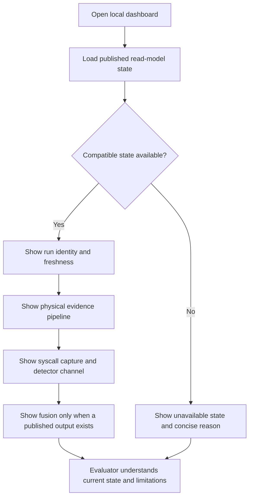
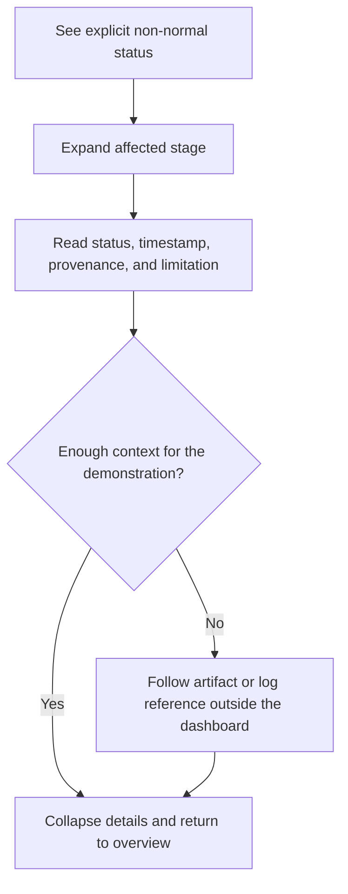

---
stepsCompleted:
  - 1
  - 2
  - 3
  - 4
  - 5
  - 6
  - 7
  - 8
  - 9
  - 10
  - 11
  - 12
  - 13
  - 14
lastStep: 14
workflowStatus: complete
completedAt: 2026-08-15T14:17:13-03:00
inputDocuments:
  - _bmad-output/planning-artifacts/product-brief-parallel-truth-fingerprint-prototype-2026-03-23.md
  - _bmad-output/planning-artifacts/prd.md
  - _bmad-output/planning-artifacts/prd-update-2026-05-21.md
  - _bmad-output/planning-artifacts/prd-update-2026-08-15.md
  - _bmad-output/planning-artifacts/architecture.md
  - _bmad-output/planning-artifacts/architecture-update-2026-05-21.md
  - _bmad-output/planning-artifacts/architecture-update-2026-08-15.md
  - _bmad-output/planning-artifacts/epics.md
  - _bmad-output/planning-artifacts/epics-update-2026-08-15.md
  - _bmad-output/planning-artifacts/research/technical-scientifically-grounded-industrial-signal-and-anomaly-simulation-research-2026-08-15.md
  - _bmad-output/planning-artifacts/implementation-readiness-report-2026-08-15.md
---

# UX Design Specification parallel-truth-fingerprint-prototype

**Author:** Emilio
**Date:** 2026-08-15

---

<!-- UX design content will be appended sequentially through collaborative workflow steps -->

## Executive Summary

### Project Vision

The Evidence-Backed Read-Only Dashboard is a lightweight local interface for
showing the academic prototype while it operates. It visualizes the physical
signal path, edge and consensus state, independent OPC UA comparison, Linux
syscall capture, detector outputs, fusion when available, and run health.

The dashboard itself and every visual, interaction, responsive, accessibility,
and component recommendation in this document are optional, non-blocking, and
outside implementation-readiness gates. If the dashboard is implemented, the
scientific and authority boundaries inherited from the PRD and architecture
still govern what it may represent or change.

### Controlling Optional-Mode Boundary

All later references to live, current, or most-recently-published state are
guidance for `legacy_demo` only. That mode carries a persistent
`DEMO - NOT PUBLISHED SCIENTIFIC EVIDENCE` status and cannot be cited as a
scientific result. `frozen_evidence` is a separate read-only mode that loads
only one explicitly selected immutable Epic 17B package whose identity and
hashes validate with `G9_PASS`; it never resolves a mutable `latest` alias and
contains no scientific or runtime controls. Mutation requests are rejected by
the local server, not merely hidden in the page. If Epic 18 is never activated,
neither mode nor any UX recommendation is required.

It is not a production HMI, experiment controller, scientific workbench, or
complete evidence-audit product. It reads existing runtime read models and
published artifacts without training, calibrating, promoting, fusing,
relabelling, recomputing, changing experiment settings, or controlling the
simulated process.

The interface preserves the controlling scientific semantics: there are
exactly two detection modalities; raw current, normalized span, and engineering
value are linked physical representations; detector channels remain separate;
and external benchmarks cannot be presented as synchronized custom evidence.

### Target Users

The primary user is the researcher or demonstration operator running and
explaining the local prototype on a laptop. This user needs to see the current
pipeline state, point to each major stage, recognize warnings or blocked
progression, and explain detector outputs without reading raw JSON.

The secondary user is the academic evaluator observing the demonstration. This
user needs to understand what is happening, distinguish the two modalities and
detector channels, see when evidence is missing or invalid, and read the main
scientific limitations.

Technical identifiers and provenance remain available in compact detail panels
when needed, but a separate audit experience is outside scope.

### Key Design Challenges

- Show the end-to-end pipeline clearly without turning the page into a dense
  engineering console.
- Preserve the distinction between modalities, signal representations,
  consensus, OPC UA comparison, detector channels, and fusion.
- Make unavailable, degraded, blocked, invalid, aborted, or legacy states
  explicit without overwhelming the main demonstration view.
- Keep the interface visibly read-only and prevent UI elements from implying
  scientific-computation or control authority.
- Update live or recently published state without presenting stale or partial
  information as current and complete.

### Design Opportunities

- Use one architecture-aligned pipeline view as the main dashboard.
- Present essential values and state directly on each stage, with compact
  details available on demand.
- Use a consistent text, icon, and color status language that remains
  understandable without color alone.
- Keep limitations and provenance close to the affected output while avoiding
  complex navigation or report-building workflows.

## Core User Experience

### Defining Experience

The core experience is a lightweight live dashboard that lets the researcher
and academic audience see the prototype operating.

The primary screen should show the current flow:

1. physical signal observations;
2. edge and consensus state;
3. independent OPC UA observation and comparison;
4. Linux syscall capture health;
5. physical and syscall detector outputs;
6. fusion output when a published result is available; and
7. current run status, warnings, and limitations.

Raw current, normalized span, engineering value, unit, profile, and quality
remain visibly linked for each physical signal. Physical, syscall, and fusion
outputs remain distinct.

The dashboard displays current or most recently published read-model data
automatically. It does not train, calibrate, promote, fuse, relabel, evaluate,
change experiment settings, or control the simulated process.

Detailed provenance may be available through a small expandable panel, but
complex claim navigation and full artifact auditing are outside the dashboard
scope.

### Platform Strategy

The dashboard is a locally served, desktop-first web page for use on a normal
laptop during development and academic demonstration.

Mouse and keyboard are the primary input methods. A native mobile application,
touch-first interaction, offline operation, production HMI behavior, and a
large multi-page navigation system are out of scope.

The main view should fit the demonstration flow on one page. Secondary
technical information may use simple expandable sections, tabs, or detail
panels.

The interface updates from existing read models or published artifacts. When
information is missing, stale, incompatible, or unavailable, the dashboard
shows that state explicitly rather than inventing or estimating a value.

### Effortless Interactions

Users should be able to:

- understand the current pipeline state at a glance;
- see whether each major component is available, degraded, blocked, or invalid;
- follow the physical flow from signal observation through consensus and OPC
  UA comparison;
- see syscall capture and detector health separately;
- distinguish physical, syscall, and fusion detector outputs;
- recognize warnings, gaps, drops, missing modalities, and aborted runs;
- expand a component for essential identifiers, provenance, and limitations;
  and
- return to the main overview without losing the current run context.

The dashboard should avoid complex filters, report builders, configuration
forms, and scientific workflow controls.

### Critical Success Moments

The dashboard succeeds when:

- a professor can understand the prototype flow during the demonstration
  without reading raw JSON;
- the researcher can point to each stage while the system is running;
- raw current, normalized span, and engineering value are clearly shown as one
  physical modality;
- consensus failure, invalid OPC UA evidence, syscall capture degradation,
  detector outputs, and fusion remain visibly distinct;
- missing or invalid evidence is obvious rather than displayed as normal;
- limitations and scientific status are visible without dominating the main
  screen; and
- the dashboard remains visibly read-only.

The experience fails if the main screen becomes overloaded, resembles a
production HMI, introduces complex audit workflows, or suggests that the
dashboard controls or calculates the experiment.

### Experience Principles

1. **Show the system happening.** The live pipeline is the main experience.
2. **Keep the first screen simple.** Essential status first; technical detail
   on demand.
3. **Preserve scientific meaning.** Modalities, representations, channels, and
   limitations remain correct.
4. **Make failure visible.** Missing, invalid, degraded, blocked, and aborted
   states are explicit.
5. **Remain read-only.** The dashboard observes the prototype and never
   controls or recalculates it.
6. **Optimize for demonstration, not production.** Use a bounded local
   interface without product-scale UX complexity.

## Desired Emotional Response

### Primary Emotional Goals

The dashboard should create clarity, confidence, and calm.

The researcher should feel confident explaining the prototype without
translating raw logs during the demonstration. The academic viewer should feel
that the system state is understandable and that warnings, limitations, and
unavailable evidence are presented honestly.

The desired reaction is: "I understand what is happening, where it is
happening, and whether the evidence is healthy."

### Emotional Journey Mapping

- **On first view:** orientation. The user recognizes the current run and the
  main pipeline immediately.
- **During operation:** confidence. Values and states update without moving the
  layout or creating visual noise.
- **When inspecting a component:** understanding. Essential details explain the
  state without requiring repository knowledge.
- **When something fails:** informed caution. The dashboard explains what
  failed, where progression stopped, and what information is unavailable.
- **After the demonstration:** credibility. The viewer understands both the
  result and its limitations.
- **When returning:** familiarity. The same stages and status language appear
  in stable locations.

### Micro-Emotions

The most important emotional balances are:

- confidence over confusion;
- trust over skepticism;
- calm attention over information overload;
- informed caution over alarm; and
- satisfaction over visual novelty.

The interface does not need celebratory effects or surprising interactions.
Its value comes from making a technically complex prototype easy to follow.

### Design Implications

- Use a stable architecture-aligned layout so components do not move as states
  change.
- Use plain domain language and short explanations.
- Show current status, last update, and run identity consistently.
- Use restrained color, supported by text and icons.
- Reserve stronger warning treatment for invalid, blocked, degraded, or
  aborted states.
- Use subtle live indicators to show that the prototype is operating.
- Avoid decorative animation, dense charts, excessive cards, and competing
  alert colors.
- Keep technical detail collapsed until requested.
- Explain failures in place instead of relying on generic error messages.
- Display limitations honestly without making them dominate the main view.
- Keep read-only status visible but unobtrusive.

### Emotional Design Principles

1. **Clarity creates confidence.**
2. **Stable layout creates calm.**
3. **Honest status creates trust.**
4. **Failures should explain, not frighten.**
5. **Restraint is more appropriate than spectacle.**
6. **The interface supports the academic explanation instead of competing with
   it.**

## UX Pattern Analysis & Inspiration

### Inspiring Products Analysis

The existing prototype dashboard is the primary design reference.

Its strongest patterns are:

- one local page that shows the prototype operating;
- an architecture-aligned visual pipeline;
- live values and component status;
- visible consensus, SCADA comparison, and fingerprint stages;
- expandable technical information and raw logs; and
- a presentation-oriented structure suitable for explaining the prototype.

The new dashboard should evolve this existing experience rather than replace
it with a new product-style interface.

### Transferable UX Patterns

#### Single-Page Pipeline

Retain one main page organized in execution order. The page should show physical
observations, edges, consensus, OPC UA comparison, syscall capture, detector
outputs, and fusion when available.

#### Live Status in Stable Components

Values and status change inside stable pipeline blocks. Components should not
move or reorganize while the prototype runs.

#### Details on Demand

The main view shows essential values and state. Existing expandable panels or
similar simple patterns can expose identifiers, provenance, limitations, and
raw logs when needed.

#### Component-Scoped Evidence

Selecting or expanding a pipeline component should reveal information for that
component only. Sensor, edge, consensus, OPC UA, syscall, detector, and fusion
information should not be mixed.

#### Clear Status Translation

Technical states should have short human-readable explanations while
preserving the original status or identifier in the detail view.

### Anti-Patterns to Avoid

- replacing the current dashboard with a complex multi-page product;
- production-HMI controls, alarms, or industrial styling beyond the academic
  demo;
- dense card grids that obscure the pipeline;
- raw JSON as the primary presentation;
- excessive charts, animation, gradients, or visual effects;
- moving components as live state changes;
- mixing sensor, edge, consensus, OPC UA, syscall, and detector semantics;
- presenting raw current, normalized span, and engineering value as separate
  modalities;
- hiding invalid, stale, degraded, blocked, or missing data;
- exposing internal BMAD story numbers or implementation jargon; and
- adding controls that train, calibrate, promote, fuse, relabel, evaluate, or
  change the experiment.

### Design Inspiration Strategy

#### Adopt

- the current single-page dashboard structure;
- architecture-aligned pipeline blocks;
- live values and health indicators;
- expandable technical details; and
- component-scoped logs where they remain useful.

#### Adapt

- correct labels to the August two-modality semantics;
- show raw current, normalized span, engineering value, profile, and quality
  together;
- add syscall capture and detector status as a separate branch;
- keep physical, syscall, and fusion outputs distinct;
- simplify old guidance panels and dense technical sections;
- replace editable or scientific controls with read-only state; and
- use consistent available, degraded, blocked, invalid, aborted, and
  unavailable states.

#### Avoid

- a complete visual redesign;
- new navigation layers without a demonstrated need;
- product-scale onboarding, personalization, reporting, or role management;
- production SCADA/HMI scope; and
- any interaction that changes scientific or control state.

The design direction is incremental refinement: preserve the recognizable
current dashboard, correct its scientific semantics, add the minimum missing v2
evidence states, and keep the academic demonstration simple.

## Design System Foundation

### 1.1 Design System Choice

Use the existing lightweight custom HTML and CSS foundation.

The dashboard remains a self-contained local page served by the existing
Python HTTP boundary. No React, Material UI, Tailwind, Bootstrap, Chakra, Ant
Design, frontend build system, or new component-library dependency is required.

This is not a new full design system. It is a small consistency layer over the
dashboard that already exists.

### Rationale for Selection

- The existing dashboard already provides a suitable local web surface.
- The project is an academic prototype maintained by one researcher.
- There is no brand or product differentiation requirement.
- The desired change is incremental refinement rather than frontend
  replacement.
- Existing HTML elements, panels, pipeline blocks, metrics, banners, and
  expandable details can be reused.
- A framework migration would add build, dependency, testing, and maintenance
  work unrelated to the research objective.
- Native semantic HTML can support basic keyboard and accessibility behavior.
- The dashboard should remain simple enough to inspect and explain directly.

The historical dashboard control-surface buttons are not part of the Epic 18
read-only experience. The new presentation layer may show current experiment
and runtime state, but it does not start, stop, configure, or change them.

### Implementation Approach

Reuse and simplify the existing dashboard structure:

- Python-served HTML;
- existing JavaScript read-model updates;
- existing panel and pipeline layout;
- CSS custom properties for the small set of shared visual values;
- semantic HTML for headings, status, details, lists, and tables;
- native `
` elements or the existing equivalent for technical
  content;
- system UI font stack for normal content; and
- the existing monospace stack only for identifiers and raw technical
  evidence.

Standardize only the components needed by the dashboard:

- pipeline stage;
- sensor or signal row;
- status badge;
- compact metric;
- warning or limitation banner;
- detector-channel panel;
- run-health summary;
- expandable detail section; and
- empty, unavailable, and blocked state.

No separate component package or general-purpose design-system documentation
is required.

### Customization Strategy

Preserve the current dashboard's recognizable appearance while reducing
inconsistency.

Use a small token set for:

- page background and panel surfaces;
- primary and secondary text;
- borders and focus indicators;
- physical, syscall, and fusion channel accents;
- available, degraded, blocked, invalid, aborted, legacy, and unavailable
  states;
- normal and monospace typography; and
- compact spacing and corner radius.

Status meaning should use text and, where helpful, a simple icon in addition to
color.

Avoid:

- a new branding exercise;
- decorative component variants;
- large icon or chart libraries;
- animation systems;
- frontend framework migration;
- production-HMI themes;
- editable scientific controls; and
- components that are not required by the single-page demonstration.

## 2. Core User Experience

### 2.1 Defining Experience

The defining experience is opening one local dashboard and immediately seeing
the prototype's evidence pipeline operating.

The dashboard presents physical observations and real Linux syscall evidence as
separate modalities, follows their published processing states, and shows
physical, syscall, and fusion detector outputs as distinct channels.

The user observes the current or most recently published state. The dashboard
does not configure, control, train, calibrate, evaluate, fuse, or recompute any
part of the experiment.

### 2.2 User Mental Model

Users approach the dashboard as a read-only monitoring view for an academic
prototype. They expect a familiar pipeline or instrumentation overview:

- the run has a visible overall state;
- each major stage shows its own health and freshness;
- evidence visibly moves from observation to detector output;
- additional technical information is available only when needed; and
- missing or invalid data is shown as a problem rather than silently replaced.

Likely sources of confusion are:

- treating raw current, normalized span, and engineering values as separate
  modalities rather than linked representations of one physical modality;
- interpreting a most recently published value as currently live;
- confusing physical, syscall, and fusion outputs;
- assuming that a workload mock implies invented syscalls; and
- assuming that the dashboard performs experiment control or scientific
  computation.

The interface should prevent these misunderstandings through concise labels,
timestamps, status indicators, and visibly separated channels.

### 2.3 Success Criteria

The core experience succeeds when:

- the prototype flow can be understood without inspecting raw JSON;
- the current run state and evidence freshness are immediately apparent;
- raw current, normalized span, engineering value, unit, profile, and quality
  remain visibly linked;
- real syscall capture health is visible independently from workload identity;
- physical, syscall, and fusion outputs cannot be mistaken for one another;
- unavailable, stale, degraded, invalid, blocked, and aborted states are
  explicit;
- essential provenance and limitations can be expanded without cluttering the
  main view; and
- the interface remains unmistakably read-only.

### 2.4 Novel UX Patterns

No novel interaction pattern is required.

The dashboard should use established patterns already familiar from monitoring
and observability interfaces:

- a stable pipeline overview;
- compact status cards;
- consistent health labels and timestamps;
- separate visual groups for independent channels; and
- expandable technical details.

The project's distinctive value comes from the scientific meaning of the
displayed evidence, not from unusual interaction design. No gesture, tutorial,
complex navigation model, or custom visualization language is needed.

### 2.5 Experience Mechanics

**Initiation**

The researcher opens the locally served dashboard. The page loads the available
read-model or published-artifact state automatically and identifies the current
or most recent run.

**Interaction**

The user primarily observes the main pipeline. Optional expanders reveal
essential identifiers, provenance, quality information, timestamps, and
limitations for a selected stage.

There are no experiment-control, training, calibration, fusion, or evaluation
actions.

**Feedback**

Each stage shows a concise state such as available, degraded, stale, missing,
blocked, invalid, or aborted. Values include enough timestamp or freshness
context to avoid implying unsupported liveness.

Physical, syscall, and fusion channels remain visually separated. Missing or
incompatible data produces an explicit state instead of a fabricated value or
a normal-looking empty card.

**Completion**

The experience is complete when the user can explain what evidence is
available, how far it progressed through the pipeline, what each detector
published, and which limitations or failures affect the current run.

No dashboard action is required to complete or change the experiment.

## Visual Design Foundation

This visual foundation is optional guidance for Epic 18. It does not establish
implementation requirements, acceptance gates, or prerequisites for the
scientific evidence package.

If the dashboard is implemented, preserving the current appearance is preferred
over introducing a redesign.

### Color System

The existing dark dashboard palette may be retained:

- background: `#0f1418`;
- primary panel: `#172126`;
- secondary panel: `#10171b`;
- primary text: `#e9f0ec`;
- muted text: `#92a6a0`;
- teal accent: `#46d4b5`;
- amber accent: `#f7bd59`; and
- subtle neutral borders.

Teal may represent normal availability or general emphasis. Amber may represent
attention or degradation. The existing coral tone may represent invalid,
blocked, aborted, or error states.

Additional channel accents may help distinguish physical, syscall, and fusion
outputs, but channel identity should always be stated in text. Color alone
should not carry scientific or operational meaning.

No alternative themes, brand palette, or theme-switching feature is needed.

### Typography System

Retain the existing system-font approach:

- `"Segoe UI"`, `system-ui`, and platform sans-serif fallbacks for normal
  interface text; and
- `"IBM Plex Mono"`, `"Consolas"`, or a monospace fallback for identifiers,
  timestamps, compact technical values, and raw details.

Use a small hierarchy consisting of:

- one page title;
- section headings;
- card or pipeline-stage titles;
- normal body and status text; and
- compact metadata text.

Long-form reading, custom web fonts, and an extended typographic scale are
unnecessary for the prototype dashboard.

### Spacing & Layout Foundation

Retain the current compact desktop-first layout:

- one centered page;
- approximately `1rem` spacing between primary panels;
- compact internal card padding;
- responsive grid cards where already useful; and
- vertical stacking when the available width becomes too narrow.

The primary pipeline and run status should receive the most space. Provenance,
limitations, logs, and raw details may remain collapsed until requested.

A formal grid system, mobile-specific composition, and pixel-perfect responsive
behavior are not required.

### Accessibility Considerations

Accessibility improvements are recommended if they can be included without
expanding the prototype scope:

- pair status colors with explicit text;
- preserve readable contrast;
- retain visible keyboard focus for interactive expanders;
- use semantic headings and native disclosure elements where practical; and
- avoid motion that could distract from changing evidence states.

These recommendations do not form an implementation or readiness gate. If the
optional dashboard is implemented, scientific distinctions and failure states
should remain understandable without relying solely on visual decoration.

## Design Direction Decision

This design direction is optional guidance for Epic 18. It does not create an
implementation requirement or readiness gate.

### Design Directions Explored

Alternative redesigns and multiple visual mockups were intentionally not
explored because the project is an academic prototype whose dashboard only
needs to demonstrate the system operating.

The existing dashboard was used as the sole visual reference.

### Chosen Direction

If the optional dashboard is maintained or extended, retain its current
single-page, dark, compact monitoring style.

The recommended direction consists of:

- one visible pipeline overview;
- compact status and evidence cards;
- physical, syscall, and fusion channels shown separately;
- technical details available through simple expanders;
- explicit missing, stale, degraded, invalid, blocked, and aborted states; and
- no experiment-control or scientific-computation interface.

### Design Rationale

This direction preserves familiarity, minimizes implementation effort, and
keeps attention on the scientific demonstration rather than interface design.

Creating alternative themes, navigation structures, interactive mockups, or a
new visual identity would not materially improve the academic prototype.

### Implementation Approach

No redesign is required.

If Epic 18 is implemented, the existing dashboard may be adjusted incrementally
using its current HTML, CSS, and JavaScript structure. Only changes needed to
display the corrected scientific model and published read-model states should
be considered.

No design-direction visualizer, frontend migration, UI library, or additional
mockup artifact is necessary.

## User Journey Flows

These journeys are optional guidance for Epic 18. They do not establish an
implementation requirement or readiness gate.

### Observe the Demonstration

The researcher or academic evaluator opens the local dashboard to understand
the current or most recently published prototype state.

The page loads automatically. The user does not configure or start an
experiment through the dashboard.

Success means that the evaluator can distinguish the physical, syscall, and
fusion channels and can identify whether the displayed information is current,
recent, degraded, or unavailable.

### Inspect a Failure or Limitation

When a stage shows a non-normal state, the researcher may inspect its essential
context without leaving the main demonstration view.

The dashboard provides explanation and references only. It does not repair,
retry, relabel, recalculate, or override the affected evidence.

### Journey Patterns

The optional dashboard may use four simple patterns:

- automatic loading of published state;
- status-first presentation;
- details on demand through native expanders; and
- external artifact or log references when deeper investigation is required.

No onboarding, wizard, multi-page navigation, editable workflow, or recovery
control is needed.

### Flow Optimization Principles

- Keep the demonstration on one page.
- Require no interaction to understand the overall state.
- Keep physical, syscall, and fusion channels visually separate.
- Preserve the page layout when values or states change.
- Explain unavailable or invalid evidence without fabricating replacements.
- Use expansion only for information that would otherwise clutter the overview.
- Keep all scientific execution and recovery actions outside the dashboard.

## Component Strategy

This component strategy is optional guidance for Epic 18. It does not create an
implementation requirement, component-library requirement, or readiness gate.

### Design System Components

There is no external design system.

If the optional dashboard is maintained, reuse the lightweight patterns already
implemented in its HTML and CSS:

- page and section panels;
- pipeline and status cards;
- metric labels and values;
- text status pills;
- warning and error banners;
- responsive grids;
- native detail expanders; and
- monospace technical-detail blocks.

No separate component package, documentation site, UI dependency, or reusable
cross-project library is needed.

### Custom Components

Only two small semantic patterns may be useful.

#### Linked Physical Representation

**Purpose:** Show that raw current, normalized span, and engineering value are
linked representations of one physical modality.

**Content:** Raw mA, normalized span, engineering value, unit, instrument
profile identifier, quality, and freshness.

**Actions:** None beyond optionally expanding provenance.

**States:** Available, degraded, stale, missing, or invalid.

**Variants:** None required.

**Accessibility:** Use explicit text labels and do not rely on color to express
quality or state.

**Interaction:** Read-only. Expansion may reveal provenance without changing
the evidence.

#### Published Channel Result

**Purpose:** Present physical, syscall, or fusion output without merging their
identities.

**Content:** Channel name, publication state, detector identity, decision or
score when published, timestamp, and concise limitation.

**Actions:** None beyond optionally expanding details.

**States:** Available, degraded, blocked, stale, missing, invalid, or not
published.

**Variants:** Physical, syscall, and fusion labels may use different accents,
but share the same structure.

**Accessibility:** Always state the channel and status in text.

**Interaction:** Read-only. The component cannot calculate, fuse, promote, or
override a result.

### Component Implementation Strategy

If Epic 18 is implemented:

- adapt the dashboard's existing card and expander styles;
- use plain semantic HTML, current CSS, and current JavaScript;
- keep status vocabulary consistent across all cards;
- avoid frontend dependencies or abstraction layers; and
- add a new component pattern only when the corrected evidence cannot be shown
  clearly with an existing pattern.

Formal component APIs, comprehensive variant sets, animation behavior, and
design-system governance are out of scope.

### Implementation Roadmap

There is no mandatory component roadmap.

If the optional dashboard work is selected, the recommended order is:

1. adapt existing cards to the corrected read models and status vocabulary;
2. add the linked physical-representation grouping where physical evidence is
   displayed; and
3. ensure physical, syscall, and fusion results remain separate.

All other component enhancements may be omitted.

## UX Consistency Patterns

These patterns are optional guidance for Epic 18. They do not establish UI
acceptance criteria or readiness gates.

### Button Hierarchy

The presentation dashboard does not need primary scientific or operational
actions.

Do not add buttons for starting runs, changing scenarios, training, calibrating,
evaluating, fusing, promoting, relabeling, or controlling the process.

If a small presentation-only action is useful, such as opening a referenced
artifact, it may use the existing secondary or neutral style. Detail disclosure
should preferably use native `details` and `summary` elements.

### Feedback Patterns

Use the same concise vocabulary throughout the dashboard:

- **available:** a compatible published value is present;
- **degraded:** evidence is present with a stated quality limitation;
- **stale:** the last published value exceeds its expected freshness context;
- **missing:** expected evidence is absent;
- **blocked:** a required upstream condition prevented publication;
- **invalid:** evidence exists but cannot be treated as valid;
- **aborted:** the associated run ended without an authorized result; and
- **not published:** an optional result, including fusion, was not produced.

Every state should appear as text. Color and icons may provide secondary
emphasis but should not define the meaning.

Feedback should explain the observed state without offering a dashboard action
that changes the experiment.

### Form Patterns

No forms are required.

Experiment configuration, scenario selection, detector parameters, labels,
thresholds, calibration, and promotion remain outside the presentation
dashboard.

Read-only identifiers and values should use ordinary labeled text rather than
disabled form fields.

### Navigation Patterns

Use a single-page overview without global navigation.

Optional technical information may use inline expanders. Opening and closing an
expander should not change the current run context or rearrange the primary
pipeline unexpectedly.

Links to artifacts or logs should be clearly identified as external supporting
detail.

### Additional Patterns

**Loading:** Show that published state is being loaded. Do not display previous
values as current without their timestamp and run identity.

**Unavailable state:** Show a concise reason when no compatible read model or
artifact is available.

**Channel separation:** Keep physical, syscall, and fusion headings explicit and
stable across all states.

**Progressive disclosure:** Keep provenance, identifiers, limitations, logs, and
raw technical detail collapsed unless requested.

**Omitted patterns:** Search, filtering, pagination, modal workflows,
notifications, onboarding, and mobile-specific navigation are unnecessary for
the bounded academic demonstration.

## Responsive Design & Accessibility

This section provides optional guidance for Epic 18. Responsive behavior,
accessibility work, and compliance testing are not implementation prerequisites
or readiness gates for the academic prototype.

### Responsive Strategy

The dashboard is desktop-first and intended for a normal laptop or desktop
browser during development and academic demonstration.

The existing multi-column layout may remain on wider screens. When horizontal
space is insufficient, primary sections and cards may stack vertically using
the dashboard's existing responsive grid behavior.

Dedicated tablet and mobile experiences, touch optimization, mobile navigation,
and device-specific feature sets are out of scope.

### Breakpoint Strategy

No formal breakpoint system is required.

The existing breakpoint near `1100px`, which changes the main workspace from
multiple columns to one column, may be retained. Auto-fitting card grids may
continue to wrap according to their available width.

Additional breakpoints should be introduced only if the optional dashboard
becomes unreadable on the laptop used for the demonstration.

### Accessibility Strategy

No formal WCAG conformance level or certification is required.

If the dashboard is implemented or adjusted, inexpensive accessibility
improvements are recommended:

- use semantic headings and native disclosure elements;
- preserve visible keyboard focus;
- pair every status color with explicit text;
- keep normal text readable against the dark background;
- use meaningful link labels; and
- avoid unnecessary animation.

Scientific state and channel identity should never depend exclusively on color,
regardless of whether broader accessibility work is performed.

### Testing Strategy

No comprehensive device or accessibility test program is required.

For the optional dashboard, a proportionate check may consist of:

- opening the page in the browser used for the demonstration;
- confirming that the layout remains readable at the expected laptop width;
- confirming that narrow layouts stack without hiding evidence;
- navigating any expanders and links with the keyboard; and
- checking that statuses remain understandable without their colors.

Cross-browser matrices, physical-device labs, formal screen-reader validation,
and accessibility certification may be omitted.

### Implementation Guidelines

If Epic 18 is implemented:

- retain the existing relative sizing and responsive grids where practical;
- prefer semantic HTML over custom interactive widgets;
- keep the primary pipeline visible before expanded technical details;
- prevent long identifiers or values from breaking the page;
- preserve text labels for states and channels; and
- add responsive or accessibility behavior only when it directly improves the
  bounded demonstration.

No mobile application, responsive redesign, accessibility framework, or formal
compliance artifact is necessary.
