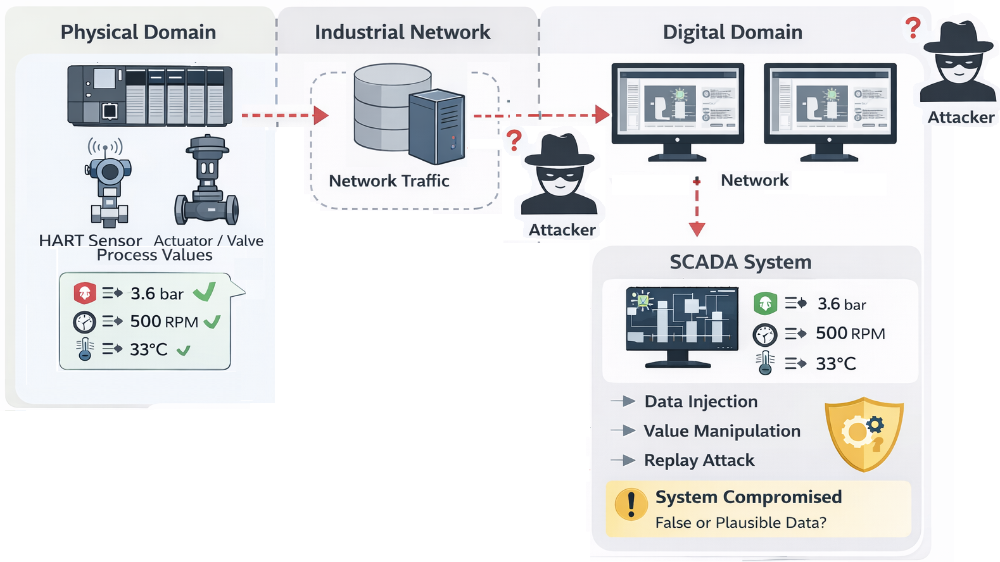
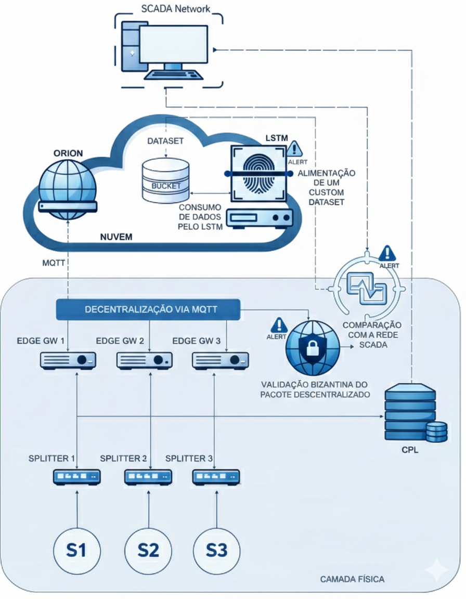
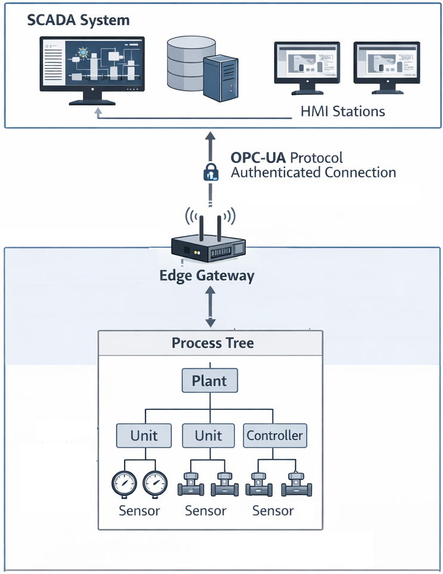
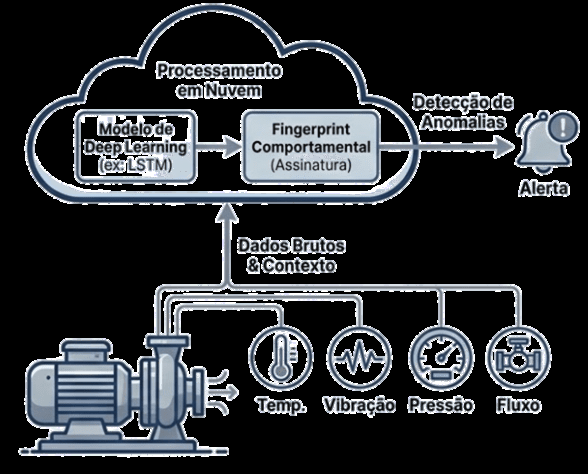
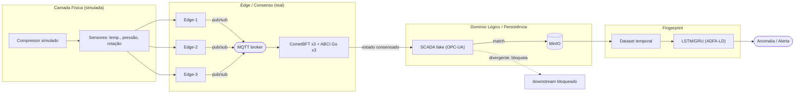
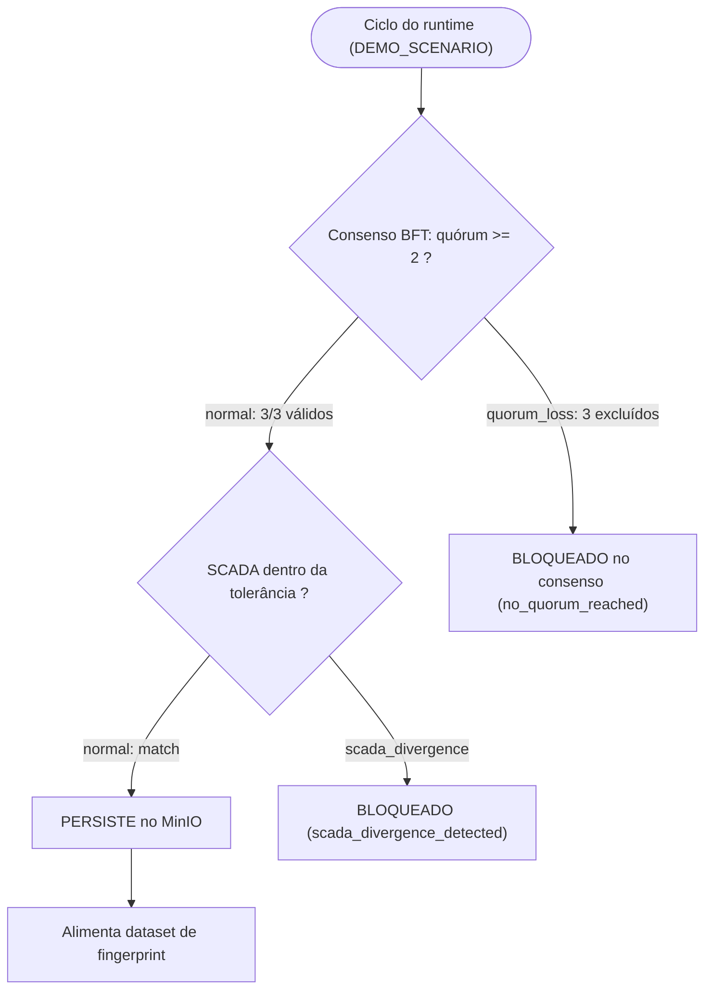

# Arquitetura Baseada em Fonte de Verdade Paralela para Geração de Fingerprint Físico-Operacional em Sistemas Industriais Legados

**Emilio Bresolin** — Escola Politécnica, Pontifícia Universidade Católica do Rio Grande do Sul (PUCRS), Porto Alegre, Brasil — emilio.bresolin@edu.pucrs.br

**Orientador:** Prof. Dr. Fabiano Passuelo Hessel — Escola Politécnica, PUCRS

*Seminário de Andamento — Programa de Pós-Graduação em Ciência da Computação — 2026*

---

## Resumo

Sistemas industriais legados dependem fortemente da integridade dos dados de processo para garantir operação segura e eficiente. Nessas arquiteturas, os sensores de campo são a interface entre o domínio físico e o digital, e suas medições são convertidas e disponibilizadas por Controladores Lógicos Programáveis (CLPs) a sistemas SCADA. Entretanto, a confiança implícita no caminho digital pode ser explorada por ataques silenciosos — injeção de dados falsos, *replay* e manipulação gradual de valores plausíveis. Grande parte dos *Intrusion Detection Systems* (IDS) industriais opera exclusivamente sobre dados já digitalizados, assumindo que a representação lógica reflete o estado físico real; quando esse pressuposto é violado, detecção e aprendizado passam a operar sobre dados comprometidos. Este trabalho propõe uma arquitetura baseada em uma **Fonte de Verdade Física Paralela**, obtida pela duplicação não intrusiva do sinal do sensor antes da entrada no CLP. As leituras físicas são coletadas por *Edge Gateways*, compartilhadas de forma descentralizada via MQTT, validadas por um mecanismo tolerante a falhas bizantinas e comparadas com os valores lógicos reportados na rede industrial; a partir daí é construído um *dataset* físico-operacional para treinamento de modelos temporais (LSTM/GRU) que geram *fingerprints* comportamentais. Este Seminário de Andamento reporta um **protótipo parcial, porém demonstrável**, executado em laboratório com infraestrutura real de consenso (CometBFT + aplicação ABCI em Go), MQTT e MinIO, validado em três cenários — `normal`, `quorum_loss` e `scada_divergence`. A etapa de *fingerprint* foi validada preliminarmente com o *dataset* público ADFA-LD (enquadramento binário Normal × Ataque), atingindo macro F1 = 0,9187 e acurácia = 0,9229. O *dataset* físico-operacional próprio do protótipo já é gerado de ponta a ponta pelo pipeline, mas ainda é normal-only e de volume insuficiente para métricas supervisionadas, sendo tratado como evidência de integração.

**Palavras-chave:** IDS Industrial; Edge Computing; SCADA; Falhas Bizantinas; LSTM; Fingerprint Operacional; Sistemas Industriais Legados.

---

## I. Introdução

Apesar do avanço tecnológico recente, grande parte da indústria ainda opera com sistemas legados nos quais sensores de campo conectados por cabo suportam operação, supervisão e manutenção em tempo real. Em ambientes SCADA, os dados de processo são usados não apenas para monitoramento, mas também para decisão operacional, acionamento de alarmes e, frequentemente, controle automático. Nessa cadeia, o CLP e a rede SCADA/HMI atuam como intermediários naturais entre o mundo físico e o digital, criando uma **dependência estrutural**: se o caminho digital que transporta ou representa os dados for adulterado, o supervisório pode receber valores plausíveis, porém falsos, sem qualquer mecanismo independente para validar a veracidade física da medição original.

Esse modelo de confiança implícito é explorável por **ataques silenciosos**, como injeção de dados falsos (*false data injection*), *replay* de leituras válidas e manipulação gradual de valores (*drift* malicioso), nos quais a adulteração permanece dentro de faixas consideradas normais pelo supervisório. A maioria das abordagens de IDS industriais concentra-se em análise de tráfego, assinaturas, anomalias em pacotes, *logs* ou padrões estatísticos sobre dados **já digitalizados** e, cada vez mais, incorpora aprendizado de máquina. O problema central é que essas técnicas dependem de dados digitais que já podem estar comprometidos: se o dado que chega ao sistema já é falso, o algoritmo aprende errado.

A questão central deste trabalho é, portanto, **como obter uma "fonte de verdade" física que não dependa dos valores reportados pelo CLP**. Assume-se a premissa de que os dados de sensoriamento enviados pelos dispositivos no chão de fábrica ao CLP são corretos, uma vez que qualquer alteração exigiria acesso físico ao dispositivo. A partir dessa premissa, propõe-se uma arquitetura de detecção/validação descentralizada baseada em verdade física, que duplica de forma não intrusiva o sinal do instrumento e o submete a validação distribuída antes de confrontá-lo com o domínio lógico.

*Figura 1 — Ausência de mecanismo independente para validar a integridade dos dados entre o sensor e a rede SCADA (reproduzida do PEP).*

O restante deste documento está organizado da seguinte forma: a Seção II discute trabalhos relacionados; a Seção III descreve a arquitetura proposta; a Seção IV apresenta o protótipo implementado; a Seção V detalha os cenários de validação executados; a Seção VI reporta os resultados preliminares; a Seção VII discute limitações; a Seção VIII lista artefatos; a Seção IX apresenta o cronograma; e a Seção X, as referências.

---

## II. Trabalhos Relacionados

A revisão priorizou trabalhos que tratam IDS próximo ao processo físico (no *edge*), descentralização e comunicação leve, tolerância a nós comprometidos e aprendizado temporal.

**IDS industrial e IDS no Edge.** Niedermaier et al. (2019) defendem IDS distribuídos em dispositivos de baixa capacidade, levando a detecção "para perto" do processo e reduzindo a dependência de defesas centralizadas. Nascimento (2019) discute oportunidades e desafios de IDS para IoT com *edge computing* e aprendizado de máquina. Em geral, esse movimento "*edge-first*" continua operando sobre dados já digitalizados (rede/*logs*/telemetria), e não sobre uma fonte física paralela.

**Abordagens distribuídas/federadas.** Olanrewaju-George e Pranggono (2024) e Nascimento (2023) exploram aprendizado distribuído/federado para IDS, reforçando a necessidade de arquiteturas descentralizadas em cenários com nós limitados. Cavalcante et al. (2017) discutem camadas *context-aware* que organizam dados como entidades com significado, apoiando a ideia de estruturar dados operacionais com semântica.

**Tolerância a falhas bizantinas.** Blanchard et al. (2017) formalizam o problema de nós bizantinos em sistemas distribuídos, enfatizando que nós podem manipular informação arbitrariamente e devem entrar no modelo de ameaça. A literatura, porém, discute isso majoritariamente no contexto de consenso e otimização colaborativa, e não como verificação de integridade físico-lógica.

**Aprendizado temporal.** Redes recorrentes (LSTM, GRU) e convolucionais 1D são amplamente usadas para modelar dependências temporais e detectar anomalias em séries industriais, capturando transientes e padrões evolutivos.

**Limitação dos datasets públicos.** Datasets como NSL-KDD, CICIDS, TON_IoT e IoTID20 são focados em TI/IoT de consumo e raramente incorporam sinais físicos reais ou diagnósticos completos de protocolos industriais, limitando sua capacidade de representar ataques que exploram a relação físico × digital.

A Tabela I sintetiza a comparação dos trabalhos analisados frente à proposta. Nenhuma das abordagens estabelece uma fonte de verdade baseada diretamente no domínio físico, independente do CLP/SCADA, nem realiza a comparação explícita entre estado físico e representação digital — lacuna na qual este trabalho se posiciona.

**Tabela I — Comparação resumida dos trabalhos relacionados** (Edge distribuído / Fonte de verdade física / Validação distribuída / Fingerprint / Físico×SCADA).

| Trabalho | Ano | Edge dist. | Fonte verdade | Valid. dist. | Fingerprint | Físico×SCADA |
| --- | :---: | :---: | :---: | :---: | :---: | :---: |
| Niedermaier et al. | 2019 | Sim | Não | Não | Parcial | Não |
| Nascimento | 2019 | Sim | Não | Não | Parcial | Não |
| Blanchard et al. | 2017 | Não | Não | Sim | Não | Não |
| Olanrewaju-George & Pranggono | 2024 | Sim | Não | Parcial | Sim | Não |
| Nascimento | 2023 | Sim | Não | Parcial | Sim | Não |
| **Proposta deste trabalho** | 2026 | **Sim** | **Sim** | **Sim** | **Sim** | **Sim** |

---

## III. Arquitetura Proposta

A arquitetura (Figura 4) adiciona uma camada paralela de observação, validação e aprendizado que **não substitui nem interfere** na lógica de controle existente. Ela é estruturada em cinco pilares encadeados como um *pipeline* contínuo.

*Figura 4 — Arquitetura proposta (reproduzida do PEP).*

**Pilar 1 — Duplicação física não intrusiva do sinal.** Cada sensor analógico (ex.: transmissores de pressão, temperatura ou vazão) continua enviando seu sinal físico ao CLP. A proposta adiciona um *Edge Gateway* externo conectado por um *splitter* industrial dedicado por sensor, instalado em paralelo ao *loop*, que duplica o sinal e envia uma cópia elétrica independente ao *edge*. A duplicação é paralela (não em série), transparente ao CLP e sem impacto operacional. Para sinais HART, o *edge* extrai a variável de processo e diagnósticos via comandos universais (CMD 3 e CMD 48); em Profibus PA, via *sniffing* do telegrama cíclico.

**Pilar 2 — Coleta e descentralização no Edge.** Cada *Edge Gateway* estrutura a leitura em um *payload* físico-operacional rico (valor, unidade, corrente de *loop*, qualidade, diagnósticos e métricas como nível de ruído, estabilidade e taxa de variação). Esses *payloads* são publicados via MQTT (*publish/subscribe*) e organizados semanticamente por um *context broker*, de modo que todos os *edges* passam a ter acesso às leituras de todos os sensores, eliminando pontos únicos de confiança. A validação opera sobre janelas temporais configuráveis (referência da ordem de 1 minuto, compatível com a dinâmica lenta de processos contínuos).

**Pilar 3 — Validação distribuída tolerante a falhas bizantinas.** A arquitetura assume explicitamente que nem todos os *edges* são confiáveis. Um mecanismo de consenso compara as leituras e classifica os nós (válido / suspeito / bizantino), usando métricas como desvio absoluto mediano (MAD) e correlação temporal de curto prazo. O resultado é um pacote de consenso físico, contendo apenas dados fisicamente plausíveis.

**Pilar 4 — Comparação físico × lógico com a rede industrial.** O *edge* atua como cliente do domínio lógico (OPC UA, Modbus TCP, DNP3, entre outros), lendo o valor que o CLP efetivamente reporta. Divergências entre o valor físico consensado e o valor lógico, acima de um limite, são tratadas como evidência de violação de integridade (Figura 3).

*Figura 3 — Acesso do Edge ao domínio lógico via OPC UA (reproduzida do PEP).*

**Pilar 5 — Fingerprint físico-comportamental com LSTM.** O histórico de pacotes validados alimenta um modelo temporal que aprende a **dinâmica normal** do equipamento (visto como sistema multivariado). Desvios tornam-se detectáveis quando essa dinâmica é violada, mesmo que valores individuais permaneçam dentro de faixas normais (Figura 5).

*Figura 5 — Fingerprint comportamental via aprendizado temporal (reproduzida do PEP).*

---

## IV. Protótipo Implementado

O protótipo materializa o *pipeline* arquitetural em um ambiente de laboratório local, distinguindo claramente **componentes reais** de **componentes simulados**. A Figura 6 resume o fluxo do protótipo.

*Figura 6 — Pipeline do protótipo (fonte: `assets/prototype-pipeline.mmd`): compressor simulado → MQTT → edges → CometBFT/ABCI → SCADA fake → MinIO → fingerprint.*

O processo industrial é representado por um **compressor simulado** (temperatura, pressão e rotação). Três serviços de *edge* logicamente independentes publicam e consomem observações via **MQTT real**. O estado físico consolidado é validado por uma **rede real de consenso CometBFT com três validadores**, cuja lógica determinística de confiança/exclusão é executada por uma **aplicação ABCI em Go**. O estado consensado é comparado, sensor a sensor, contra uma **projeção SCADA simulada** (cliente *fake* OPC-UA), e apenas estados válidos são persistidos em um **MinIO real**. A partir do histórico válido, o pipeline gera *datasets* temporais e executa o estágio de *fingerprint*.

A Tabela II resume os componentes do protótipo e sua natureza (real ou simulada). A separação é importante: o objetivo atual **não** é validar em planta industrial real, mas demonstrar a viabilidade funcional da lógica arquitetural em ambiente controlado.

**Tabela II — Componentes do protótipo** (resumo de `tables/infrastructure-components.md`).

| Componente | Tecnologia | Natureza | Função |
| --- | --- | --- | --- |
| Validadores de consenso (×3) | CometBFT v0.39.0 | real | Camada BFT; ordena e committa as rodadas |
| Aplicação ABCI (×3) | Go | real | Confiança/exclusão determinística por rodada |
| Broker de mensagens | MQTT (Mosquitto) | real | Transporte *pub/sub* entre *edges* |
| Object store | MinIO | real | Persiste artefatos válidos e *datasets* |
| Serviços de Edge (×3) | Python | real (lógica) | Aquisição, publicação, consumo, visão replicada |
| Compressor + sensores | Simulador (seed=101) | simulado | Fonte de processo |
| SCADA / OPC-UA | Serviço *fake* | simulado | Projeção do domínio lógico |
| Fingerprint (ADFA-LD) | Keras 3 / torch | real | Classificador supervisionado (métrica) |

---

## V. Cenários de Validação do Protótipo

O protótipo foi exercitado ao vivo pelo caminho oficial do *runtime* (sem *bypass* do pipeline), nos três cenários considerados obrigatórios nesta etapa. A Figura 7 ilustra o fluxo de decisão.

*Figura 7 — Fluxo dos cenários `normal`, `quorum_loss` e `scada_divergence` (fonte: `assets/validation-scenarios-flow.mmd`).*

- **`normal`** — caminho feliz: consenso bem-sucedido com 3/3 *edges* válidos e nenhuma exclusão; a comparação SCADA é compatível nos três sensores (dentro da tolerância); o artefato válido é **persistido** no MinIO.
- **`quorum_loss`** — o consenso **falha**: os três *edges* são classificados como suspeitos (`suspected_byzantine_behavior`) e excluídos; sem quórum, a comparação SCADA, a persistência e o *fingerprint* são **bloqueados** a montante (`no_quorum_reached`).
- **`scada_divergence`** — o consenso ocorre normalmente (3/3 válidos), mas a comparação físico-lógica detecta **divergência em temperatura, pressão e rotação**; o *downstream* é **bloqueado** (`scada_divergence_detected`) e nenhum artefato é persistido.

A Tabela III consolida os cenários e o resultado observado. Os cenários `single_edge_exclusion` e `replay/freeze` **não** são apresentados como resultados validados nesta etapa; eles aparecem como trabalho pendente na Seção VII.

**Tabela III — Cenários de validação executados ao vivo** (resumo de `tables/validation-scenarios.md`).

| Cenário | Consenso | Comparação SCADA | Persistência | Resultado observado |
| --- | --- | --- | --- | --- |
| `normal` | success (3/3, 0 exclusões) | *match* nos 3 sensores | persistido | conforme esperado |
| `quorum_loss` | failed (3 excluídos) | bloqueada (sem estado físico) | bloqueada; bucket não criado | conforme esperado |
| `scada_divergence` | success (3/3) | divergente (temp/press/rpm) | bloqueada; bucket não criado | conforme esperado |

---

## VI. Resultados Preliminares

### VI-A. Artefatos e persistência

No cenário `normal`, cada ciclo válido gera um registro JSON pós-consenso e pós-comparação-SCADA, persistido no MinIO sob `valid-consensus-artifacts/`. O artefato contém identidade da rodada, contexto de consenso (status, *quorum*, exclusões), estado físico validado, contexto de *dataset* (rótulo e elegibilidade), contexto SCADA e diagnósticos (evidências: `minio/sample-valid-consensus-artifact.txt` e `minio/sample-scada-comparison.txt`). Nos cenários `quorum_loss` e `scada_divergence`, **nenhum artefato é persistido** e o *bucket* sequer é criado — comportamento **correto** da arquitetura, que persiste apenas estado validado, evitando contaminar o histórico de treinamento com dados não confiáveis.

### VI-B. Dataset custom físico-operacional

O *dataset* físico-operacional próprio do protótipo foi **regenerado ao vivo** a partir dos artefatos válidos do cenário `normal`. Suas características atuais (Tabela IV): **13 janelas temporais** a partir de **14 artefatos elegíveis**, **27 *features*** (9 por sensor × 3 sensores), `sequence_length = 2`, `stride = 1`, tensor de forma `[13, 2, 27]`. Todas as janelas possuem **apenas o rótulo `normal`**, e o próprio pipeline marca o conjunto como abaixo do piso de adequação (`adequacy_met = false`; pisos de 30 artefatos / 20 janelas), com nível de validação `runtime_valid_only`.

Esse resultado **não é um fracasso**, e sim uma limitação esperada do estágio atual: o *dataset* comprova a **integração ponta a ponta** do pipeline de *fingerprint* (consenso → SCADA → persistência → janelas temporais → tensor pronto para modelo), mas, por ser normal-only e de baixo volume, ainda não permite o cálculo de métricas supervisionadas (que exigem, no mínimo, duas classes rotuladas e volume adequado).

**Tabela IV — Resumo do dataset custom** (de `tables/custom-dataset-summary.md`).

| Janelas | Artefatos elegíveis | Features | seq_len | stride | Rótulos | Uso atual |
| :---: | :---: | :---: | :---: | :---: | --- | --- |
| 13 | 14 | 27 | 2 | 1 | apenas `normal` | evidência de integração do pipeline |

### VI-C. ADFA-LD e fingerprint supervisionado

Para obter métricas supervisionadas na etapa de *fingerprint*, utilizou-se o *dataset* público **ADFA-LD** (UNSW Canberra, 2013), que fornece rótulos de comportamento normal e de ataque (5.951 *traces*: 5.205 normais e 746 de ataque, em 5 famílias). Empregou-se um classificador com *embedding* de *syscalls* seguido de LSTM/GRU, com varredura de `sequence_length ∈ {50, 80, 120}` (18 épocas, *seed* 42, *split* estratificado 80/20).

No **enquadramento binário (Normal × Ataque)** — que corresponde à pergunta operacional do protótipo ("é normal ou anômalo?") — quatro dos seis *runs* ultrapassaram simultaneamente os limiares de qualidade adotados (macro F1 ≥ 0,85 e acurácia ≥ 0,90), indicando estabilidade entre arquiteturas e comprimentos de sequência (Tabela V). O *run* campeão (LSTM, seq=80, 65.922 parâmetros) atingiu **macro F1 = 0,9187** e **acurácia = 0,9229**, com **recall de ataque = 0,9578** (Tabela VI) — apenas 25 de 593 janelas de ataque perdidas, a um FPR de 4,2% sobre tráfego normal.

**Tabela V — Resultados ADFA-LD binário** (de `tables/adfa-ld-binary-results.md`).

| Modelo | seq_len | macro F1 | acurácia | macro prec. | macro recall |
| --- | :---: | :---: | :---: | :---: | :---: |
| LSTM | 80 | **0,9187** | **0,9229** | 0,9116 | 0,9304 |
| LSTM | 120 | 0,9165 | 0,9244 | 0,9098 | 0,9250 |
| GRU | 120 | 0,9158 | 0,9238 | 0,9092 | 0,9241 |
| GRU | 80 | 0,9120 | 0,9162 | 0,9046 | 0,9259 |
| LSTM | 50 | 0,8910 | 0,8962 | 0,8843 | 0,9033 |
| GRU | 50 | 0,8819 | 0,8871 | 0,8752 | 0,8961 |

**Tabela VI — Matriz de confusão do campeão** (1.634 janelas de teste: 1.041 Normal / 593 Attack).

|  | pred Normal | pred Attack |
| --- | :---: | :---: |
| **true Normal** | 940 | 101 |
| **true Attack** | 25 | 568 |

O **enquadramento de 6 classes** também foi executado, mas **nenhum** *run* atingiu o critério de qualidade (melhor macro F1 = 0,5610, LSTM seq=80) — distinguir a família exata de ataque no ADFA-LD com uma única *feature* de *syscall* e modelo pequeno é reconhecidamente difícil. Portanto, o resultado de 6 classes é **complementar** e o critério atual é satisfeito apenas no enquadramento **binário**.

Cabe a ressalva de domínio: o ADFA-LD é composto por sequências de *syscalls* de *host* e **não representa diretamente** o domínio físico-operacional industrial. Ele é usado aqui como **validação preliminar** do pipeline de *fingerprint*/detecção de anomalia, enquanto o *dataset* físico-operacional rotulado é construído.

A reintegração do classificador ao *runtime* foi exercitada: a inferência online carregou o modelo promovido e classificou uma janela de teste de ponta a ponta. Ressalva importante: o modelo promovido no *store* local é um *run* **GRU multiclasse** (de uma rodada anterior), e **não** o campeão binário LSTM; além disso, o carregamento re-treina o modelo (atalho documentado). Logo, essa execução comprova a **integração do canal de inferência online**, não a métrica acadêmica.

---

## VII. Discussão e Limitações

O estágio atual é honestamente **parcial, porém demonstrável**. Os principais pontos a destacar:

1. **Ambiente de laboratório.** Compressor, sensores e SCADA são **simulados**; CometBFT, ABCI, MQTT e MinIO são **reais**. Não há, nem se afirma haver, teste em planta industrial real.
2. **Dataset custom normal-only.** O *dataset* físico-operacional próprio ainda é de classe única e abaixo do piso de adequação; serve como evidência de integração, não como base de métrica supervisionada.
3. **ADFA-LD é validação preliminar.** Confirma a viabilidade do pipeline temporal supervisionado, mas não substitui um *dataset* industrial físico-operacional; a transferência de domínio ainda precisa ser demonstrada.
4. **Cenários pendentes.** `replay/freeze` e `single_edge_exclusion` existem no *runtime*, mas ainda não têm captura de evidência bruta estável; são tratados como trabalho futuro.
5. **Inferência online.** Funciona, mas o ponteiro de promoção local aponta para um modelo GRU multiclasse, e os pesos reais não são persistidos (re-treino na carga) — melhoria planejada.
6. **Liveness do consenso.** A *testnet* de laboratório, quando ociosa, pode estagnar a produção de blocos, exigindo reinício; as três execuções obrigatórias foram realizadas em janela saudável.

A tabela de limitações detalhada está em `tables/prototype-limitations.md`, e a análise da inferência online em `evidence/online-inference/online-inference-summary.md`. Os próximos passos centram-se em ampliar *datasets* públicos (incluindo LID-DS 2021), expandir e **rotular** o *dataset* físico-operacional custom, persistir corretamente o modelo promovido e capturar os cenários pendentes.

---

## VIII. Artefatos e Publicações

Até o momento, o trabalho possui **artefatos técnicos e resultados parciais de protótipo**, mas **ainda não possui submissão formal de artigo**. A transformação dos resultados em artigo científico está prevista como atividade futura.

Os principais artefatos de evidência (consolidados em `evidence/evidence-index.md`) incluem:

- evidências dos três cenários executados (`evidence/scenarios/`), com comandos, saídas de terminal, *payloads* de consenso e de comparação SCADA;
- amostras de artefatos persistidos no MinIO (`evidence/minio/`);
- *dataset* físico-operacional custom regenerado ao vivo (`evidence/custom-dataset/`);
- resultados ADFA-LD e tabelas de métricas (`tables/`);
- evidência de inferência online (`evidence/online-inference/`);
- figuras auxiliares (`assets/`) e mapa do projeto (`evidence/project-map.md`).

---

## IX. Cronograma

A Tabela VII apresenta as próximas atividades até a defesa. Os marcos estão em janelas relativas (M1–M6); o calendário exato será ajustado conforme o cronograma acadêmico do programa.

**Tabela VII — Cronograma das próximas atividades.**

| Atividade | M1 | M2 | M3 | M4 | M5 | M6 |
| --- | :---: | :---: | :---: | :---: | :---: | :---: |
| A1. Consolidar Seminário de Andamento | X |  |  |  |  |  |
| A2. Ampliar experimentos com datasets públicos (LID-DS 2021) | X | X |  |  |  |  |
| A3. Persistir modelo promovido e pesos reais | X | X |  |  |  |  |
| A4. Capturar replay/freeze e single_edge_exclusion |  | X | X |  |  |  |
| A5. Expandir e rotular dataset físico-operacional custom |  | X | X | X |  |  |
| A6. Escrita de artigo / produção textual |  |  | X | X | X |  |
| A7. Escrita da dissertação |  |  |  | X | X | X |
| A8. Defesa da dissertação |  |  |  |  |  | X |

---

## X. Referências

[1] P. Vrablec, V. Anofriev, S. Serebryakov, A. Grinberg, and A. Sinyavskiy, "Analysis, classification and detection methods of attacks via wireless sensor networks in SCADA systems," *Life Science Journal*, vol. 11, no. 11s, pp. 384–388, 2014.

[2] M. Niedermaier, P. Kreimel, and M. Golling, "Efficient intrusion detection on low-performance industrial IoT edge node devices," in *Proc. IEEE Int. Conf. on Industrial Cyber-Physical Systems (ICPS)*, Taipei, Taiwan, 2019, pp. 345–350.

[3] F. A. M. do Nascimento, "Intrusion Detection System for IoT: Opportunities and Challenges Offered by Edge Computing and Machine Learning," *Future Generation Computer Systems*, Elsevier, 2019.

[4] F. A. M. do Nascimento, "Decentralized Federated Learning-Based Intrusion Detection in IoT Systems," Tese de Doutorado, Escola Politécnica, PUCRS, Porto Alegre, Brasil, 2023.

[5] B. Olanrewaju-George and B. Pranggono, "Federated learning-based intrusion detection system for the Internet of Things using unsupervised and supervised deep learning models," 2024.

[6] B. D. M. Chi, D. H. Hoang, and D. P. Nguyen, "Homomorphic Encryption-Enabled Federated Learning for Privacy-Preserving Intrusion Detection in Resource-Constrained IoT Networks," 2024.

[7] Z. Aljohani, J. H. Alhajri, and S. Huda, "MDS-Based Cloned Device Detection in IoT-Fog Network," *IEEE Internet of Things Journal*, vol. 11, no. 11, Jun. 2024.

[8] X. Wang, Q. Yuan, Y. Shen, Y. Wang, N. Su, and J. Teng, "Collaborative Intrusion Detection Architecture in 6G Network: A Zero Trust Approach," 2024.

[9] P. Blanchard, E. M. El Mhamdi, R. Guerraoui, and J. Stainer, "Machine learning with adversaries: Byzantine tolerant gradient descent," in *Advances in Neural Information Processing Systems (NeurIPS)*, 2017.

[10] E. Cavalcante, T. Batista, F. Barros, and M. Pitanga, "Context-aware security in the Internet of Things: A review," 2017.

[11] G. Creech and J. Hu, "Generation of a New IDS Test Dataset: Time to Retire the KDD Collection," in *Proc. IEEE Wireless Communications and Networking Conference (WCNC)*, 2013 — ADFA-LD.

[12] LID-DS 2021, Database Systems Group, Universität Leipzig — segundo *benchmark* (em andamento).

---

*Documento gerado como rascunho do Seminário de Andamento a partir do PEP, do relatório técnico do protótipo e das evidências em `docs/seminario-andamento/`. Resultados reportados são parciais e de laboratório; ver Seção VII (Limitações).*
