# Academic evaluation report — pilot

**Claim status:** EXPLORATORY PILOT — NOT ELIGIBLE FOR FINAL CLAIMS

This report retains every planned outcome, calibrates operating thresholds on validation data, and evaluates the untouched test partition once per frozen cell. It does not select a global champion across datasets or modalities.

## Executive audit

- Experiment: `thesis-evaluation-v1`
- Configuration identity: `sha256:4ed5be597c446a69a82c4e6be91ae9f0ff1b3be33051291c9fd33ecf7e41256e`
- Phase: `pilot`
- Completed cells available: 23
- Failed cells in the latest invocation: 0
- Preflight gate: passed
- Generated (UTC): 2026-09-15T09:39:26.059461Z

### Why the previous matrix cannot support the thesis claim

The legacy report `cross-benchmark-comparison.md` (SHA-256 `sha256:716114d18c330c96ef0606e991c9a9315082ea21ba92fe00d4531219660f2db5`) exposes 4 champion rows and therefore performs outcome selection rather than retaining a predeclared repeated-run matrix. It also does not expose validation-only anomaly-score calibration or uncertainty intervals. It remains a software smoke artifact and is not pooled with the results below.

### Controlled custom-track readiness

**Status:** BLOCKED — INTEGRATION-SMOKE ONLY

The existing files are integration evidence only. `faulty_edge_exclusion` is a cyber/availability condition, while every captured physical vector has zero malfunction, saturation, and cold-start flags; it cannot be relabelled as a physical anomaly. A new paired pilot must capture separate physical, syscall, replay, and pipeline-outcome truth for every run, then derive confirmatory repetitions from between-pair dispersion.

| campaigns | round rows | normal rows | edge-exclusion rows | rows with AE score | AE anomaly classifications | rows with physical quality flag | validation levels |
| --- | --- | --- | --- | --- | --- | --- | --- |
| 4 | 17 | 13 | 4 | 2 | 0 | 0 | runtime_valid_only:2 |

## Frozen experimental design

The `pilot` seed schedule is `[101, 211, 307, 419, 523]`. The primary metric is `auroc`; confidence level is `0.95`; unit-bootstrap replicates are `2000`. The operating threshold method is `target-fpr` with target validation FPR `0.01`. Hyperparameters and dataset caps come from the content-addressed frozen configuration.

### Leakage and support gates

| dataset | status | train units | validation units | test normal | test attack | group overlap | window violations |
| --- | --- | --- | --- | --- | --- | --- | --- |
| adfa-ld | ready | 250 | 100 | 100 | 150 | 0 | 0 |
| hai-23.05 | ready | 360 | 120 | 745 | 55 | 0 | 0 |
| lid-ds-2021 | ready | 90 | 90 | 90 | 90 | 0 | 0 |

The independent unit is a trace/recording for ADFA-LD and LID-DS, and a non-overlapping native-file temporal block for HAI. Windows are created only after partition assignment. Preprocessing parameters and categorical vocabulary are fitted on normal training units only.

## Aggregate results (no winner selection)

| dataset | model | trials | deterministic | F1 mean [seed CI] | balanced accuracy mean [seed CI] | MCC mean [seed CI] | AUROC mean [seed CI] | AUPRC mean [seed CI] |
| --- | --- | --- | --- | --- | --- | --- | --- | --- |
| adfa-ld | categorical-unigram | 1 | True | undefined | 0.490000 | -0.109985 | 0.565067 | 0.673037 |
| adfa-ld | pca-autoencoder | 1 | True | undefined | 0.495000 | -0.077615 | 0.516067 | 0.588522 |
| adfa-ld | recurrent-autoencoder | 5 | False | 0.104728 [0.090864, 0.118592] | 0.519000 [0.517040, 0.520960] | 0.094254 [0.091722, 0.096785] | 0.558400 [0.550763, 0.566037] | 0.657294 [0.653035, 0.661553] |
| adfa-ld | robust-distance | 1 | True | undefined | 0.495000 | -0.077615 | 0.412933 | 0.518251 |
| hai-23.05 | pca-autoencoder | 1 | True | 0.135593 | 0.536364 | 0.260898 | 0.826089 | 0.399558 |
| hai-23.05 | recurrent-autoencoder | 5 | False | 0.276923 [0.276923, 0.276923] | 0.581147 [0.581147, 0.581147] | 0.369614 [0.369614, 0.369614] | 0.699919 [0.690894, 0.708945] | 0.333946 [0.324538, 0.343354] |
| hai-23.05 | robust-distance | 1 | True | 0.187500 | 0.552532 | 0.252060 | 0.667261 | 0.220572 |
| lid-ds-2021 | categorical-unigram | 1 | True | 0.021978 | 0.505556 | 0.074744 | 0.570802 | 0.598155 |
| lid-ds-2021 | pca-autoencoder | 1 | True | 0.021978 | 0.505556 | 0.074744 | 0.638827 | 0.677174 |
| lid-ds-2021 | recurrent-autoencoder | 5 | False | 0.021978 [0.021978, 0.021978] | 0.504444 [0.502267, 0.506622] | 0.074744 [0.074744, 0.074744] | 0.546000 [0.533840, 0.558160] | 0.562734 [0.550523, 0.574946] |
| lid-ds-2021 | robust-distance | 1 | True | 0.064516 | 0.516667 | 0.130189 | 0.623580 | 0.665247 |

Across-seed intervals describe stochastic training dispersion. A deterministic model is fitted once; its uncertainty is the stratified bootstrap interval over independent test units, available in the per-run artifact. Display values use six decimals; JSON artifacts retain full precision.

## Every completed run

| dataset | model | seed | test n | F1 | F1 unit-CI | balanced accuracy | MCC | AUROC | AUPRC | FPR | FNR | threshold | validation normal | validation attack | validation FPR |
| --- | --- | --- | --- | --- | --- | --- | --- | --- | --- | --- | --- | --- | --- | --- | --- |
| adfa-ld | categorical-unigram | 101 | 250 | undefined | undefined | 0.490000 | -0.109985 | 0.565067 | 0.673037 | 0.020000 | 1.000000 | 6.854127 | 100 | 0 | 0.010000 |
| adfa-ld | pca-autoencoder | 101 | 250 | undefined | undefined | 0.495000 | -0.077615 | 0.516067 | 0.588522 | 0.010000 | 1.000000 | 630.497367 | 100 | 0 | 0.010000 |
| adfa-ld | recurrent-autoencoder | 101 | 250 | 0.111801 | [0.050955, 0.180723] | 0.520000 | 0.095546 | 0.561667 | 0.656971 | 0.020000 | 0.940000 | 6.531815 | 100 | 0 | 0.010000 |
| adfa-ld | recurrent-autoencoder | 211 | 250 | 0.076433 | [0.026144, 0.136646] | 0.515000 | 0.089087 | 0.547400 | 0.653204 | 0.010000 | 0.960000 | 6.390766 | 100 | 0 | 0.010000 |
| adfa-ld | recurrent-autoencoder | 307 | 250 | 0.111801 | [0.050633, 0.179641] | 0.520000 | 0.095546 | 0.570200 | 0.664602 | 0.020000 | 0.940000 | 6.427367 | 100 | 0 | 0.010000 |
| adfa-ld | recurrent-autoencoder | 419 | 250 | 0.111801 | [0.051274, 0.179641] | 0.520000 | 0.095546 | 0.552867 | 0.652684 | 0.020000 | 0.940000 | 6.490698 | 100 | 0 | 0.010000 |
| adfa-ld | recurrent-autoencoder | 523 | 250 | 0.111801 | [0.050633, 0.180723] | 0.520000 | 0.095546 | 0.559867 | 0.659007 | 0.020000 | 0.940000 | 6.463379 | 100 | 0 | 0.010000 |
| adfa-ld | robust-distance | 101 | 250 | undefined | undefined | 0.495000 | -0.077615 | 0.412933 | 0.518251 | 0.010000 | 1.000000 | 10.897823 | 100 | 0 | 0.010000 |
| hai-23.05 | pca-autoencoder | 101 | 800 | 0.135593 | [0.035714, 0.253968] | 0.536364 | 0.260898 | 0.826089 | 0.399558 | 0.000000 | 0.927273 | 730.230383 | 120 | 0 | 0.008333 |
| hai-23.05 | recurrent-autoencoder | 101 | 800 | 0.276923 | [0.133333, 0.422535] | 0.581147 | 0.369614 | 0.683075 | 0.320078 | 0.001342 | 0.836364 | 1.851193 | 120 | 0 | 0.008333 |
| hai-23.05 | recurrent-autoencoder | 211 | 800 | 0.276923 | [0.133333, 0.422535] | 0.581147 | 0.369614 | 0.707114 | 0.342110 | 0.001342 | 0.836364 | 1.873739 | 120 | 0 | 0.008333 |
| hai-23.05 | recurrent-autoencoder | 307 | 800 | 0.276923 | [0.131148, 0.406069] | 0.581147 | 0.369614 | 0.706650 | 0.340521 | 0.001342 | 0.836364 | 1.880940 | 120 | 0 | 0.008333 |
| hai-23.05 | recurrent-autoencoder | 419 | 800 | 0.276923 | [0.133333, 0.422535] | 0.581147 | 0.369614 | 0.705796 | 0.324616 | 0.001342 | 0.836364 | 1.887745 | 120 | 0 | 0.008333 |
| hai-23.05 | recurrent-autoencoder | 523 | 800 | 0.276923 | [0.135537, 0.422535] | 0.581147 | 0.369614 | 0.696962 | 0.342405 | 0.001342 | 0.836364 | 1.814381 | 120 | 0 | 0.008333 |
| hai-23.05 | robust-distance | 101 | 800 | 0.187500 | [0.065574, 0.318841] | 0.552532 | 0.252060 | 0.667261 | 0.220572 | 0.004027 | 0.890909 | 12.805291 | 120 | 0 | 0.008333 |
| lid-ds-2021 | categorical-unigram | 101 | 180 | 0.021978 | [0.021978, 0.085106] | 0.505556 | 0.074744 | 0.570802 | 0.598155 | 0.000000 | 0.988889 | 6.768064 | 90 | 0 | 0.000000 |
| lid-ds-2021 | pca-autoencoder | 101 | 180 | 0.021978 | [0.021978, 0.085106] | 0.505556 | 0.074744 | 0.638827 | 0.677174 | 0.000000 | 0.988889 | 529.122046 | 90 | 0 | 0.000000 |
| lid-ds-2021 | recurrent-autoencoder | 101 | 180 | undefined | undefined | 0.500000 | undefined | 0.549815 | 0.562385 | 0.000000 | 1.000000 | 5.666566 | 90 | 0 | 0.000000 |
| lid-ds-2021 | recurrent-autoencoder | 211 | 180 | 0.021978 | [0.021978, 0.085106] | 0.505556 | 0.074744 | 0.531914 | 0.551664 | 0.000000 | 0.988889 | 5.756688 | 90 | 0 | 0.000000 |
| lid-ds-2021 | recurrent-autoencoder | 307 | 180 | 0.021978 | [0.021978, 0.064516] | 0.505556 | 0.074744 | 0.567963 | 0.586472 | 0.000000 | 0.988889 | 5.873954 | 90 | 0 | 0.000000 |
| lid-ds-2021 | recurrent-autoencoder | 419 | 180 | 0.021978 | [0.021978, 0.085106] | 0.505556 | 0.074744 | 0.541914 | 0.553897 | 0.000000 | 0.988889 | 5.860728 | 90 | 0 | 0.000000 |
| lid-ds-2021 | recurrent-autoencoder | 523 | 180 | 0.021978 | [0.021978, 0.085106] | 0.505556 | 0.074744 | 0.538395 | 0.559254 | 0.000000 | 0.988889 | 5.993104 | 90 | 0 | 0.000000 |
| lid-ds-2021 | robust-distance | 101 | 180 | 0.064516 | [0.021978, 0.144330] | 0.516667 | 0.130189 | 0.623580 | 0.665247 | 0.000000 | 0.966667 | 15.160039 | 90 | 0 | 0.000000 |

## Confusion matrices, score distributions, convergence, and cost

These diagnostics prevent equal headline metrics from hiding different error modes, score overlap, optimization histories, or resource costs.

| dataset | model | seed | TN/FP/FN/TP | normal score median [IQR] | attack score median [IQR] | epochs planned/executed | loss first→last | val loss first→last | parameters | weight bytes | fit wall-s | fit CPU-s | test ms/window | model hash | prediction hash |
| --- | --- | --- | --- | --- | --- | --- | --- | --- | --- | --- | --- | --- | --- | --- | --- |
| adfa-ld | categorical-unigram | 101 | 98/2/150/0 | 3.375521 [3.251106, 3.946327] | 3.530231 [3.231267, 4.458503] | 0/0 | not iterative | not iterative | 121 | 968 | 0.000757 | 0.000000 | 0.003367 | sha256:8e686ca74f4c8379116fea2cfcb513917605f78fc82d0eb6199a586224bcbd68 | sha256:b331ac77af636413f8b2cea7f2eafc1cdbf97d027824c23e8b8b12da369c59dd |
| adfa-ld | pca-autoencoder | 101 | 99/1/150/0 | 0.478370 [0.223695, 3.228186] | 0.683676 [0.279257, 2.025387] | 0/1 | not iterative | not iterative | 2304 | 18432 | 0.230000 | 0.109375 | 0.017716 | sha256:72872d03f15f7001c657ecf51c9459b16d2591f6502f03676666ef88a87ab5f7 | sha256:e46249dacc0888df983dd686defc83cc6ae764d5c5fd94b899363786065d40a8 |
| adfa-ld | recurrent-autoencoder | 101 | 98/2/141/9 | 3.412506 [3.263101, 3.869704] | 3.549806 [3.266181, 4.226112] | 12/12 | 4.742416 → 3.179147 | 4.738087 → 3.405428 | 14313 | 57252 | 395.963419 | 1414.593750 | 6.465713 | sha256:a3c91742310f5351033246d7d33a770ef26070263aeb8a0dcc0c3467360cafad | sha256:69cf7500cbfd05a3d83701149cb3c35229e80980c49880c3aab809fabf340882 |
| adfa-ld | recurrent-autoencoder | 211 | 99/1/144/6 | 3.432841 [3.329893, 3.873368] | 3.549983 [3.270609, 4.167025] | 12/12 | 4.743318 → 3.186456 | 4.738075 → 3.399380 | 14313 | 57252 | 393.441512 | 1440.515625 | 6.858271 | sha256:f1887bd35f7ba85ad71aa0c65d5824795be5424b4ac9e5d914721f45089bd50e | sha256:879ad64a038cb5269d0cadc89ecd11a831e1a0f00cd9e9a6168d2690e1e2f503 |
| adfa-ld | recurrent-autoencoder | 307 | 98/2/141/9 | 3.430643 [3.307261, 3.839746] | 3.597744 [3.270826, 4.318974] | 12/12 | 4.742660 → 3.181855 | 4.738297 → 3.409743 | 14313 | 57252 | 395.902976 | 1434.359375 | 5.947515 | sha256:5c51d50d84bf05f4a4c425c8eb8a5bfb63ed68dd3020eafe3e35d30e6302b268 | sha256:06ae73788928452ec17588f8bbf696eac3433655b0c075911f9e070b92adaf8c |
| adfa-ld | recurrent-autoencoder | 419 | 98/2/141/9 | 3.420302 [3.291943, 3.873253] | 3.578003 [3.270244, 4.278701] | 12/12 | 4.742050 → 3.181241 | 4.736078 → 3.394094 | 14313 | 57252 | 380.744854 | 1381.390625 | 6.641008 | sha256:ba88626eb1ee28aa5c092da1da659469e5a0ab52a5d320e2918e980cbfe81c23 | sha256:95dcfdecbfdbf5fd8ae716b9e92366f31dccc71ba7ca53d6d132b405f09e2b8a |
| adfa-ld | recurrent-autoencoder | 523 | 98/2/141/9 | 3.415927 [3.283193, 3.877966] | 3.554150 [3.266742, 4.289006] | 12/12 | 4.742870 → 3.184908 | 4.740107 → 3.417461 | 14313 | 57252 | 369.280297 | 1366.531250 | 5.472462 | sha256:a4adccd17761c447689274fe0317f4dfd3ffc9718aadf0eb7cce476f5c3e41d5 | sha256:b90e8dbc63dc36dae0a0ffcc682ccab173ca0173343c48003578d50223ef153f |
| adfa-ld | robust-distance | 101 | 99/1/150/0 | 1.652162 [0.527812, 3.598858] | 0.952093 [0.530330, 2.414374] | 0/0 | not iterative | not iterative | 256 | 2048 | 0.037558 | 0.031250 | 0.014273 | sha256:8355117d3539aad489577aa9b3e6a896c94d433696168be78e5ac8f4cfb0cc65 | sha256:c8e26db422dfa551abc94ba95c086d206830a60e9572aacc3b161436410e6bc1 |
| hai-23.05 | pca-autoencoder | 101 | 745/0/51/4 | 0.179600 [0.145735, 0.230576] | 0.421743 [0.216486, 1.126827] | 0/1 | not iterative | not iterative | 11180 | 89440 | 0.198485 | 0.156250 | 0.144488 | sha256:ac28a05026e70c87862c0976b94fb52d45a34757de39082a58ecdd92ddbd61d3 | sha256:52d2cccaa675e181e43aa21418d4e0032e31fcf44a83aa4c3d0e2089638b6b26 |
| hai-23.05 | recurrent-autoencoder | 101 | 744/1/46/9 | 0.603236 [0.516183, 0.712462] | 0.708685 [0.586928, 1.516974] | 12/12 | 0.769007 → 0.667190 | 0.857243 → 0.762034 | 15702 | 62808 | 115.576196 | 436.484375 | 5.734734 | sha256:34cde625c9ef2c20b631ab927f98255346b4ceb1000396946179d631838d05ce | sha256:aebeb838f9d97d27a0238ac86399f6cb7bdf93e4a69bc65351ca3d4429466406 |
| hai-23.05 | recurrent-autoencoder | 211 | 744/1/46/9 | 0.614656 [0.527211, 0.732636] | 0.736256 [0.616892, 1.468973] | 12/12 | 0.762729 → 0.654152 | 0.849204 → 0.763600 | 15702 | 62808 | 116.772452 | 439.437500 | 5.917810 | sha256:42e9baab580993a20a7901eaa7730ba440398ac2b665fc411746b9bf692d7f92 | sha256:0af42d40c9684c275bb6ec2f39fd47f2be1511c72b7dc54a77c00870e545bb8f |
| hai-23.05 | recurrent-autoencoder | 307 | 744/1/46/9 | 0.614396 [0.529656, 0.740996] | 0.751138 [0.623552, 1.472591] | 12/12 | 0.766870 → 0.661458 | 0.846732 → 0.762787 | 15702 | 62808 | 30191.409781 | 442.921875 | 5.881020 | sha256:223886704b42b47828c8aaf0cc9ed91e933676c9073a7103d0abdbf8f7615241 | sha256:9140efa8fa4876891dd0aa7076832a8af74a0c1dfea718c4e0893484e35d4c86 |
| hai-23.05 | recurrent-autoencoder | 419 | 744/1/46/9 | 0.609777 [0.518270, 0.728536] | 0.720050 [0.596288, 1.533607] | 12/12 | 0.766831 → 0.667842 | 0.849321 → 0.763139 | 15702 | 62808 | 141.572337 | 453.281250 | 8.408144 | sha256:2a93c7fbd0f960cf881eb026ae152d5567292f7228266c94d18c856c2ac97264 | sha256:7722aa6e7bfb0119772ca9bda82acad06f9781fb80709f7fd8b278cbde16cd5f |
| hai-23.05 | recurrent-autoencoder | 523 | 744/1/46/9 | 0.609590 [0.528068, 0.731908] | 0.721009 [0.602766, 1.474520] | 12/12 | 0.768194 → 0.664026 | 0.852603 → 0.762073 | 15702 | 62808 | 126.747533 | 449.390625 | 5.286927 | sha256:d6d250054c6e6947b8fe1a49cfd1cef7299cc987ef61b0eb8023073a8bb1d7b7 | sha256:ad8ef5ccb811e14e4832622d565187e81ef83adee7c25556498efaa3f10f1295 |
| hai-23.05 | robust-distance | 101 | 742/3/49/6 | 4.409474 [3.231573, 5.942547] | 5.809564 [4.118672, 7.851533] | 0/0 | not iterative | not iterative | 860 | 6880 | 0.165853 | 0.062500 | 0.159335 | sha256:e1715d9add0a81d9a09912d68ee462383b2cb2db5cab0c4eba33b604ca54288d | sha256:e8aa686b8ca29270c7da4e9ff7a0ba372deafaec0b44984a581497b1f1f5cb06 |
| lid-ds-2021 | categorical-unigram | 101 | 90/0/89/1 | 3.924831 [3.540999, 4.245041] | 3.972845 [3.709298, 4.406017] | 0/0 | not iterative | not iterative | 98 | 784 | 0.000796 | 0.000000 | 0.004529 | sha256:5ded03e98f504289402b76672eba6568edce4b01c09ccf6caaab2ab7327a7e04 | sha256:c92e8f22bfdf63af0321c0f8eb733d7889d39240b165b32d0b3db64c6c9b72da |
| lid-ds-2021 | pca-autoencoder | 101 | 90/0/89/1 | 0.795492 [0.293932, 1.782970] | 1.618341 [0.400599, 6.199918] | 0/1 | not iterative | not iterative | 2304 | 18432 | 0.048265 | 0.046875 | 0.017281 | sha256:0789f993be2372ba55d0ac5a2d8a3fa6f28a0a24df5a131608f5b9b3a038f918 | sha256:efca81d906e82c633b62c2737e32f307693fc1ffcd26f215c6488e07210798e8 |
| lid-ds-2021 | recurrent-autoencoder | 101 | 90/0/90/0 | 4.075580 [3.533138, 4.294766] | 4.140710 [3.687626, 4.375321] | 12/12 | 4.555817 → 3.397118 | 4.506972 → 3.405206 | 13186 | 52744 | 404.818332 | 1429.312500 | 6.183928 | sha256:dd1b509f962e9e403e6a495d588602401b9c330f593525257dfa72ecfeab713a | sha256:22776982e61dbc1b3df68316af0ea59df4ad6ddb44c2cd764b50f9f9b420f634 |
| lid-ds-2021 | recurrent-autoencoder | 211 | 90/0/89/1 | 4.007206 [3.518137, 4.237413] | 4.004844 [3.693185, 4.256776] | 12/12 | 4.555603 → 3.408586 | 4.506848 → 3.424763 | 13186 | 52744 | 405.511405 | 1479.515625 | 6.016797 | sha256:5645f269359e45e72491f023209a4eee2c5c58f2eafd3f5d9f35a372e5c174f0 | sha256:936fbcae710a3199da6758ba32abb2b6e365620fdee81f603157eaa35f6d3e71 |
| lid-ds-2021 | recurrent-autoencoder | 307 | 90/0/89/1 | 4.037183 [3.693918, 4.347657] | 4.126567 [3.769128, 4.421524] | 12/12 | 4.555748 → 3.469172 | 4.505466 → 3.511308 | 13186 | 52744 | 405.967335 | 1486.031250 | 6.067706 | sha256:93025f3445ea293923c8d70e8ba6d27adc232a9c2604c2f64abbd048775b14d1 | sha256:ca0dfe7110c3d44cc9eb17e6b875da107a6b3748bd3c86400d7f8589cc63cd26 |
| lid-ds-2021 | recurrent-autoencoder | 419 | 90/0/89/1 | 4.004870 [3.771314, 4.327464] | 4.038360 [3.797566, 4.354931] | 12/12 | 4.551405 → 3.462247 | 4.495846 → 3.500464 | 13186 | 52744 | 431.316974 | 1510.968750 | 6.686364 | sha256:5265fd7a517cebad0c3fbd3efe43ba009365c56078e4eec86719b6efec8232f3 | sha256:d83674fe99fbee9af8a6aa5cbcdaef72663dea7f09ee00df739510c3946bf580 |
| lid-ds-2021 | recurrent-autoencoder | 523 | 90/0/89/1 | 3.972017 [3.582332, 4.338977] | 4.037576 [3.710042, 4.375248] | 12/12 | 4.554939 → 3.451444 | 4.506090 → 3.496561 | 13186 | 52744 | 438.459117 | 1504.390625 | 5.428438 | sha256:ed12f42fb0b032c5c4b40691e04faf940fc5aa7561d8ee5bcc4ea77008cf0c34 | sha256:01448eb1a008117a74927271b7470bb992243e4d06e6991ac44aadc393096ac1 |
| lid-ds-2021 | robust-distance | 101 | 90/0/87/3 | 2.156395 [1.080574, 3.317880] | 3.141593 [1.228360, 6.081660] | 0/0 | not iterative | not iterative | 256 | 2048 | 0.030786 | 0.031250 | 0.014247 | sha256:ccf550a9d52a59529b86036e4143874e1c8d7d2d63635473cbe9ed96ecdeca2c | sha256:214cc8bdb98174c5f93d0ada5945d3eabd8d2f257ec259646ea847968e530e4f |

## Threshold calibration and anomaly scores

Thresholds below are frozen from validation scores only. Scores always use the same direction: larger means more anomalous. Test truth is used only after threshold freezing.

| dataset | model | seed | threshold | validation normal | validation attack | attained validation FPR | test FPR | test FNR |
| --- | --- | --- | --- | --- | --- | --- | --- | --- |
| adfa-ld | categorical-unigram | 101 | 6.854127 | 100 | 0 | 0.010000 | 0.020000 | 1.000000 |
| adfa-ld | pca-autoencoder | 101 | 630.497367 | 100 | 0 | 0.010000 | 0.010000 | 1.000000 |
| adfa-ld | recurrent-autoencoder | 101 | 6.531815 | 100 | 0 | 0.010000 | 0.020000 | 0.940000 |
| adfa-ld | recurrent-autoencoder | 211 | 6.390766 | 100 | 0 | 0.010000 | 0.010000 | 0.960000 |
| adfa-ld | recurrent-autoencoder | 307 | 6.427367 | 100 | 0 | 0.010000 | 0.020000 | 0.940000 |
| adfa-ld | recurrent-autoencoder | 419 | 6.490698 | 100 | 0 | 0.010000 | 0.020000 | 0.940000 |
| adfa-ld | recurrent-autoencoder | 523 | 6.463379 | 100 | 0 | 0.010000 | 0.020000 | 0.940000 |
| adfa-ld | robust-distance | 101 | 10.897823 | 100 | 0 | 0.010000 | 0.010000 | 1.000000 |
| hai-23.05 | pca-autoencoder | 101 | 730.230383 | 120 | 0 | 0.008333 | 0.000000 | 0.927273 |
| hai-23.05 | recurrent-autoencoder | 101 | 1.851193 | 120 | 0 | 0.008333 | 0.001342 | 0.836364 |
| hai-23.05 | recurrent-autoencoder | 211 | 1.873739 | 120 | 0 | 0.008333 | 0.001342 | 0.836364 |
| hai-23.05 | recurrent-autoencoder | 307 | 1.880940 | 120 | 0 | 0.008333 | 0.001342 | 0.836364 |
| hai-23.05 | recurrent-autoencoder | 419 | 1.887745 | 120 | 0 | 0.008333 | 0.001342 | 0.836364 |
| hai-23.05 | recurrent-autoencoder | 523 | 1.814381 | 120 | 0 | 0.008333 | 0.001342 | 0.836364 |
| hai-23.05 | robust-distance | 101 | 12.805291 | 120 | 0 | 0.008333 | 0.004027 | 0.890909 |
| lid-ds-2021 | categorical-unigram | 101 | 6.768064 | 90 | 0 | 0.000000 | 0.000000 | 0.988889 |
| lid-ds-2021 | pca-autoencoder | 101 | 529.122046 | 90 | 0 | 0.000000 | 0.000000 | 0.988889 |
| lid-ds-2021 | recurrent-autoencoder | 101 | 5.666566 | 90 | 0 | 0.000000 | 0.000000 | 1.000000 |
| lid-ds-2021 | recurrent-autoencoder | 211 | 5.756688 | 90 | 0 | 0.000000 | 0.000000 | 0.988889 |
| lid-ds-2021 | recurrent-autoencoder | 307 | 5.873954 | 90 | 0 | 0.000000 | 0.000000 | 0.988889 |
| lid-ds-2021 | recurrent-autoencoder | 419 | 5.860728 | 90 | 0 | 0.000000 | 0.000000 | 0.988889 |
| lid-ds-2021 | recurrent-autoencoder | 523 | 5.993104 | 90 | 0 | 0.000000 | 0.000000 | 0.988889 |
| lid-ds-2021 | robust-distance | 101 | 15.160039 | 90 | 0 | 0.000000 | 0.000000 | 0.966667 |

### Predeclared threshold sensitivity on the blind test set

Each row applies a threshold that was derived only from a validation-normal quantile. The test labels are used to evaluate those already-fixed operating points, never to choose one.

| dataset | model | seed | validation normal quantile | threshold | attained validation FPR | test FPR | test recall | test precision | test F1 | test balanced accuracy |
| --- | --- | --- | --- | --- | --- | --- | --- | --- | --- | --- |
| adfa-ld | categorical-unigram | 101 | 0.900000 | 4.455172 | 0.100000 | 0.130000 | 0.253333 | 0.745098 | 0.378109 | 0.561667 |
| adfa-ld | categorical-unigram | 101 | 0.950000 | 5.161495 | 0.050000 | 0.040000 | 0.140000 | 0.840000 | 0.240000 | 0.550000 |
| adfa-ld | categorical-unigram | 101 | 0.975000 | 6.094930 | 0.020000 | 0.020000 | 0.080000 | 0.857143 | 0.146341 | 0.530000 |
| adfa-ld | categorical-unigram | 101 | 0.990000 | 6.854127 | 0.010000 | 0.020000 | 0.000000 | 0.000000 | undefined | 0.490000 |
| adfa-ld | categorical-unigram | 101 | 0.995000 | 7.374403 | 0.000000 | 0.020000 | 0.000000 | 0.000000 | undefined | 0.490000 |
| adfa-ld | pca-autoencoder | 101 | 0.900000 | 11.688464 | 0.100000 | 0.110000 | 0.106667 | 0.592593 | 0.180791 | 0.498333 |
| adfa-ld | pca-autoencoder | 101 | 0.950000 | 82.894300 | 0.050000 | 0.030000 | 0.000000 | 0.000000 | undefined | 0.485000 |
| adfa-ld | pca-autoencoder | 101 | 0.975000 | 386.929463 | 0.020000 | 0.020000 | 0.000000 | 0.000000 | undefined | 0.490000 |
| adfa-ld | pca-autoencoder | 101 | 0.990000 | 630.497367 | 0.010000 | 0.010000 | 0.000000 | 0.000000 | undefined | 0.495000 |
| adfa-ld | pca-autoencoder | 101 | 0.995000 | 861.311325 | 0.000000 | 0.010000 | 0.000000 | 0.000000 | undefined | 0.495000 |
| adfa-ld | recurrent-autoencoder | 101 | 0.900000 | 4.343583 | 0.100000 | 0.120000 | 0.206667 | 0.720930 | 0.321244 | 0.543333 |
| adfa-ld | recurrent-autoencoder | 101 | 0.950000 | 5.290913 | 0.050000 | 0.070000 | 0.080000 | 0.631579 | 0.142012 | 0.505000 |
| adfa-ld | recurrent-autoencoder | 101 | 0.975000 | 5.867983 | 0.020000 | 0.020000 | 0.060000 | 0.818182 | 0.111801 | 0.520000 |
| adfa-ld | recurrent-autoencoder | 101 | 0.990000 | 6.531815 | 0.010000 | 0.020000 | 0.060000 | 0.818182 | 0.111801 | 0.520000 |
| adfa-ld | recurrent-autoencoder | 101 | 0.995000 | 6.881317 | 0.000000 | 0.020000 | 0.040000 | 0.750000 | 0.075949 | 0.510000 |
| adfa-ld | recurrent-autoencoder | 211 | 0.900000 | 4.309613 | 0.100000 | 0.120000 | 0.186667 | 0.700000 | 0.294737 | 0.533333 |
| adfa-ld | recurrent-autoencoder | 211 | 0.950000 | 5.223007 | 0.050000 | 0.030000 | 0.080000 | 0.800000 | 0.145455 | 0.525000 |
| adfa-ld | recurrent-autoencoder | 211 | 0.975000 | 5.800369 | 0.020000 | 0.020000 | 0.060000 | 0.818182 | 0.111801 | 0.520000 |
| adfa-ld | recurrent-autoencoder | 211 | 0.990000 | 6.390766 | 0.010000 | 0.010000 | 0.040000 | 0.857143 | 0.076433 | 0.515000 |
| adfa-ld | recurrent-autoencoder | 211 | 0.995000 | 6.588379 | 0.000000 | 0.010000 | 0.000000 | 0.000000 | undefined | 0.495000 |
| adfa-ld | recurrent-autoencoder | 307 | 0.900000 | 4.353513 | 0.100000 | 0.130000 | 0.226667 | 0.723404 | 0.345178 | 0.548333 |
| adfa-ld | recurrent-autoencoder | 307 | 0.950000 | 5.340923 | 0.050000 | 0.080000 | 0.093333 | 0.636364 | 0.162791 | 0.506667 |
| adfa-ld | recurrent-autoencoder | 307 | 0.975000 | 5.942182 | 0.020000 | 0.020000 | 0.060000 | 0.818182 | 0.111801 | 0.520000 |
| adfa-ld | recurrent-autoencoder | 307 | 0.990000 | 6.427367 | 0.010000 | 0.020000 | 0.060000 | 0.818182 | 0.111801 | 0.520000 |
| adfa-ld | recurrent-autoencoder | 307 | 0.995000 | 6.632471 | 0.000000 | 0.020000 | 0.046667 | 0.777778 | 0.088050 | 0.513333 |
| adfa-ld | recurrent-autoencoder | 419 | 0.900000 | 4.419393 | 0.100000 | 0.120000 | 0.200000 | 0.714286 | 0.312500 | 0.540000 |
| adfa-ld | recurrent-autoencoder | 419 | 0.950000 | 5.150027 | 0.050000 | 0.080000 | 0.093333 | 0.636364 | 0.162791 | 0.506667 |
| adfa-ld | recurrent-autoencoder | 419 | 0.975000 | 5.755814 | 0.020000 | 0.020000 | 0.066667 | 0.833333 | 0.123457 | 0.523333 |
| adfa-ld | recurrent-autoencoder | 419 | 0.990000 | 6.490698 | 0.010000 | 0.020000 | 0.060000 | 0.818182 | 0.111801 | 0.520000 |
| adfa-ld | recurrent-autoencoder | 419 | 0.995000 | 6.961066 | 0.000000 | 0.020000 | 0.000000 | 0.000000 | undefined | 0.490000 |
| adfa-ld | recurrent-autoencoder | 523 | 0.900000 | 4.419992 | 0.100000 | 0.110000 | 0.233333 | 0.760870 | 0.357143 | 0.561667 |
| adfa-ld | recurrent-autoencoder | 523 | 0.950000 | 5.325556 | 0.050000 | 0.030000 | 0.080000 | 0.800000 | 0.145455 | 0.525000 |
| adfa-ld | recurrent-autoencoder | 523 | 0.975000 | 5.616751 | 0.020000 | 0.030000 | 0.080000 | 0.800000 | 0.145455 | 0.525000 |
| adfa-ld | recurrent-autoencoder | 523 | 0.990000 | 6.463379 | 0.010000 | 0.020000 | 0.060000 | 0.818182 | 0.111801 | 0.520000 |
| adfa-ld | recurrent-autoencoder | 523 | 0.995000 | 7.196609 | 0.000000 | 0.010000 | 0.000000 | 0.000000 | undefined | 0.495000 |
| adfa-ld | robust-distance | 101 | 0.900000 | 5.230560 | 0.100000 | 0.100000 | 0.026667 | 0.285714 | 0.048780 | 0.463333 |
| adfa-ld | robust-distance | 101 | 0.950000 | 6.386453 | 0.050000 | 0.040000 | 0.006667 | 0.200000 | 0.012903 | 0.483333 |
| adfa-ld | robust-distance | 101 | 0.975000 | 8.161345 | 0.020000 | 0.010000 | 0.000000 | 0.000000 | undefined | 0.495000 |
| adfa-ld | robust-distance | 101 | 0.990000 | 10.897823 | 0.010000 | 0.010000 | 0.000000 | 0.000000 | undefined | 0.495000 |
| adfa-ld | robust-distance | 101 | 0.995000 | 12.772160 | 0.000000 | 0.010000 | 0.000000 | 0.000000 | undefined | 0.495000 |
| hai-23.05 | pca-autoencoder | 101 | 0.900000 | 0.328360 | 0.100000 | 0.091275 | 0.563636 | 0.313131 | 0.402597 | 0.736181 |
| hai-23.05 | pca-autoencoder | 101 | 0.950000 | 0.356598 | 0.050000 | 0.075168 | 0.527273 | 0.341176 | 0.414286 | 0.726052 |
| hai-23.05 | pca-autoencoder | 101 | 0.975000 | 0.891126 | 0.025000 | 0.020134 | 0.327273 | 0.545455 | 0.409091 | 0.653569 |
| hai-23.05 | pca-autoencoder | 101 | 0.990000 | 730.230383 | 0.008333 | 0.000000 | 0.072727 | 1.000000 | 0.135593 | 0.536364 |
| hai-23.05 | pca-autoencoder | 101 | 0.995000 | 1441.158820 | 0.000000 | 0.000000 | 0.036364 | 1.000000 | 0.070175 | 0.518182 |
| hai-23.05 | recurrent-autoencoder | 101 | 0.900000 | 1.151487 | 0.100000 | 0.068456 | 0.327273 | 0.260870 | 0.290323 | 0.629408 |
| hai-23.05 | recurrent-autoencoder | 101 | 0.950000 | 1.294582 | 0.050000 | 0.032215 | 0.309091 | 0.414634 | 0.354167 | 0.638438 |
| hai-23.05 | recurrent-autoencoder | 101 | 0.975000 | 1.386672 | 0.025000 | 0.020134 | 0.290909 | 0.516129 | 0.372093 | 0.635387 |
| hai-23.05 | recurrent-autoencoder | 101 | 0.990000 | 1.851193 | 0.008333 | 0.001342 | 0.163636 | 0.900000 | 0.276923 | 0.581147 |
| hai-23.05 | recurrent-autoencoder | 101 | 0.995000 | 2.006374 | 0.000000 | 0.001342 | 0.163636 | 0.900000 | 0.276923 | 0.581147 |
| hai-23.05 | recurrent-autoencoder | 211 | 0.900000 | 1.125249 | 0.100000 | 0.045638 | 0.327273 | 0.346154 | 0.336449 | 0.640818 |
| hai-23.05 | recurrent-autoencoder | 211 | 0.950000 | 1.228990 | 0.050000 | 0.028188 | 0.309091 | 0.447368 | 0.365591 | 0.640451 |
| hai-23.05 | recurrent-autoencoder | 211 | 0.975000 | 1.275201 | 0.025000 | 0.018792 | 0.309091 | 0.548387 | 0.395349 | 0.645149 |
| hai-23.05 | recurrent-autoencoder | 211 | 0.990000 | 1.873739 | 0.008333 | 0.001342 | 0.163636 | 0.900000 | 0.276923 | 0.581147 |
| hai-23.05 | recurrent-autoencoder | 211 | 0.995000 | 2.051310 | 0.000000 | 0.001342 | 0.145455 | 0.888889 | 0.250000 | 0.572056 |
| hai-23.05 | recurrent-autoencoder | 307 | 0.900000 | 1.073828 | 0.100000 | 0.053691 | 0.327273 | 0.310345 | 0.318584 | 0.636791 |
| hai-23.05 | recurrent-autoencoder | 307 | 0.950000 | 1.225418 | 0.050000 | 0.026846 | 0.309091 | 0.459459 | 0.369565 | 0.641123 |
| hai-23.05 | recurrent-autoencoder | 307 | 0.975000 | 1.273805 | 0.025000 | 0.014765 | 0.309091 | 0.607143 | 0.409639 | 0.647163 |
| hai-23.05 | recurrent-autoencoder | 307 | 0.990000 | 1.880940 | 0.008333 | 0.001342 | 0.163636 | 0.900000 | 0.276923 | 0.581147 |
| hai-23.05 | recurrent-autoencoder | 307 | 0.995000 | 2.055296 | 0.000000 | 0.001342 | 0.145455 | 0.888889 | 0.250000 | 0.572056 |
| hai-23.05 | recurrent-autoencoder | 419 | 0.900000 | 1.077022 | 0.100000 | 0.087248 | 0.327273 | 0.216867 | 0.260870 | 0.620012 |
| hai-23.05 | recurrent-autoencoder | 419 | 0.950000 | 1.293779 | 0.050000 | 0.032215 | 0.309091 | 0.414634 | 0.354167 | 0.638438 |
| hai-23.05 | recurrent-autoencoder | 419 | 0.975000 | 1.345222 | 0.025000 | 0.025503 | 0.309091 | 0.472222 | 0.373626 | 0.641794 |
| hai-23.05 | recurrent-autoencoder | 419 | 0.990000 | 1.887745 | 0.008333 | 0.001342 | 0.163636 | 0.900000 | 0.276923 | 0.581147 |
| hai-23.05 | recurrent-autoencoder | 419 | 0.995000 | 2.063921 | 0.000000 | 0.001342 | 0.145455 | 0.888889 | 0.250000 | 0.572056 |
| hai-23.05 | recurrent-autoencoder | 523 | 0.900000 | 1.101520 | 0.100000 | 0.057718 | 0.327273 | 0.295082 | 0.310345 | 0.634777 |
| hai-23.05 | recurrent-autoencoder | 523 | 0.950000 | 1.210007 | 0.050000 | 0.028188 | 0.327273 | 0.461538 | 0.382979 | 0.649542 |
| hai-23.05 | recurrent-autoencoder | 523 | 0.975000 | 1.276571 | 0.025000 | 0.022819 | 0.309091 | 0.500000 | 0.382022 | 0.643136 |
| hai-23.05 | recurrent-autoencoder | 523 | 0.990000 | 1.814381 | 0.008333 | 0.001342 | 0.163636 | 0.900000 | 0.276923 | 0.581147 |
| hai-23.05 | recurrent-autoencoder | 523 | 0.995000 | 2.066298 | 0.000000 | 0.001342 | 0.145455 | 0.888889 | 0.250000 | 0.572056 |
| hai-23.05 | robust-distance | 101 | 0.900000 | 7.868923 | 0.100000 | 0.089933 | 0.254545 | 0.172840 | 0.205882 | 0.582306 |
| hai-23.05 | robust-distance | 101 | 0.950000 | 8.517911 | 0.050000 | 0.063087 | 0.200000 | 0.189655 | 0.194690 | 0.568456 |
| hai-23.05 | robust-distance | 101 | 0.975000 | 9.960183 | 0.025000 | 0.020134 | 0.163636 | 0.375000 | 0.227848 | 0.571751 |
| hai-23.05 | robust-distance | 101 | 0.990000 | 12.805291 | 0.008333 | 0.004027 | 0.109091 | 0.666667 | 0.187500 | 0.552532 |
| hai-23.05 | robust-distance | 101 | 0.995000 | 13.916969 | 0.000000 | 0.002685 | 0.109091 | 0.750000 | 0.190476 | 0.553203 |
| lid-ds-2021 | categorical-unigram | 101 | 0.900000 | 5.039608 | 0.100000 | 0.022222 | 0.066667 | 0.750000 | 0.122449 | 0.522222 |
| lid-ds-2021 | categorical-unigram | 101 | 0.950000 | 5.707185 | 0.044444 | 0.000000 | 0.022222 | 1.000000 | 0.043478 | 0.511111 |
| lid-ds-2021 | categorical-unigram | 101 | 0.975000 | 5.771454 | 0.022222 | 0.000000 | 0.022222 | 1.000000 | 0.043478 | 0.511111 |
| lid-ds-2021 | categorical-unigram | 101 | 0.990000 | 6.768064 | 0.000000 | 0.000000 | 0.011111 | 1.000000 | 0.021978 | 0.505556 |
| lid-ds-2021 | categorical-unigram | 101 | 0.995000 | 6.768064 | 0.000000 | 0.000000 | 0.011111 | 1.000000 | 0.021978 | 0.505556 |
| lid-ds-2021 | pca-autoencoder | 101 | 0.900000 | 12.291021 | 0.100000 | 0.022222 | 0.122222 | 0.846154 | 0.213592 | 0.550000 |
| lid-ds-2021 | pca-autoencoder | 101 | 0.950000 | 28.511951 | 0.033333 | 0.000000 | 0.055556 | 1.000000 | 0.105263 | 0.527778 |
| lid-ds-2021 | pca-autoencoder | 101 | 0.975000 | 49.476455 | 0.022222 | 0.000000 | 0.033333 | 1.000000 | 0.064516 | 0.516667 |
| lid-ds-2021 | pca-autoencoder | 101 | 0.990000 | 529.122046 | 0.000000 | 0.000000 | 0.011111 | 1.000000 | 0.021978 | 0.505556 |
| lid-ds-2021 | pca-autoencoder | 101 | 0.995000 | 529.122046 | 0.000000 | 0.000000 | 0.011111 | 1.000000 | 0.021978 | 0.505556 |
| lid-ds-2021 | recurrent-autoencoder | 101 | 0.900000 | 4.805082 | 0.100000 | 0.022222 | 0.077778 | 0.777778 | 0.141414 | 0.527778 |
| lid-ds-2021 | recurrent-autoencoder | 101 | 0.950000 | 5.543149 | 0.044444 | 0.000000 | 0.000000 | undefined | undefined | 0.500000 |
| lid-ds-2021 | recurrent-autoencoder | 101 | 0.975000 | 5.666037 | 0.011111 | 0.000000 | 0.000000 | undefined | undefined | 0.500000 |
| lid-ds-2021 | recurrent-autoencoder | 101 | 0.990000 | 5.666566 | 0.000000 | 0.000000 | 0.000000 | undefined | undefined | 0.500000 |
| lid-ds-2021 | recurrent-autoencoder | 101 | 0.995000 | 5.666566 | 0.000000 | 0.000000 | 0.000000 | undefined | undefined | 0.500000 |
| lid-ds-2021 | recurrent-autoencoder | 211 | 0.900000 | 4.689045 | 0.100000 | 0.022222 | 0.088889 | 0.800000 | 0.160000 | 0.533333 |
| lid-ds-2021 | recurrent-autoencoder | 211 | 0.950000 | 5.401618 | 0.044444 | 0.000000 | 0.022222 | 1.000000 | 0.043478 | 0.511111 |
| lid-ds-2021 | recurrent-autoencoder | 211 | 0.975000 | 5.696173 | 0.011111 | 0.000000 | 0.011111 | 1.000000 | 0.021978 | 0.505556 |
| lid-ds-2021 | recurrent-autoencoder | 211 | 0.990000 | 5.756688 | 0.000000 | 0.000000 | 0.011111 | 1.000000 | 0.021978 | 0.505556 |
| lid-ds-2021 | recurrent-autoencoder | 211 | 0.995000 | 5.756688 | 0.000000 | 0.000000 | 0.011111 | 1.000000 | 0.021978 | 0.505556 |
| lid-ds-2021 | recurrent-autoencoder | 307 | 0.900000 | 4.760119 | 0.100000 | 0.033333 | 0.088889 | 0.727273 | 0.158416 | 0.527778 |
| lid-ds-2021 | recurrent-autoencoder | 307 | 0.950000 | 5.745231 | 0.044444 | 0.000000 | 0.011111 | 1.000000 | 0.021978 | 0.505556 |
| lid-ds-2021 | recurrent-autoencoder | 307 | 0.975000 | 5.751329 | 0.022222 | 0.000000 | 0.011111 | 1.000000 | 0.021978 | 0.505556 |
| lid-ds-2021 | recurrent-autoencoder | 307 | 0.990000 | 5.873954 | 0.000000 | 0.000000 | 0.011111 | 1.000000 | 0.021978 | 0.505556 |
| lid-ds-2021 | recurrent-autoencoder | 307 | 0.995000 | 5.873954 | 0.000000 | 0.000000 | 0.011111 | 1.000000 | 0.021978 | 0.505556 |
| lid-ds-2021 | recurrent-autoencoder | 419 | 0.900000 | 4.741318 | 0.100000 | 0.044444 | 0.100000 | 0.692308 | 0.174757 | 0.527778 |
| lid-ds-2021 | recurrent-autoencoder | 419 | 0.950000 | 5.696865 | 0.044444 | 0.000000 | 0.022222 | 1.000000 | 0.043478 | 0.511111 |
| lid-ds-2021 | recurrent-autoencoder | 419 | 0.975000 | 5.730291 | 0.022222 | 0.000000 | 0.022222 | 1.000000 | 0.043478 | 0.511111 |
| lid-ds-2021 | recurrent-autoencoder | 419 | 0.990000 | 5.860728 | 0.000000 | 0.000000 | 0.011111 | 1.000000 | 0.021978 | 0.505556 |
| lid-ds-2021 | recurrent-autoencoder | 419 | 0.995000 | 5.860728 | 0.000000 | 0.000000 | 0.011111 | 1.000000 | 0.021978 | 0.505556 |
| lid-ds-2021 | recurrent-autoencoder | 523 | 0.900000 | 4.847322 | 0.100000 | 0.033333 | 0.088889 | 0.727273 | 0.158416 | 0.527778 |
| lid-ds-2021 | recurrent-autoencoder | 523 | 0.950000 | 5.821146 | 0.044444 | 0.000000 | 0.011111 | 1.000000 | 0.021978 | 0.505556 |
| lid-ds-2021 | recurrent-autoencoder | 523 | 0.975000 | 5.859149 | 0.022222 | 0.000000 | 0.011111 | 1.000000 | 0.021978 | 0.505556 |
| lid-ds-2021 | recurrent-autoencoder | 523 | 0.990000 | 5.993104 | 0.000000 | 0.000000 | 0.011111 | 1.000000 | 0.021978 | 0.505556 |
| lid-ds-2021 | recurrent-autoencoder | 523 | 0.995000 | 5.993104 | 0.000000 | 0.000000 | 0.011111 | 1.000000 | 0.021978 | 0.505556 |
| lid-ds-2021 | robust-distance | 101 | 0.900000 | 4.954696 | 0.100000 | 0.111111 | 0.300000 | 0.729730 | 0.425197 | 0.594444 |
| lid-ds-2021 | robust-distance | 101 | 0.950000 | 7.152038 | 0.044444 | 0.044444 | 0.222222 | 0.833333 | 0.350877 | 0.588889 |
| lid-ds-2021 | robust-distance | 101 | 0.975000 | 12.915218 | 0.022222 | 0.011111 | 0.055556 | 0.833333 | 0.104167 | 0.522222 |
| lid-ds-2021 | robust-distance | 101 | 0.990000 | 15.160039 | 0.000000 | 0.000000 | 0.033333 | 1.000000 | 0.064516 | 0.516667 |
| lid-ds-2021 | robust-distance | 101 | 0.995000 | 15.160039 | 0.000000 | 0.000000 | 0.033333 | 1.000000 | 0.064516 | 0.516667 |

## Attack-family and event results

| dataset | model | seed | attack class | attack support | recall | precision | F1 | AUROC | event recall (overall) |
| --- | --- | --- | --- | --- | --- | --- | --- | --- | --- |
| adfa-ld | categorical-unigram | 101 | Adduser | 30 | 0.000000 | 0.000000 | undefined | 0.588667 | 0.000000 |
| adfa-ld | categorical-unigram | 101 | Hydra-FTP | 30 | 0.000000 | 0.000000 | undefined | 0.475000 | 0.000000 |
| adfa-ld | categorical-unigram | 101 | Hydra-SSH | 30 | 0.000000 | 0.000000 | undefined | 0.633333 | 0.000000 |
| adfa-ld | categorical-unigram | 101 | Java-Meterpreter | 30 | 0.000000 | 0.000000 | undefined | 0.586333 | 0.000000 |
| adfa-ld | categorical-unigram | 101 | Web-Shell | 30 | 0.000000 | 0.000000 | undefined | 0.542000 | 0.000000 |
| adfa-ld | pca-autoencoder | 101 | Adduser | 30 | 0.000000 | 0.000000 | undefined | 0.568000 | 0.000000 |
| adfa-ld | pca-autoencoder | 101 | Hydra-FTP | 30 | 0.000000 | 0.000000 | undefined | 0.402333 | 0.000000 |
| adfa-ld | pca-autoencoder | 101 | Hydra-SSH | 30 | 0.000000 | 0.000000 | undefined | 0.545000 | 0.000000 |
| adfa-ld | pca-autoencoder | 101 | Java-Meterpreter | 30 | 0.000000 | 0.000000 | undefined | 0.526000 | 0.000000 |
| adfa-ld | pca-autoencoder | 101 | Web-Shell | 30 | 0.000000 | 0.000000 | undefined | 0.539000 | 0.000000 |
| adfa-ld | recurrent-autoencoder | 101 | Adduser | 30 | 0.133333 | 0.666667 | 0.222222 | 0.589000 | 0.060000 |
| adfa-ld | recurrent-autoencoder | 101 | Hydra-FTP | 30 | 0.033333 | 0.333333 | 0.060606 | 0.476333 | 0.060000 |
| adfa-ld | recurrent-autoencoder | 101 | Hydra-SSH | 30 | 0.066667 | 0.500000 | 0.117647 | 0.625333 | 0.060000 |
| adfa-ld | recurrent-autoencoder | 101 | Java-Meterpreter | 30 | 0.066667 | 0.500000 | 0.117647 | 0.570667 | 0.060000 |
| adfa-ld | recurrent-autoencoder | 101 | Web-Shell | 30 | 0.000000 | 0.000000 | undefined | 0.547000 | 0.060000 |
| adfa-ld | recurrent-autoencoder | 211 | Adduser | 30 | 0.133333 | 0.800000 | 0.228571 | 0.576000 | 0.040000 |
| adfa-ld | recurrent-autoencoder | 211 | Hydra-FTP | 30 | 0.000000 | 0.000000 | undefined | 0.454333 | 0.040000 |
| adfa-ld | recurrent-autoencoder | 211 | Hydra-SSH | 30 | 0.000000 | 0.000000 | undefined | 0.609667 | 0.040000 |
| adfa-ld | recurrent-autoencoder | 211 | Java-Meterpreter | 30 | 0.066667 | 0.666667 | 0.121212 | 0.575333 | 0.040000 |
| adfa-ld | recurrent-autoencoder | 211 | Web-Shell | 30 | 0.000000 | 0.000000 | undefined | 0.521667 | 0.040000 |
| adfa-ld | recurrent-autoencoder | 307 | Adduser | 30 | 0.133333 | 0.666667 | 0.222222 | 0.597667 | 0.060000 |
| adfa-ld | recurrent-autoencoder | 307 | Hydra-FTP | 30 | 0.033333 | 0.333333 | 0.060606 | 0.476667 | 0.060000 |
| adfa-ld | recurrent-autoencoder | 307 | Hydra-SSH | 30 | 0.066667 | 0.500000 | 0.117647 | 0.630000 | 0.060000 |
| adfa-ld | recurrent-autoencoder | 307 | Java-Meterpreter | 30 | 0.066667 | 0.500000 | 0.117647 | 0.588333 | 0.060000 |
| adfa-ld | recurrent-autoencoder | 307 | Web-Shell | 30 | 0.000000 | 0.000000 | undefined | 0.558333 | 0.060000 |
| adfa-ld | recurrent-autoencoder | 419 | Adduser | 30 | 0.133333 | 0.666667 | 0.222222 | 0.580333 | 0.060000 |
| adfa-ld | recurrent-autoencoder | 419 | Hydra-FTP | 30 | 0.033333 | 0.333333 | 0.060606 | 0.450333 | 0.060000 |
| adfa-ld | recurrent-autoencoder | 419 | Hydra-SSH | 30 | 0.066667 | 0.500000 | 0.117647 | 0.620000 | 0.060000 |
| adfa-ld | recurrent-autoencoder | 419 | Java-Meterpreter | 30 | 0.066667 | 0.500000 | 0.117647 | 0.574667 | 0.060000 |
| adfa-ld | recurrent-autoencoder | 419 | Web-Shell | 30 | 0.000000 | 0.000000 | undefined | 0.539000 | 0.060000 |
| adfa-ld | recurrent-autoencoder | 523 | Adduser | 30 | 0.133333 | 0.666667 | 0.222222 | 0.583667 | 0.060000 |
| adfa-ld | recurrent-autoencoder | 523 | Hydra-FTP | 30 | 0.033333 | 0.333333 | 0.060606 | 0.474667 | 0.060000 |
| adfa-ld | recurrent-autoencoder | 523 | Hydra-SSH | 30 | 0.066667 | 0.500000 | 0.117647 | 0.617333 | 0.060000 |
| adfa-ld | recurrent-autoencoder | 523 | Java-Meterpreter | 30 | 0.066667 | 0.500000 | 0.117647 | 0.574667 | 0.060000 |
| adfa-ld | recurrent-autoencoder | 523 | Web-Shell | 30 | 0.000000 | 0.000000 | undefined | 0.549000 | 0.060000 |
| adfa-ld | robust-distance | 101 | Adduser | 30 | 0.000000 | 0.000000 | undefined | 0.449000 | 0.000000 |
| adfa-ld | robust-distance | 101 | Hydra-FTP | 30 | 0.000000 | 0.000000 | undefined | 0.383000 | 0.000000 |
| adfa-ld | robust-distance | 101 | Hydra-SSH | 30 | 0.000000 | 0.000000 | undefined | 0.418000 | 0.000000 |
| adfa-ld | robust-distance | 101 | Java-Meterpreter | 30 | 0.000000 | 0.000000 | undefined | 0.388667 | 0.000000 |
| adfa-ld | robust-distance | 101 | Web-Shell | 30 | 0.000000 | 0.000000 | undefined | 0.426000 | 0.000000 |
| hai-23.05 | pca-autoencoder | 101 | Attack | 55 | 0.072727 | 1.000000 | 0.135593 | 0.826089 | 0.148148 |
| hai-23.05 | recurrent-autoencoder | 101 | Attack | 55 | 0.163636 | 0.900000 | 0.276923 | 0.683075 | 0.185185 |
| hai-23.05 | recurrent-autoencoder | 211 | Attack | 55 | 0.163636 | 0.900000 | 0.276923 | 0.707114 | 0.185185 |
| hai-23.05 | recurrent-autoencoder | 307 | Attack | 55 | 0.163636 | 0.900000 | 0.276923 | 0.706650 | 0.185185 |
| hai-23.05 | recurrent-autoencoder | 419 | Attack | 55 | 0.163636 | 0.900000 | 0.276923 | 0.705796 | 0.185185 |
| hai-23.05 | recurrent-autoencoder | 523 | Attack | 55 | 0.163636 | 0.900000 | 0.276923 | 0.696962 | 0.185185 |
| hai-23.05 | robust-distance | 101 | Attack | 55 | 0.109091 | 0.666667 | 0.187500 | 0.667261 | 0.111111 |
| lid-ds-2021 | categorical-unigram | 101 | Bruteforce_CWE-307-attack | 6 | 0.000000 | undefined | undefined | 0.574074 | 0.011111 |
| lid-ds-2021 | categorical-unigram | 101 | CVE-2012-2122-attack | 6 | 0.000000 | undefined | undefined | 0.798148 | 0.011111 |
| lid-ds-2021 | categorical-unigram | 101 | CVE-2014-0160-attack | 6 | 0.000000 | undefined | undefined | 0.735185 | 0.011111 |
| lid-ds-2021 | categorical-unigram | 101 | CVE-2017-12635_6-attack | 6 | 0.000000 | undefined | undefined | 0.166667 | 0.011111 |
| lid-ds-2021 | categorical-unigram | 101 | CVE-2017-7529-attack | 6 | 0.000000 | undefined | undefined | 0.328704 | 0.011111 |
| lid-ds-2021 | categorical-unigram | 101 | CVE-2018-3760-attack | 6 | 0.000000 | undefined | undefined | 0.437037 | 0.011111 |
| lid-ds-2021 | categorical-unigram | 101 | CVE-2019-5418-attack | 6 | 0.000000 | undefined | undefined | 0.387037 | 0.011111 |
| lid-ds-2021 | categorical-unigram | 101 | CVE-2020-13942-attack | 6 | 0.000000 | undefined | undefined | 0.296296 | 0.011111 |
| lid-ds-2021 | categorical-unigram | 101 | CVE-2020-23839-attack | 6 | 0.000000 | undefined | undefined | 0.875926 | 0.011111 |
| lid-ds-2021 | categorical-unigram | 101 | CVE-2020-9484-attack | 6 | 0.000000 | undefined | undefined | 0.194444 | 0.011111 |
| lid-ds-2021 | categorical-unigram | 101 | CWE-89-SQL-injection-attack | 6 | 0.000000 | undefined | undefined | 0.629630 | 0.011111 |
| lid-ds-2021 | categorical-unigram | 101 | EPS_CWE-434-attack | 6 | 0.000000 | undefined | undefined | 0.827778 | 0.011111 |
| lid-ds-2021 | categorical-unigram | 101 | Juice-Shop-attack | 6 | 0.166667 | 1.000000 | 0.285714 | 0.433333 | 0.011111 |
| lid-ds-2021 | categorical-unigram | 101 | PHP_CWE-434-attack | 6 | 0.000000 | undefined | undefined | 0.940741 | 0.011111 |
| lid-ds-2021 | categorical-unigram | 101 | ZipSlip-attack | 6 | 0.000000 | undefined | undefined | 0.937037 | 0.011111 |
| lid-ds-2021 | pca-autoencoder | 101 | Bruteforce_CWE-307-attack | 6 | 0.000000 | undefined | undefined | 0.377778 | 0.011111 |
| lid-ds-2021 | pca-autoencoder | 101 | CVE-2012-2122-attack | 6 | 0.000000 | undefined | undefined | 0.955556 | 0.011111 |
| lid-ds-2021 | pca-autoencoder | 101 | CVE-2014-0160-attack | 6 | 0.000000 | undefined | undefined | 0.353704 | 0.011111 |
| lid-ds-2021 | pca-autoencoder | 101 | CVE-2017-12635_6-attack | 6 | 0.000000 | undefined | undefined | 0.888889 | 0.011111 |
| lid-ds-2021 | pca-autoencoder | 101 | CVE-2017-7529-attack | 6 | 0.000000 | undefined | undefined | 0.304630 | 0.011111 |
| lid-ds-2021 | pca-autoencoder | 101 | CVE-2018-3760-attack | 6 | 0.000000 | undefined | undefined | 0.527778 | 0.011111 |
| lid-ds-2021 | pca-autoencoder | 101 | CVE-2019-5418-attack | 6 | 0.000000 | undefined | undefined | 0.474074 | 0.011111 |
| lid-ds-2021 | pca-autoencoder | 101 | CVE-2020-13942-attack | 6 | 0.000000 | undefined | undefined | 0.657407 | 0.011111 |
| lid-ds-2021 | pca-autoencoder | 101 | CVE-2020-23839-attack | 6 | 0.000000 | undefined | undefined | 0.881481 | 0.011111 |
| lid-ds-2021 | pca-autoencoder | 101 | CVE-2020-9484-attack | 6 | 0.000000 | undefined | undefined | 0.312963 | 0.011111 |
| lid-ds-2021 | pca-autoencoder | 101 | CWE-89-SQL-injection-attack | 6 | 0.000000 | undefined | undefined | 0.522222 | 0.011111 |
| lid-ds-2021 | pca-autoencoder | 101 | EPS_CWE-434-attack | 6 | 0.000000 | undefined | undefined | 0.918519 | 0.011111 |
| lid-ds-2021 | pca-autoencoder | 101 | Juice-Shop-attack | 6 | 0.166667 | 1.000000 | 0.285714 | 0.705556 | 0.011111 |
| lid-ds-2021 | pca-autoencoder | 101 | PHP_CWE-434-attack | 6 | 0.000000 | undefined | undefined | 0.857407 | 0.011111 |
| lid-ds-2021 | pca-autoencoder | 101 | ZipSlip-attack | 6 | 0.000000 | undefined | undefined | 0.844444 | 0.011111 |
| lid-ds-2021 | recurrent-autoencoder | 101 | Bruteforce_CWE-307-attack | 6 | 0.000000 | undefined | undefined | 0.518519 | 0.000000 |
| lid-ds-2021 | recurrent-autoencoder | 101 | CVE-2012-2122-attack | 6 | 0.000000 | undefined | undefined | 0.583333 | 0.000000 |
| lid-ds-2021 | recurrent-autoencoder | 101 | CVE-2014-0160-attack | 6 | 0.000000 | undefined | undefined | 0.735185 | 0.000000 |
| lid-ds-2021 | recurrent-autoencoder | 101 | CVE-2017-12635_6-attack | 6 | 0.000000 | undefined | undefined | 0.100000 | 0.000000 |
| lid-ds-2021 | recurrent-autoencoder | 101 | CVE-2017-7529-attack | 6 | 0.000000 | undefined | undefined | 0.337963 | 0.000000 |
| lid-ds-2021 | recurrent-autoencoder | 101 | CVE-2018-3760-attack | 6 | 0.000000 | undefined | undefined | 0.639815 | 0.000000 |
| lid-ds-2021 | recurrent-autoencoder | 101 | CVE-2019-5418-attack | 6 | 0.000000 | undefined | undefined | 0.664815 | 0.000000 |
| lid-ds-2021 | recurrent-autoencoder | 101 | CVE-2020-13942-attack | 6 | 0.000000 | undefined | undefined | 0.255556 | 0.000000 |
| lid-ds-2021 | recurrent-autoencoder | 101 | CVE-2020-23839-attack | 6 | 0.000000 | undefined | undefined | 0.838889 | 0.000000 |
| lid-ds-2021 | recurrent-autoencoder | 101 | CVE-2020-9484-attack | 6 | 0.000000 | undefined | undefined | 0.162963 | 0.000000 |
| lid-ds-2021 | recurrent-autoencoder | 101 | CWE-89-SQL-injection-attack | 6 | 0.000000 | undefined | undefined | 0.577778 | 0.000000 |
| lid-ds-2021 | recurrent-autoencoder | 101 | EPS_CWE-434-attack | 6 | 0.000000 | undefined | undefined | 0.703704 | 0.000000 |
| lid-ds-2021 | recurrent-autoencoder | 101 | Juice-Shop-attack | 6 | 0.000000 | undefined | undefined | 0.418519 | 0.000000 |
| lid-ds-2021 | recurrent-autoencoder | 101 | PHP_CWE-434-attack | 6 | 0.000000 | undefined | undefined | 0.883333 | 0.000000 |
| lid-ds-2021 | recurrent-autoencoder | 101 | ZipSlip-attack | 6 | 0.000000 | undefined | undefined | 0.826852 | 0.000000 |
| lid-ds-2021 | recurrent-autoencoder | 211 | Bruteforce_CWE-307-attack | 6 | 0.000000 | undefined | undefined | 0.516667 | 0.011111 |
| lid-ds-2021 | recurrent-autoencoder | 211 | CVE-2012-2122-attack | 6 | 0.000000 | undefined | undefined | 0.603704 | 0.011111 |
| lid-ds-2021 | recurrent-autoencoder | 211 | CVE-2014-0160-attack | 6 | 0.000000 | undefined | undefined | 0.753704 | 0.011111 |
| lid-ds-2021 | recurrent-autoencoder | 211 | CVE-2017-12635_6-attack | 6 | 0.000000 | undefined | undefined | 0.072222 | 0.011111 |
| lid-ds-2021 | recurrent-autoencoder | 211 | CVE-2017-7529-attack | 6 | 0.000000 | undefined | undefined | 0.358333 | 0.011111 |
| lid-ds-2021 | recurrent-autoencoder | 211 | CVE-2018-3760-attack | 6 | 0.000000 | undefined | undefined | 0.448148 | 0.011111 |
| lid-ds-2021 | recurrent-autoencoder | 211 | CVE-2019-5418-attack | 6 | 0.000000 | undefined | undefined | 0.420370 | 0.011111 |
| lid-ds-2021 | recurrent-autoencoder | 211 | CVE-2020-13942-attack | 6 | 0.000000 | undefined | undefined | 0.229630 | 0.011111 |
| lid-ds-2021 | recurrent-autoencoder | 211 | CVE-2020-23839-attack | 6 | 0.000000 | undefined | undefined | 0.853704 | 0.011111 |
| lid-ds-2021 | recurrent-autoencoder | 211 | CVE-2020-9484-attack | 6 | 0.000000 | undefined | undefined | 0.202778 | 0.011111 |
| lid-ds-2021 | recurrent-autoencoder | 211 | CWE-89-SQL-injection-attack | 6 | 0.000000 | undefined | undefined | 0.620370 | 0.011111 |
| lid-ds-2021 | recurrent-autoencoder | 211 | EPS_CWE-434-attack | 6 | 0.000000 | undefined | undefined | 0.698148 | 0.011111 |
| lid-ds-2021 | recurrent-autoencoder | 211 | Juice-Shop-attack | 6 | 0.166667 | 1.000000 | 0.285714 | 0.431481 | 0.011111 |
| lid-ds-2021 | recurrent-autoencoder | 211 | PHP_CWE-434-attack | 6 | 0.000000 | undefined | undefined | 0.912963 | 0.011111 |
| lid-ds-2021 | recurrent-autoencoder | 211 | ZipSlip-attack | 6 | 0.000000 | undefined | undefined | 0.856481 | 0.011111 |
| lid-ds-2021 | recurrent-autoencoder | 307 | Bruteforce_CWE-307-attack | 6 | 0.000000 | undefined | undefined | 0.516667 | 0.011111 |
| lid-ds-2021 | recurrent-autoencoder | 307 | CVE-2012-2122-attack | 6 | 0.000000 | undefined | undefined | 0.583333 | 0.011111 |
| lid-ds-2021 | recurrent-autoencoder | 307 | CVE-2014-0160-attack | 6 | 0.000000 | undefined | undefined | 0.751852 | 0.011111 |
| lid-ds-2021 | recurrent-autoencoder | 307 | CVE-2017-12635_6-attack | 6 | 0.000000 | undefined | undefined | 0.170370 | 0.011111 |
| lid-ds-2021 | recurrent-autoencoder | 307 | CVE-2017-7529-attack | 6 | 0.000000 | undefined | undefined | 0.376852 | 0.011111 |
| lid-ds-2021 | recurrent-autoencoder | 307 | CVE-2018-3760-attack | 6 | 0.000000 | undefined | undefined | 0.689815 | 0.011111 |
| lid-ds-2021 | recurrent-autoencoder | 307 | CVE-2019-5418-attack | 6 | 0.000000 | undefined | undefined | 0.711111 | 0.011111 |
| lid-ds-2021 | recurrent-autoencoder | 307 | CVE-2020-13942-attack | 6 | 0.000000 | undefined | undefined | 0.218519 | 0.011111 |
| lid-ds-2021 | recurrent-autoencoder | 307 | CVE-2020-23839-attack | 6 | 0.000000 | undefined | undefined | 0.822222 | 0.011111 |
| lid-ds-2021 | recurrent-autoencoder | 307 | CVE-2020-9484-attack | 6 | 0.000000 | undefined | undefined | 0.230556 | 0.011111 |
| lid-ds-2021 | recurrent-autoencoder | 307 | CWE-89-SQL-injection-attack | 6 | 0.000000 | undefined | undefined | 0.568519 | 0.011111 |
| lid-ds-2021 | recurrent-autoencoder | 307 | EPS_CWE-434-attack | 6 | 0.000000 | undefined | undefined | 0.716667 | 0.011111 |
| lid-ds-2021 | recurrent-autoencoder | 307 | Juice-Shop-attack | 6 | 0.166667 | 1.000000 | 0.285714 | 0.429630 | 0.011111 |
| lid-ds-2021 | recurrent-autoencoder | 307 | PHP_CWE-434-attack | 6 | 0.000000 | undefined | undefined | 0.894444 | 0.011111 |
| lid-ds-2021 | recurrent-autoencoder | 307 | ZipSlip-attack | 6 | 0.000000 | undefined | undefined | 0.838889 | 0.011111 |
| lid-ds-2021 | recurrent-autoencoder | 419 | Bruteforce_CWE-307-attack | 6 | 0.000000 | undefined | undefined | 0.557407 | 0.011111 |
| lid-ds-2021 | recurrent-autoencoder | 419 | CVE-2012-2122-attack | 6 | 0.000000 | undefined | undefined | 0.625926 | 0.011111 |
| lid-ds-2021 | recurrent-autoencoder | 419 | CVE-2014-0160-attack | 6 | 0.000000 | undefined | undefined | 0.772222 | 0.011111 |
| lid-ds-2021 | recurrent-autoencoder | 419 | CVE-2017-12635_6-attack | 6 | 0.000000 | undefined | undefined | 0.161111 | 0.011111 |
| lid-ds-2021 | recurrent-autoencoder | 419 | CVE-2017-7529-attack | 6 | 0.000000 | undefined | undefined | 0.312037 | 0.011111 |
| lid-ds-2021 | recurrent-autoencoder | 419 | CVE-2018-3760-attack | 6 | 0.000000 | undefined | undefined | 0.463889 | 0.011111 |
| lid-ds-2021 | recurrent-autoencoder | 419 | CVE-2019-5418-attack | 6 | 0.000000 | undefined | undefined | 0.420370 | 0.011111 |
| lid-ds-2021 | recurrent-autoencoder | 419 | CVE-2020-13942-attack | 6 | 0.000000 | undefined | undefined | 0.275926 | 0.011111 |
| lid-ds-2021 | recurrent-autoencoder | 419 | CVE-2020-23839-attack | 6 | 0.000000 | undefined | undefined | 0.814815 | 0.011111 |
| lid-ds-2021 | recurrent-autoencoder | 419 | CVE-2020-9484-attack | 6 | 0.000000 | undefined | undefined | 0.254630 | 0.011111 |
| lid-ds-2021 | recurrent-autoencoder | 419 | CWE-89-SQL-injection-attack | 6 | 0.000000 | undefined | undefined | 0.572222 | 0.011111 |
| lid-ds-2021 | recurrent-autoencoder | 419 | EPS_CWE-434-attack | 6 | 0.000000 | undefined | undefined | 0.737037 | 0.011111 |
| lid-ds-2021 | recurrent-autoencoder | 419 | Juice-Shop-attack | 6 | 0.166667 | 1.000000 | 0.285714 | 0.409259 | 0.011111 |
| lid-ds-2021 | recurrent-autoencoder | 419 | PHP_CWE-434-attack | 6 | 0.000000 | undefined | undefined | 0.896296 | 0.011111 |
| lid-ds-2021 | recurrent-autoencoder | 419 | ZipSlip-attack | 6 | 0.000000 | undefined | undefined | 0.855556 | 0.011111 |
| lid-ds-2021 | recurrent-autoencoder | 523 | Bruteforce_CWE-307-attack | 6 | 0.000000 | undefined | undefined | 0.553704 | 0.011111 |
| lid-ds-2021 | recurrent-autoencoder | 523 | CVE-2012-2122-attack | 6 | 0.000000 | undefined | undefined | 0.629630 | 0.011111 |
| lid-ds-2021 | recurrent-autoencoder | 523 | CVE-2014-0160-attack | 6 | 0.000000 | undefined | undefined | 0.764815 | 0.011111 |
| lid-ds-2021 | recurrent-autoencoder | 523 | CVE-2017-12635_6-attack | 6 | 0.000000 | undefined | undefined | 0.103704 | 0.011111 |
| lid-ds-2021 | recurrent-autoencoder | 523 | CVE-2017-7529-attack | 6 | 0.000000 | undefined | undefined | 0.347222 | 0.011111 |
| lid-ds-2021 | recurrent-autoencoder | 523 | CVE-2018-3760-attack | 6 | 0.000000 | undefined | undefined | 0.449074 | 0.011111 |
| lid-ds-2021 | recurrent-autoencoder | 523 | CVE-2019-5418-attack | 6 | 0.000000 | undefined | undefined | 0.405556 | 0.011111 |
| lid-ds-2021 | recurrent-autoencoder | 523 | CVE-2020-13942-attack | 6 | 0.000000 | undefined | undefined | 0.268519 | 0.011111 |
| lid-ds-2021 | recurrent-autoencoder | 523 | CVE-2020-23839-attack | 6 | 0.000000 | undefined | undefined | 0.844444 | 0.011111 |
| lid-ds-2021 | recurrent-autoencoder | 523 | CVE-2020-9484-attack | 6 | 0.000000 | undefined | undefined | 0.192593 | 0.011111 |
| lid-ds-2021 | recurrent-autoencoder | 523 | CWE-89-SQL-injection-attack | 6 | 0.000000 | undefined | undefined | 0.609259 | 0.011111 |
| lid-ds-2021 | recurrent-autoencoder | 523 | EPS_CWE-434-attack | 6 | 0.000000 | undefined | undefined | 0.735185 | 0.011111 |
| lid-ds-2021 | recurrent-autoencoder | 523 | Juice-Shop-attack | 6 | 0.166667 | 1.000000 | 0.285714 | 0.403704 | 0.011111 |
| lid-ds-2021 | recurrent-autoencoder | 523 | PHP_CWE-434-attack | 6 | 0.000000 | undefined | undefined | 0.909259 | 0.011111 |
| lid-ds-2021 | recurrent-autoencoder | 523 | ZipSlip-attack | 6 | 0.000000 | undefined | undefined | 0.859259 | 0.011111 |
| lid-ds-2021 | robust-distance | 101 | Bruteforce_CWE-307-attack | 6 | 0.000000 | undefined | undefined | 0.300000 | 0.033333 |
| lid-ds-2021 | robust-distance | 101 | CVE-2012-2122-attack | 6 | 0.000000 | undefined | undefined | 0.983333 | 0.033333 |
| lid-ds-2021 | robust-distance | 101 | CVE-2014-0160-attack | 6 | 0.000000 | undefined | undefined | 0.231481 | 0.033333 |
| lid-ds-2021 | robust-distance | 101 | CVE-2017-12635_6-attack | 6 | 0.000000 | undefined | undefined | 0.668519 | 0.033333 |
| lid-ds-2021 | robust-distance | 101 | CVE-2017-7529-attack | 6 | 0.000000 | undefined | undefined | 0.305556 | 0.033333 |
| lid-ds-2021 | robust-distance | 101 | CVE-2018-3760-attack | 6 | 0.000000 | undefined | undefined | 0.709259 | 0.033333 |
| lid-ds-2021 | robust-distance | 101 | CVE-2019-5418-attack | 6 | 0.000000 | undefined | undefined | 0.642593 | 0.033333 |
| lid-ds-2021 | robust-distance | 101 | CVE-2020-13942-attack | 6 | 0.000000 | undefined | undefined | 0.514815 | 0.033333 |
| lid-ds-2021 | robust-distance | 101 | CVE-2020-23839-attack | 6 | 0.000000 | undefined | undefined | 0.951852 | 0.033333 |
| lid-ds-2021 | robust-distance | 101 | CVE-2020-9484-attack | 6 | 0.000000 | undefined | undefined | 0.212963 | 0.033333 |
| lid-ds-2021 | robust-distance | 101 | CWE-89-SQL-injection-attack | 6 | 0.000000 | undefined | undefined | 0.527778 | 0.033333 |
| lid-ds-2021 | robust-distance | 101 | EPS_CWE-434-attack | 6 | 0.000000 | undefined | undefined | 0.870370 | 0.033333 |
| lid-ds-2021 | robust-distance | 101 | Juice-Shop-attack | 6 | 0.000000 | undefined | undefined | 0.650000 | 0.033333 |
| lid-ds-2021 | robust-distance | 101 | PHP_CWE-434-attack | 6 | 0.333333 | 1.000000 | 0.500000 | 0.879630 | 0.033333 |
| lid-ds-2021 | robust-distance | 101 | ZipSlip-attack | 6 | 0.166667 | 1.000000 | 0.285714 | 0.905556 | 0.033333 |

## Ablation interpretation

`categorical-unigram` and `robust-distance` are transparent reference baselines; `pca-autoencoder` removes non-linearity and recurrence; `recurrent-autoencoder` is the full sequence reconstruction model. Comparisons are made within each dataset only. A more complex model is supported only if its uncertainty-aware result and cost justify the difference.

## Figures

### adfa-ld

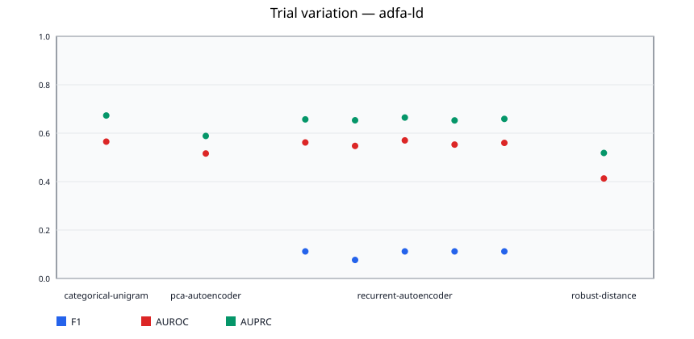

### adfa-ld / categorical-unigram

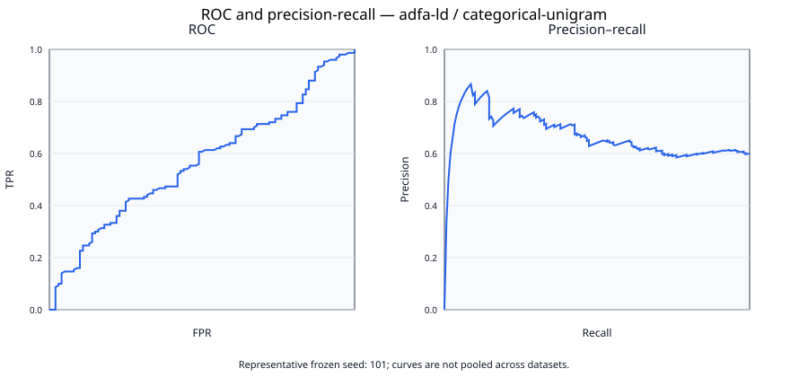

### adfa-ld / pca-autoencoder

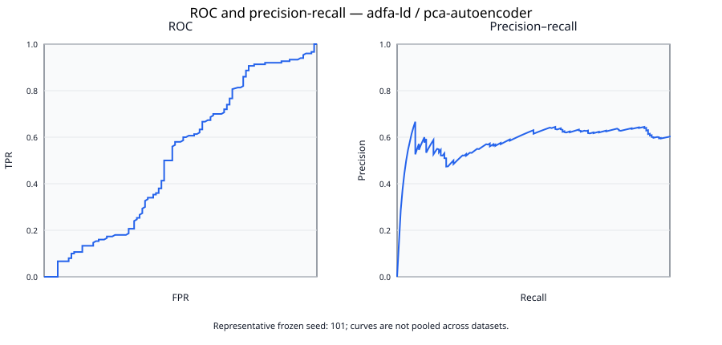

### adfa-ld / recurrent-autoencoder

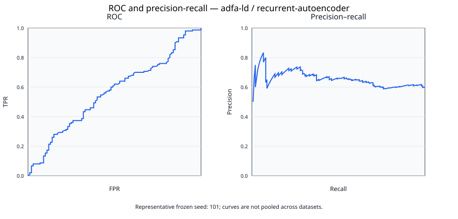

### adfa-ld / robust-distance

### hai-23.05

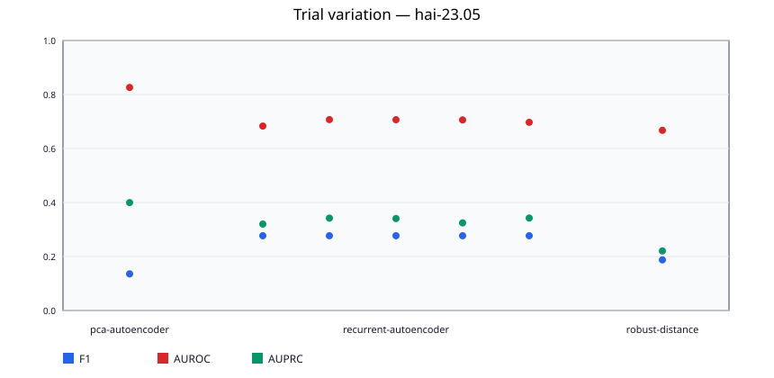

### hai-23.05 / pca-autoencoder

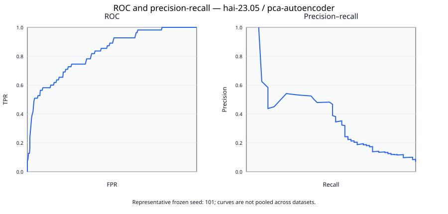

### hai-23.05 / recurrent-autoencoder

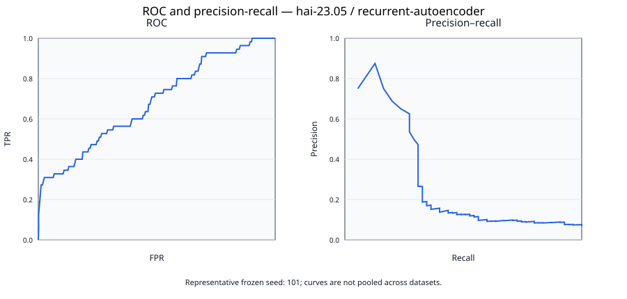

### hai-23.05 / robust-distance

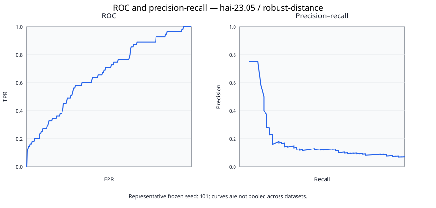

### lid-ds-2021

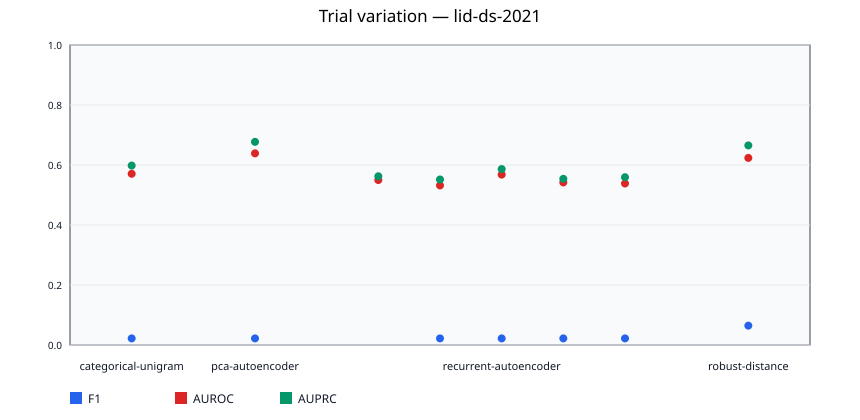

### lid-ds-2021 / categorical-unigram

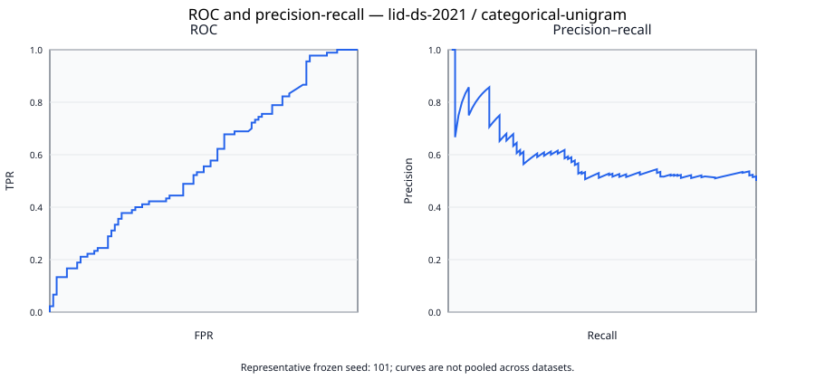

### lid-ds-2021 / pca-autoencoder

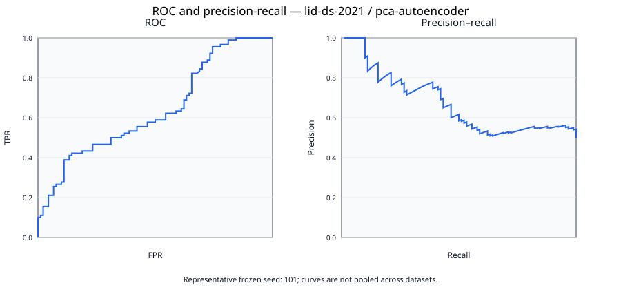

### lid-ds-2021 / recurrent-autoencoder

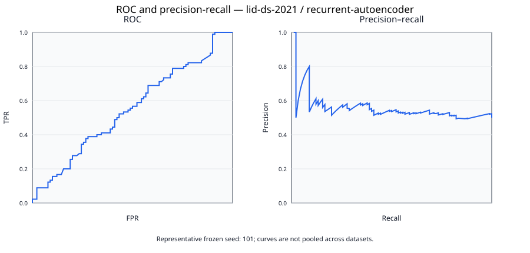

### lid-ds-2021 / robust-distance

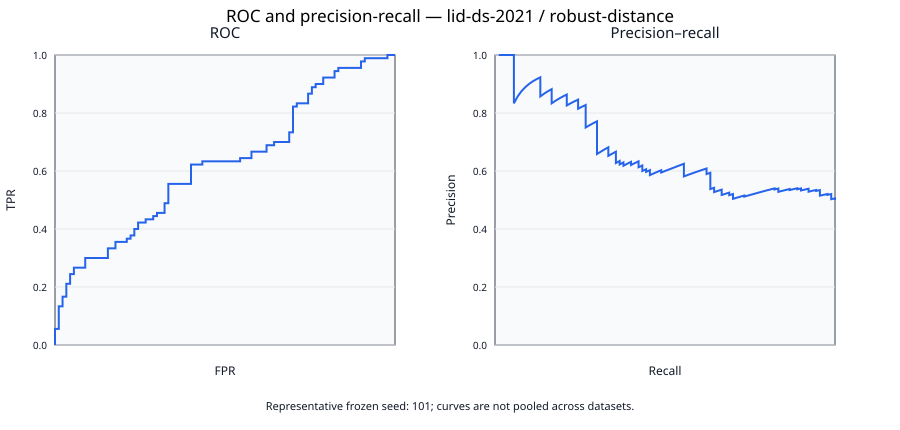

## Paired comparisons

| comparison | paired trials | mean difference | Cohen dz | raw p | Holm p |
| --- | --- | --- | --- | --- | --- |
| adfa-ld/categorical-unigram-vs-pca-autoencoder | 5 | 0.049000 | undefined | 0.062500 | 0.937500 |
| adfa-ld/categorical-unigram-vs-recurrent-autoencoder | 5 | 0.006667 | 0.765122 | 0.187500 | 0.937500 |
| adfa-ld/categorical-unigram-vs-robust-distance | 5 | 0.152133 | undefined | 0.062500 | 0.937500 |
| adfa-ld/pca-autoencoder-vs-recurrent-autoencoder | 5 | -0.042333 | -4.858524 | 0.062500 | 0.937500 |
| adfa-ld/pca-autoencoder-vs-robust-distance | 5 | 0.103133 | 6646971326355693.000000 | 0.062500 | 0.937500 |
| adfa-ld/recurrent-autoencoder-vs-robust-distance | 5 | 0.145467 | 16.694960 | 0.062500 | 0.937500 |
| hai-23.05/pca-autoencoder-vs-recurrent-autoencoder | 5 | 0.126170 | 12.253405 | 0.062500 | 0.937500 |
| hai-23.05/pca-autoencoder-vs-robust-distance | 5 | 0.158829 | undefined | 0.062500 | 0.937500 |
| hai-23.05/recurrent-autoencoder-vs-robust-distance | 5 | 0.032659 | 3.171787 | 0.062500 | 0.937500 |
| lid-ds-2021/categorical-unigram-vs-pca-autoencoder | 5 | -0.068025 | undefined | 0.062500 | 0.937500 |
| lid-ds-2021/categorical-unigram-vs-recurrent-autoencoder | 5 | 0.024802 | 1.787771 | 0.062500 | 0.937500 |
| lid-ds-2021/categorical-unigram-vs-robust-distance | 5 | -0.052778 | undefined | 0.062500 | 0.937500 |
| lid-ds-2021/pca-autoencoder-vs-recurrent-autoencoder | 5 | 0.092827 | 6.691014 | 0.062500 | 0.937500 |
| lid-ds-2021/pca-autoencoder-vs-robust-distance | 5 | 0.015247 | undefined | 0.062500 | 0.937500 |
| lid-ds-2021/recurrent-autoencoder-vs-robust-distance | 5 | -0.077580 | -5.592011 | 0.062500 | 0.937500 |

Comparisons use the frozen primary metric and paired sign-flip tests. Undefined comparisons are reported, not converted to zero. Holm adjustment controls family-wise error in this report.

## Repetition planning

| cell family | pilot trials | observed SD | target half-width | recommended total | mean fit CPU-s | projected fit CPU-h | reason |
| --- | --- | --- | --- | --- | --- | --- | --- |
| adfa-ld/categorical-unigram | 1 | undefined | 0.025000 | 1 | 0.000000 | 0.000000 | deterministic fit; uncertainty is estimated by unit bootstrap |
| adfa-ld/pca-autoencoder | 1 | undefined | 0.025000 | 1 | 0.109375 | 0.000030 | deterministic fit; uncertainty is estimated by unit bootstrap |
| adfa-ld/recurrent-autoencoder | 5 | 0.008713 | 0.025000 | 10 | 1407.478125 | 3.909661 | normal-approximation precision calculation from pilot SD |
| adfa-ld/robust-distance | 1 | undefined | 0.025000 | 1 | 0.031250 | 0.000009 | deterministic fit; uncertainty is estimated by unit bootstrap |
| hai-23.05/pca-autoencoder | 1 | undefined | 0.025000 | 1 | 0.156250 | 0.000043 | deterministic fit; uncertainty is estimated by unit bootstrap |
| hai-23.05/recurrent-autoencoder | 5 | 0.010297 | 0.025000 | 10 | 444.303125 | 1.234175 | normal-approximation precision calculation from pilot SD |
| hai-23.05/robust-distance | 1 | undefined | 0.025000 | 1 | 0.062500 | 0.000017 | deterministic fit; uncertainty is estimated by unit bootstrap |
| lid-ds-2021/categorical-unigram | 1 | undefined | 0.025000 | 1 | 0.000000 | 0.000000 | deterministic fit; uncertainty is estimated by unit bootstrap |
| lid-ds-2021/pca-autoencoder | 1 | undefined | 0.025000 | 1 | 0.046875 | 0.000013 | deterministic fit; uncertainty is estimated by unit bootstrap |
| lid-ds-2021/recurrent-autoencoder | 5 | 0.013873 | 0.025000 | 10 | 1482.043750 | 4.116788 | normal-approximation precision calculation from pilot SD |
| lid-ds-2021/robust-distance | 1 | undefined | 0.025000 | 1 | 0.031250 | 0.000009 | deterministic fit; uncertainty is estimated by unit bootstrap |

Epochs are optimization steps, not independent executions. The repetition count is derived from pilot dispersion subject to the predeclared minimum and maximum; it is never inferred from a round number in an older report. Cost projections cover fit at pilot support only and therefore are lower bounds when confirmatory dataset caps are larger.

## Reproducibility artifacts

- Machine-readable run table: `pilot-per-run-metrics.csv`
- Machine-readable aggregate table: `pilot-aggregate-metrics.csv`
- Machine-readable class table: `pilot-per-class-metrics.csv`
- Machine-readable threshold sensitivity: `pilot-threshold-sensitivity.csv`
- Machine-readable diagnostics: `pilot-diagnostics.csv`
- Custom-track readiness audit: `pilot-custom-track-readiness.json`
- Frozen configuration: `../frozen-config.json`
- Numerical core hashes: `../numerical-core-manifest.json`
- Each cell JSON records source, window, preprocessing, model, calibration, metric, timing, and artifact identities.
- Each JSONL prediction artifact contains one row per independent test unit with score, threshold, truth, and prediction.

## Interpretation boundary

Pilot results estimate feasibility and variance only; they must not be presented as final confirmatory evidence.
 Cross-dataset averages are intentionally absent because label semantics and sensing modalities differ.

### Dataset-specific limitations

- ADFA-LD: official validation normals are split into validation/test at raw-trace level; byte-identical copies and contradictory label hashes are excluded and counted.
- LID-DS 2021: published truth is recording-level, while a bounded label-blind sample of intact syscall sequences represents each recording; attack localization within a recording is unavailable.
- HAI-23.05: the unit is a fixed non-overlapping temporal block; a block is positive when it overlaps a published attack event, so block-level and row-level metrics are not interchangeable.
- Controlled custom campaign: the legacy two-instance result remains smoke evidence and is not admitted into this official-benchmark matrix. It requires a separately powered paired campaign.
