# Academic evaluation report — pilot

**Claim status:** EXPLORATORY PILOT — NOT ELIGIBLE FOR FINAL CLAIMS

This report retains every planned outcome, calibrates operating thresholds on validation data, and evaluates the untouched test partition once per frozen cell. It does not select a global champion across datasets or modalities.

## Executive audit

- Experiment: `thesis-evaluation-v2`
- Configuration identity: `sha256:23aa81cfb426dc4eb4d37b55c99a640d0bd7d93230d2b44dadb35b849b5782dd`
- Phase: `pilot`
- Completed cells available: 23
- Retained failed cells: 0
- Preflight gate: passed
- Full-protocol cost projection complete: `False`
- Phase preflight invocations costed: `1`
- Conservative full-protocol CPU-hours: `undefined` (ask-first threshold `440.000000`)
- Over-budget authorization recorded: `False`
- Generated (UTC): 2026-09-28T00:19:14.429268Z

### Admission and artifact-integrity gate

- Exact eligibility result: `blocked`
- Numeric-authority closure: `accountable`
- Evidence-origin closure: `pass`
- Pilot/confirmatory disjointness: `pass`
- Blocking reasons:
  - pilot evidence is exploratory by contract
  - complete finite computational-cost projection is not authenticated

| cell id | dataset | model | seed | status | expected rows | actual rows | expected SHA-256 | actual SHA-256 | evidence origin | prediction origins | raw reconstruction identity | reasons |
| --- | --- | --- | --- | --- | --- | --- | --- | --- | --- | --- | --- | --- |
| adfa-ld__categorical-unigram__seed-101__fe5ce75a7d6f | adfa-ld | categorical-unigram | 101 | pass | 250 | 250 | sha256:ace83651e078154f07d8267519b12b66a46cacc5639ba2de6639c2511db1addd | sha256:ace83651e078154f07d8267519b12b66a46cacc5639ba2de6639c2511db1addd | official_native | official_native | sha256:8621b34b041815b46a8fc41e08def3cf7fddee9a1027eb5657ec8014e006b60a | none |
| adfa-ld__pca-autoencoder__seed-101__902cc42c5cc2 | adfa-ld | pca-autoencoder | 101 | pass | 250 | 250 | sha256:cc6e0c9ed2189f21425f7b6f9e3f66f73deb729a333f63bc239b272ce2e02a46 | sha256:cc6e0c9ed2189f21425f7b6f9e3f66f73deb729a333f63bc239b272ce2e02a46 | official_native | official_native | sha256:bac2482e6ad38447d95ca95f1722292423a7f1046f33d7b050a1418eab73d3c5 | none |
| adfa-ld__recurrent-autoencoder__seed-101__3f5d5ee12e88 | adfa-ld | recurrent-autoencoder | 101 | pass | 250 | 250 | sha256:cc00a5391f4c9bfc16630fafc766fa945039c4370902e2a25acc444396b8c2ff | sha256:cc00a5391f4c9bfc16630fafc766fa945039c4370902e2a25acc444396b8c2ff | official_native | official_native | sha256:0854e9ff497a0755c3b9559770ea24ff15da944f61692225124ace303f157de5 | none |
| adfa-ld__recurrent-autoencoder__seed-211__9dbd5e44335b | adfa-ld | recurrent-autoencoder | 211 | pass | 250 | 250 | sha256:2258638b2ff5565891dc81f45199028bbc8f84b2990daefb38453716d1c06f04 | sha256:2258638b2ff5565891dc81f45199028bbc8f84b2990daefb38453716d1c06f04 | official_native | official_native | sha256:07261af0a03505b0f9969fb76ef0466bd6f73d13fc5170163116f7b365881836 | none |
| adfa-ld__recurrent-autoencoder__seed-307__f4daf0afc492 | adfa-ld | recurrent-autoencoder | 307 | pass | 250 | 250 | sha256:26244905d548d14c3c5a2da49657e7b59618fc53beca00117a2d33db153b1237 | sha256:26244905d548d14c3c5a2da49657e7b59618fc53beca00117a2d33db153b1237 | official_native | official_native | sha256:0f96f3023e4b893846d7c307ed796bfd41852c1dd3add3e50c97cb0ce5d861be | none |
| adfa-ld__recurrent-autoencoder__seed-419__bf909957f5f3 | adfa-ld | recurrent-autoencoder | 419 | pass | 250 | 250 | sha256:c76b623af2869124a4e4df8193f78fb66f023794f687e3700f9ccf611fee06ff | sha256:c76b623af2869124a4e4df8193f78fb66f023794f687e3700f9ccf611fee06ff | official_native | official_native | sha256:c5d7b3910aac1df7de6b1fd9d4d3b01456ac002a0901fb488e50def57eda881e | none |
| adfa-ld__recurrent-autoencoder__seed-523__537657f23a77 | adfa-ld | recurrent-autoencoder | 523 | pass | 250 | 250 | sha256:91b170582278adc28e114046aa09f20a7b804286ac9dabe984ec87197f141812 | sha256:91b170582278adc28e114046aa09f20a7b804286ac9dabe984ec87197f141812 | official_native | official_native | sha256:d788fdc41e9f18dcd3ffa749d3729b1ba2eece5e0a5787ea79563c68123e21d4 | none |
| adfa-ld__robust-distance__seed-101__27530761a2e1 | adfa-ld | robust-distance | 101 | pass | 250 | 250 | sha256:18d1f71ec33801c2c7157d03cc30b7f8247802846e8ede4191e27a1266871555 | sha256:18d1f71ec33801c2c7157d03cc30b7f8247802846e8ede4191e27a1266871555 | official_native | official_native | sha256:c724b5e3f6224180bf8080329948e11ac4b579aa4a73f0fd5f467cb65c44b384 | none |
| hai-23-05__pca-autoencoder__seed-101__1cc8f79d15aa | hai-23.05 | pca-autoencoder | 101 | pass | 800 | 800 | sha256:5c80504ccafd2737a713524f197e825cb3bab482e969eee67d4930723252bca8 | sha256:5c80504ccafd2737a713524f197e825cb3bab482e969eee67d4930723252bca8 | official_native | official_native | sha256:2fceb2bd0ebd97ea46adfca972f6a5183d2b9b40f7b9bf18d660ada66c8fe0ba | none |
| hai-23-05__recurrent-autoencoder__seed-101__7b1b149083e8 | hai-23.05 | recurrent-autoencoder | 101 | pass | 800 | 800 | sha256:6344db0a13ce1f0280ba963af1dddac711be7a9d9cb737a31c4d2fe3387e1612 | sha256:6344db0a13ce1f0280ba963af1dddac711be7a9d9cb737a31c4d2fe3387e1612 | official_native | official_native | sha256:4da806f71857740134b6e3bf04590a9f042dc8adf027e6c45da925434663b279 | none |
| hai-23-05__recurrent-autoencoder__seed-211__0a1b11169c46 | hai-23.05 | recurrent-autoencoder | 211 | pass | 800 | 800 | sha256:395a7b405a287db28bfdebcccb85d0e7c66db66e60a1392318516c5e2ce61a0b | sha256:395a7b405a287db28bfdebcccb85d0e7c66db66e60a1392318516c5e2ce61a0b | official_native | official_native | sha256:493de771c73cf7bb18460ad1c41eb0c738b0db125bec33d205a9e9f572139961 | none |
| hai-23-05__recurrent-autoencoder__seed-307__03b36ca28e64 | hai-23.05 | recurrent-autoencoder | 307 | pass | 800 | 800 | sha256:22c7c1fc4d8530dbe377d68199d617ab489846206c3fb3aa641caaa1a9797aba | sha256:22c7c1fc4d8530dbe377d68199d617ab489846206c3fb3aa641caaa1a9797aba | official_native | official_native | sha256:0f0d26b1432a858af18d084c4ec27f6fde46a49eba7be67623c5969d8c9ce091 | none |
| hai-23-05__recurrent-autoencoder__seed-419__0d8eb7f5cb98 | hai-23.05 | recurrent-autoencoder | 419 | pass | 800 | 800 | sha256:a293c8cc854a6d460fb0f28726d01de8e11f184725d0ad8244909c5ee87a7f46 | sha256:a293c8cc854a6d460fb0f28726d01de8e11f184725d0ad8244909c5ee87a7f46 | official_native | official_native | sha256:8b41ba77665b2c19ee12f0a2091e9e5bea6fcf5020a095aa028522fa90ce6e91 | none |
| hai-23-05__recurrent-autoencoder__seed-523__772ba4336d73 | hai-23.05 | recurrent-autoencoder | 523 | pass | 800 | 800 | sha256:75ecb6f5d1c8f8879fe52e477298ab815af3880b07709723d8f6a8b3c5ed059e | sha256:75ecb6f5d1c8f8879fe52e477298ab815af3880b07709723d8f6a8b3c5ed059e | official_native | official_native | sha256:3af0018b2d40d6d416245fd1eb8a5e50899f61c399aced860f7168dc15505517 | none |
| hai-23-05__robust-distance__seed-101__59c922a703f6 | hai-23.05 | robust-distance | 101 | pass | 800 | 800 | sha256:2bfa77ccaf1c82c0e3bb3b775ebf1bcd882643275927c5a77205da4073e93537 | sha256:2bfa77ccaf1c82c0e3bb3b775ebf1bcd882643275927c5a77205da4073e93537 | official_native | official_native | sha256:0edb7e58b494eaada51405afcee2351e0c533d7138897c48dc35df7c4ed27b89 | none |
| lid-ds-2021__categorical-unigram__seed-101__8effb9a9c381 | lid-ds-2021 | categorical-unigram | 101 | pass | 180 | 180 | sha256:9da026dd02d8efbe29486cbe701e153e1973f022b24902d6be4c3d500d4b81c0 | sha256:9da026dd02d8efbe29486cbe701e153e1973f022b24902d6be4c3d500d4b81c0 | official_native | official_native | sha256:82d9fe6c3199501a2df9ad98e7c0cbb993c47006706f5712c00ff83623749677 | none |
| lid-ds-2021__pca-autoencoder__seed-101__c765b8db963d | lid-ds-2021 | pca-autoencoder | 101 | pass | 180 | 180 | sha256:bf26a8ab525859b28cd091aa45387d813beca3671218f6f2ae69dfd210ad1247 | sha256:bf26a8ab525859b28cd091aa45387d813beca3671218f6f2ae69dfd210ad1247 | official_native | official_native | sha256:7892de91be91ef58901b96d2b7d519211966962cfb48ca84b9619903cf565b2f | none |
| lid-ds-2021__recurrent-autoencoder__seed-101__4f838981c571 | lid-ds-2021 | recurrent-autoencoder | 101 | pass | 180 | 180 | sha256:e20678026a3d0d6c4e1a797e7272275ea25c7c61f233ddb203eefa8a169080e8 | sha256:e20678026a3d0d6c4e1a797e7272275ea25c7c61f233ddb203eefa8a169080e8 | official_native | official_native | sha256:ca35ab436908a3e0bfea4e650cbe76d5a3f857e4e1dfd8563a350f4e65e76108 | none |
| lid-ds-2021__recurrent-autoencoder__seed-211__393900e4c2d5 | lid-ds-2021 | recurrent-autoencoder | 211 | pass | 180 | 180 | sha256:fc1955abd4e64daa99f8721a5bec2bd35f7d191b9c6b3b6d2aa29f6a8329dcbb | sha256:fc1955abd4e64daa99f8721a5bec2bd35f7d191b9c6b3b6d2aa29f6a8329dcbb | official_native | official_native | sha256:d0a7ce1114fa06e6f4b893bd359659ed443bf9791d527e964c5d928528bb5723 | none |
| lid-ds-2021__recurrent-autoencoder__seed-307__8aeb59eb78fb | lid-ds-2021 | recurrent-autoencoder | 307 | pass | 180 | 180 | sha256:a48bc0a0c0d0b73360dabba231afdd99a3f0e5cb430c0e4c3c1ffc409f0da384 | sha256:a48bc0a0c0d0b73360dabba231afdd99a3f0e5cb430c0e4c3c1ffc409f0da384 | official_native | official_native | sha256:6f9932bcd507422e57c4cd5806b0ef2e65e55f9c428b240c232d1d8ddaca5264 | none |
| lid-ds-2021__recurrent-autoencoder__seed-419__5a6f7f0fef37 | lid-ds-2021 | recurrent-autoencoder | 419 | pass | 180 | 180 | sha256:c68fc0a7230ed8eff9335d11abf6fa6ac08010009c946892ac7bd2fba09f69d8 | sha256:c68fc0a7230ed8eff9335d11abf6fa6ac08010009c946892ac7bd2fba09f69d8 | official_native | official_native | sha256:6d69e5621a18b96edb6f61142065d88649f23cb71f0ab03db6ed35c462bab0e7 | none |
| lid-ds-2021__recurrent-autoencoder__seed-523__4d899db21b17 | lid-ds-2021 | recurrent-autoencoder | 523 | pass | 180 | 180 | sha256:154595f7f786cec7290a5f8efe653a895ca55437efa29bd1764ffffb41c6406a | sha256:154595f7f786cec7290a5f8efe653a895ca55437efa29bd1764ffffb41c6406a | official_native | official_native | sha256:4d17f7516f010eab3eaec9093f752571a0e66021a4200db0428b8d0043176ae7 | none |
| lid-ds-2021__robust-distance__seed-101__3fbeb651f53c | lid-ds-2021 | robust-distance | 101 | pass | 180 | 180 | sha256:2d8734e2824aa73d865109f24a7b40fca78c8d24b0b21a72659f8bd126c3ebac | sha256:2d8734e2824aa73d865109f24a7b40fca78c8d24b0b21a72659f8bd126c3ebac | official_native | official_native | sha256:92efba226ded0bf4ce56e06ff482e60cba5ee14b67b435e76bcef0c9216275df | none |

### Why the previous matrix cannot support the thesis claim

The legacy report `cross-benchmark-comparison.md` (SHA-256 `sha256:716114d18c330c96ef0606e991c9a9315082ea21ba92fe00d4531219660f2db5`) is retained but not pooled. Each displayed legacy run is classified below; missing raw evidence remains explicit.

| legacy result | benchmark | model | classification | admissible | reason |
| --- | --- | --- | --- | --- | --- |
| run-hai-23.05-lstm-classifier-20260914T165229-dd571c76 | hai-23.05 | lstm-classifier | integration-smoke | no | outcome-selected row; no predeclared repetitions, validation-only score calibration, or uncertainty interval |
| run-lid-ds-2021-lstm-classifier-20260914T165610-be698260 | lid-ds-2021 | lstm-classifier | integration-smoke | no | outcome-selected row; no predeclared repetitions, validation-only score calibration, or uncertainty interval |
| run-adfa-ld-lstm-classifier-20260914T164724-e8f6e32a | adfa-ld | lstm-classifier | integration-smoke | no | outcome-selected row; no predeclared repetitions, validation-only score calibration, or uncertainty interval |
| run-custom-current-syscall-runtime-autoencoder-20260914T170021-cfc12359 | custom-current-syscall | runtime-lstm-autoencoder+edge-syscalls | integration-smoke | no | outcome-selected row; no predeclared repetitions, validation-only score calibration, or uncertainty interval |

### Controlled custom-track readiness

**Status:** BLOCKED — INTEGRATION-SMOKE ONLY

The existing files are integration evidence only. `faulty_edge_exclusion` is a cyber/availability condition, while every captured physical vector has zero malfunction, saturation, and cold-start flags; it cannot be relabelled as a physical anomaly. A new paired pilot must capture separate physical, syscall, replay, and pipeline-outcome truth for every run, then derive confirmatory repetitions from between-pair dispersion.

| campaigns | round rows | normal rows | edge-exclusion rows | rows with AE score | AE anomaly classifications | rows with physical quality flag | validation levels |
| --- | --- | --- | --- | --- | --- | --- | --- |
| 4 | 17 | 13 | 4 | 2 | 0 | 0 | runtime_valid_only:2 |

## Frozen experimental design

The `pilot` seed schedule is `[101, 211, 307, 419, 523]`. The primary metric is `auroc`; confidence level is `0.95`; unit-bootstrap replicates are `2000`. Cluster inference requires `5` class-carrying clusters per class and at least `1900` / `0.95` valid mixed-label replicates. The operating threshold method is `target-fpr` with target validation FPR `0.01`. Hyperparameters and dataset caps come from the content-addressed frozen configuration. Each deterministic dataset/model fit is executed once in this phase.

### Dataset protocols and sampling limits

| dataset | kind | protocol id | evidence origin | phase | phase caps | phase allocation | window | minimum support |
| --- | --- | --- | --- | --- | --- | --- | --- | --- |
| adfa-ld | adfa-ld | adfa-ld-native-normal-only-v2 | official_native | pilot | {"test_attack_per_class":30,"test_normal":100,"train":250,"validation":100} | {"counts":{"attack_per_class":30,"test_normal":100,"train":250,"validation":100},"offsets":{"attack_per_class":0,"test_normal":0,"train":0,"validation":0}} | {"aggregation":"p95","max_windows_per_unit":6,"sequence_length":128,"stride":64} | {"test_attack":100,"test_normal":50} |
| hai-23.05 | hai-23.05 | hai-23.05-native-file-temporal-block-v2 | official_native | pilot | {"test":{"total":800},"train":{"normal":360},"validation":{"normal":120}} | {"counts":{"test":800,"train":360,"validation":120},"offsets":{"test":0,"train":0,"validation":0}} | {"aggregation":"max","max_windows_per_unit":1,"sequence_length":128,"stride":128} | {"test_attack":20,"test_normal":700} |
| lid-ds-2021 | lid-ds-2021 | lid-ds-2021-native-recording-v4 | official_native | pilot | {"archives_per_scenario_partition":6} | {"counts":{"test-normal":6,"test-normal-and-attack":6,"training":6,"validation":6},"offsets":{"test-normal":0,"test-normal-and-attack":0,"training":0,"validation":0}} | {"aggregation":"max","max_windows_per_unit":8,"sequence_length":128,"stride":128} | {"test_attack":30,"test_normal":30} |

### Model and hyperparameter registry

| dataset | model | randomness | parameter | value | numeric authority |
| --- | --- | --- | --- | --- | --- |
| adfa-ld | categorical-unigram | deterministic | laplace_alpha | 1.0 | see authenticated ParameterEvidence.v1 gate |
| adfa-ld | pca-autoencoder | deterministic | hash_bins | 128 | see authenticated ParameterEvidence.v1 gate |
| adfa-ld | pca-autoencoder | deterministic | latent_dimensions | 16 | see authenticated ParameterEvidence.v1 gate |
| adfa-ld | recurrent-autoencoder | seeded | batch_size | 128 | see authenticated ParameterEvidence.v1 gate |
| adfa-ld | recurrent-autoencoder | seeded | embedding_dimensions | 16 | see authenticated ParameterEvidence.v1 gate |
| adfa-ld | recurrent-autoencoder | seeded | epochs | 12 | see authenticated ParameterEvidence.v1 gate |
| adfa-ld | recurrent-autoencoder | seeded | hidden_units | 32 | see authenticated ParameterEvidence.v1 gate |
| adfa-ld | recurrent-autoencoder | seeded | latent_units | 16 | see authenticated ParameterEvidence.v1 gate |
| adfa-ld | recurrent-autoencoder | seeded | learning_rate | 0.001 | see authenticated ParameterEvidence.v1 gate |
| adfa-ld | recurrent-autoencoder | seeded | min_delta | 1e-05 | see authenticated ParameterEvidence.v1 gate |
| adfa-ld | recurrent-autoencoder | seeded | patience | 3 | see authenticated ParameterEvidence.v1 gate |
| adfa-ld | robust-distance | deterministic | hash_bins | 128 | see authenticated ParameterEvidence.v1 gate |
| adfa-ld | robust-distance | deterministic | max_robust_z | 20.0 | see authenticated ParameterEvidence.v1 gate |
| hai-23.05 | pca-autoencoder | deterministic | latent_dimensions | 24 | see authenticated ParameterEvidence.v1 gate |
| hai-23.05 | recurrent-autoencoder | seeded | batch_size | 128 | see authenticated ParameterEvidence.v1 gate |
| hai-23.05 | recurrent-autoencoder | seeded | epochs | 12 | see authenticated ParameterEvidence.v1 gate |
| hai-23.05 | recurrent-autoencoder | seeded | hidden_units | 32 | see authenticated ParameterEvidence.v1 gate |
| hai-23.05 | recurrent-autoencoder | seeded | latent_units | 16 | see authenticated ParameterEvidence.v1 gate |
| hai-23.05 | recurrent-autoencoder | seeded | learning_rate | 0.001 | see authenticated ParameterEvidence.v1 gate |
| hai-23.05 | recurrent-autoencoder | seeded | min_delta | 1e-05 | see authenticated ParameterEvidence.v1 gate |
| hai-23.05 | recurrent-autoencoder | seeded | patience | 3 | see authenticated ParameterEvidence.v1 gate |
| hai-23.05 | robust-distance | deterministic | max_robust_z | 20.0 | see authenticated ParameterEvidence.v1 gate |
| lid-ds-2021 | categorical-unigram | deterministic | laplace_alpha | 1.0 | see authenticated ParameterEvidence.v1 gate |
| lid-ds-2021 | pca-autoencoder | deterministic | hash_bins | 128 | see authenticated ParameterEvidence.v1 gate |
| lid-ds-2021 | pca-autoencoder | deterministic | latent_dimensions | 16 | see authenticated ParameterEvidence.v1 gate |
| lid-ds-2021 | recurrent-autoencoder | seeded | batch_size | 128 | see authenticated ParameterEvidence.v1 gate |
| lid-ds-2021 | recurrent-autoencoder | seeded | embedding_dimensions | 16 | see authenticated ParameterEvidence.v1 gate |
| lid-ds-2021 | recurrent-autoencoder | seeded | epochs | 12 | see authenticated ParameterEvidence.v1 gate |
| lid-ds-2021 | recurrent-autoencoder | seeded | hidden_units | 32 | see authenticated ParameterEvidence.v1 gate |
| lid-ds-2021 | recurrent-autoencoder | seeded | latent_units | 16 | see authenticated ParameterEvidence.v1 gate |
| lid-ds-2021 | recurrent-autoencoder | seeded | learning_rate | 0.001 | see authenticated ParameterEvidence.v1 gate |
| lid-ds-2021 | recurrent-autoencoder | seeded | min_delta | 1e-05 | see authenticated ParameterEvidence.v1 gate |
| lid-ds-2021 | recurrent-autoencoder | seeded | patience | 3 | see authenticated ParameterEvidence.v1 gate |
| lid-ds-2021 | robust-distance | deterministic | hash_bins | 128 | see authenticated ParameterEvidence.v1 gate |
| lid-ds-2021 | robust-distance | deterministic | max_robust_z | 20.0 | see authenticated ParameterEvidence.v1 gate |

### Leakage and support gates

| dataset | status | train units | validation units | test normal | test attack | group overlap | window violations |
| --- | --- | --- | --- | --- | --- | --- | --- |
| adfa-ld | ready | 250 | 100 | 100 | 150 | 0 | 0 |
| hai-23.05 | ready | 360 | 120 | 759 | 41 | 0 | 0 |
| lid-ds-2021 | ready | 90 | 90 | 90 | 90 | 0 | 0 |

The independent unit is a trace/recording for ADFA-LD and LID-DS. HAI point estimates use non-overlapping temporal blocks, but recording-cluster uncertainty is emitted only when the declared minimum independent recordings is met; adjacent blocks are never declared independent. Across-seed intervals are a separate training-variability estimand. Windows are created only after partition assignment. Preprocessing parameters and categorical vocabulary are fitted on normal training units only.

## Aggregate results (no winner selection)

| dataset | dataset protocol | evidence origin | model | trials | deterministic | F1 mean [seed CI] | balanced accuracy mean [seed CI] | MCC mean [seed CI] | AUROC mean [seed CI] | AUPRC mean [seed CI] |
| --- | --- | --- | --- | --- | --- | --- | --- | --- | --- | --- |
| adfa-ld | adfa-ld-native-normal-only-v2 | official_native | categorical-unigram | 1 | True | 0.146341 | 0.530000 | 0.127843 | 0.565067 | 0.673037 |
| adfa-ld | adfa-ld-native-normal-only-v2 | official_native | pca-autoencoder | 1 | True | undefined | 0.490000 | -0.109985 | 0.516067 | 0.588522 |
| adfa-ld | adfa-ld-native-normal-only-v2 | official_native | recurrent-autoencoder | 5 | False | 0.148573 [0.138661, 0.158486] | 0.519333 [0.509028, 0.529639] | 0.078173 [0.032976, 0.123369] | 0.557493 [0.545547, 0.569440] | 0.659430 [0.653632, 0.665228] |
| adfa-ld | adfa-ld-native-normal-only-v2 | official_native | robust-distance | 1 | True | undefined | 0.495000 | -0.077615 | 0.412933 | 0.518251 |
| hai-23.05 | hai-23.05-native-file-temporal-block-v2 | official_native | pca-autoencoder | 1 | True | 0.358209 | 0.637119 | 0.341022 | 0.767666 | 0.307184 |
| hai-23.05 | hai-23.05-native-file-temporal-block-v2 | official_native | recurrent-autoencoder | 5 | False | 0.351335 [0.321998, 0.380672] | 0.654263 [0.649636, 0.658890] | 0.318111 [0.283714, 0.352508] | 0.722498 [0.715770, 0.729225] | 0.337167 [0.332416, 0.341917] |
| hai-23.05 | hai-23.05-native-file-temporal-block-v2 | official_native | robust-distance | 1 | True | 0.339623 | 0.607780 | 0.391045 | 0.714515 | 0.294203 |
| lid-ds-2021 | lid-ds-2021-native-recording-v4 | official_native | categorical-unigram | 1 | True | 0.021978 | 0.505556 | 0.074744 | 0.569321 | 0.595013 |
| lid-ds-2021 | lid-ds-2021-native-recording-v4 | official_native | pca-autoencoder | 1 | True | 0.021978 | 0.505556 | 0.074744 | 0.635864 | 0.674786 |
| lid-ds-2021 | lid-ds-2021-native-recording-v4 | official_native | recurrent-autoencoder | 5 | False | 0.029145 [-0.001691, 0.059981] | 0.504444 [0.498673, 0.510216] | 0.085162 [0.040334, 0.129991] | 0.543840 [0.517130, 0.570549] | 0.560219 [0.535715, 0.584722] |
| lid-ds-2021 | lid-ds-2021-native-recording-v4 | official_native | robust-distance | 1 | True | 0.105263 | 0.527778 | 0.169031 | 0.619136 | 0.662024 |

### adfa-ld: protocol-specific results

| dataset | dataset protocol | evidence origin | model | trials | deterministic | F1 mean [seed CI] | balanced accuracy mean [seed CI] | MCC mean [seed CI] | AUROC mean [seed CI] | AUPRC mean [seed CI] |
| --- | --- | --- | --- | --- | --- | --- | --- | --- | --- | --- |
| adfa-ld | adfa-ld-native-normal-only-v2 | official_native | categorical-unigram | 1 | True | 0.146341 | 0.530000 | 0.127843 | 0.565067 | 0.673037 |
| adfa-ld | adfa-ld-native-normal-only-v2 | official_native | pca-autoencoder | 1 | True | undefined | 0.490000 | -0.109985 | 0.516067 | 0.588522 |
| adfa-ld | adfa-ld-native-normal-only-v2 | official_native | recurrent-autoencoder | 5 | False | 0.148573 [0.138661, 0.158486] | 0.519333 [0.509028, 0.529639] | 0.078173 [0.032976, 0.123369] | 0.557493 [0.545547, 0.569440] | 0.659430 [0.653632, 0.665228] |
| adfa-ld | adfa-ld-native-normal-only-v2 | official_native | robust-distance | 1 | True | undefined | 0.495000 | -0.077615 | 0.412933 | 0.518251 |

### hai-23.05: protocol-specific results

| dataset | dataset protocol | evidence origin | model | trials | deterministic | F1 mean [seed CI] | balanced accuracy mean [seed CI] | MCC mean [seed CI] | AUROC mean [seed CI] | AUPRC mean [seed CI] |
| --- | --- | --- | --- | --- | --- | --- | --- | --- | --- | --- |
| hai-23.05 | hai-23.05-native-file-temporal-block-v2 | official_native | pca-autoencoder | 1 | True | 0.358209 | 0.637119 | 0.341022 | 0.767666 | 0.307184 |
| hai-23.05 | hai-23.05-native-file-temporal-block-v2 | official_native | recurrent-autoencoder | 5 | False | 0.351335 [0.321998, 0.380672] | 0.654263 [0.649636, 0.658890] | 0.318111 [0.283714, 0.352508] | 0.722498 [0.715770, 0.729225] | 0.337167 [0.332416, 0.341917] |
| hai-23.05 | hai-23.05-native-file-temporal-block-v2 | official_native | robust-distance | 1 | True | 0.339623 | 0.607780 | 0.391045 | 0.714515 | 0.294203 |

### lid-ds-2021: protocol-specific results

| dataset | dataset protocol | evidence origin | model | trials | deterministic | F1 mean [seed CI] | balanced accuracy mean [seed CI] | MCC mean [seed CI] | AUROC mean [seed CI] | AUPRC mean [seed CI] |
| --- | --- | --- | --- | --- | --- | --- | --- | --- | --- | --- |
| lid-ds-2021 | lid-ds-2021-native-recording-v4 | official_native | categorical-unigram | 1 | True | 0.021978 | 0.505556 | 0.074744 | 0.569321 | 0.595013 |
| lid-ds-2021 | lid-ds-2021-native-recording-v4 | official_native | pca-autoencoder | 1 | True | 0.021978 | 0.505556 | 0.074744 | 0.635864 | 0.674786 |
| lid-ds-2021 | lid-ds-2021-native-recording-v4 | official_native | recurrent-autoencoder | 5 | False | 0.029145 [-0.001691, 0.059981] | 0.504444 [0.498673, 0.510216] | 0.085162 [0.040334, 0.129991] | 0.543840 [0.517130, 0.570549] | 0.560219 [0.535715, 0.584722] |
| lid-ds-2021 | lid-ds-2021-native-recording-v4 | official_native | robust-distance | 1 | True | 0.105263 | 0.527778 | 0.169031 | 0.619136 | 0.662024 |

Across-seed intervals use Student-t uncertainty for genuine independent stochastic trials. A deterministic model is fitted once and is never copied across seed identifiers. Unit-bootstrap intervals are conditional on frozen sampled prevalence; cluster-bootstrap intervals preserve declared recording/event dependence. Display values use six decimals; JSON artifacts retain full precision.

## Every completed run

| dataset | dataset protocol | evidence origin | model | seed | test n | F1 | F1 unit-CI | balanced accuracy | balanced accuracy unit-CI | MCC | MCC unit-CI | AUROC | AUROC unit-CI | AUPRC | AUPRC unit-CI | FPR | FNR | threshold | validation normal | validation attack | validation FPR | bootstrap unit | independent clusters | minimum clusters required | cluster interval valid | cluster interval undefined reason | bootstrap qualification |
| --- | --- | --- | --- | --- | --- | --- | --- | --- | --- | --- | --- | --- | --- | --- | --- | --- | --- | --- | --- | --- | --- | --- | --- | --- | --- | --- | --- |
| adfa-ld | adfa-ld-native-normal-only-v2 | official_native | categorical-unigram | 101 | 250 | 0.146341 | [0.075000, 0.214286] | 0.530000 | [0.503333, 0.555000] | 0.127843 | [0.015924, 0.213504] | 0.565067 | [0.493258, 0.632693] | 0.673037 | [0.614754, 0.745161] | 0.020000 | 0.920000 | 5.856007 | 50 | 0 | 0.000000 | declared independent cluster | 250 | 5 | True | None | Whole clusters, never adjacent blocks, are resampled. Prevalence-sensitive intervals remain conditional on frozen per-class cluster support. |
| adfa-ld | adfa-ld-native-normal-only-v2 | official_native | pca-autoencoder | 101 | 250 | undefined | undefined | 0.490000 | [0.475000, 0.500000] | -0.109985 | undefined | 0.516067 | [0.441791, 0.593006] | 0.588522 | [0.543873, 0.655517] | 0.020000 | 1.000000 | 374.175516 | 50 | 0 | 0.000000 | declared independent cluster | 250 | 5 | True | None | Whole clusters, never adjacent blocks, are resampled. Prevalence-sensitive intervals remain conditional on frozen per-class cluster support. |
| adfa-ld | adfa-ld-native-normal-only-v2 | official_native | recurrent-autoencoder | 101 | 250 | 0.143713 | [0.073608, 0.210557] | 0.515000 | [0.483333, 0.545000] | 0.058380 | [-0.066194, 0.164255] | 0.561667 | [0.490930, 0.631668] | 0.656971 | [0.602206, 0.728184] | 0.050000 | 0.920000 | 5.330316 | 50 | 0 | 0.000000 | declared independent cluster | 250 | 5 | True | None | Whole clusters, never adjacent blocks, are resampled. Prevalence-sensitive intervals remain conditional on frozen per-class cluster support. |
| adfa-ld | adfa-ld-native-normal-only-v2 | official_native | recurrent-autoencoder | 211 | 250 | 0.145455 | [0.075460, 0.222222] | 0.525000 | [0.498333, 0.553333] | 0.103142 | [-0.007639, 0.197955] | 0.547400 | [0.475797, 0.619207] | 0.653204 | [0.599653, 0.723688] | 0.030000 | 0.920000 | 5.219590 | 50 | 0 | 0.000000 | declared independent cluster | 250 | 5 | True | None | Whole clusters, never adjacent blocks, are resampled. Prevalence-sensitive intervals remain conditional on frozen per-class cluster support. |
| adfa-ld | adfa-ld-native-normal-only-v2 | official_native | recurrent-autoencoder | 307 | 250 | 0.162791 | [0.093554, 0.237858] | 0.506667 | [0.471667, 0.540000] | 0.023057 | [-0.100557, 0.141732] | 0.570200 | [0.497525, 0.643942] | 0.664602 | [0.604933, 0.734910] | 0.080000 | 0.906667 | 5.293382 | 50 | 0 | 0.000000 | declared independent cluster | 250 | 5 | True | None | Whole clusters, never adjacent blocks, are resampled. Prevalence-sensitive intervals remain conditional on frozen per-class cluster support. |
| adfa-ld | adfa-ld-native-normal-only-v2 | official_native | recurrent-autoencoder | 419 | 250 | 0.145455 | [0.075472, 0.220963] | 0.525000 | [0.496667, 0.551667] | 0.103142 | [-0.014205, 0.198867] | 0.548333 | [0.475465, 0.618940] | 0.663365 | [0.604389, 0.727644] | 0.030000 | 0.920000 | 5.334234 | 50 | 0 | 0.000000 | declared independent cluster | 250 | 5 | True | None | Whole clusters, never adjacent blocks, are resampled. Prevalence-sensitive intervals remain conditional on frozen per-class cluster support. |
| adfa-ld | adfa-ld-native-normal-only-v2 | official_native | recurrent-autoencoder | 523 | 250 | 0.145455 | [0.075000, 0.219685] | 0.525000 | [0.498333, 0.553333] | 0.103142 | [-0.006487, 0.198867] | 0.559867 | [0.486863, 0.632142] | 0.659007 | [0.604640, 0.733532] | 0.030000 | 0.920000 | 5.369357 | 50 | 0 | 0.000000 | declared independent cluster | 250 | 5 | True | None | Whole clusters, never adjacent blocks, are resampled. Prevalence-sensitive intervals remain conditional on frozen per-class cluster support. |
| adfa-ld | adfa-ld-native-normal-only-v2 | official_native | robust-distance | 101 | 250 | undefined | undefined | 0.495000 | [0.485000, 0.500000] | -0.077615 | undefined | 0.412933 | [0.339858, 0.490974] | 0.518251 | [0.487334, 0.569787] | 0.010000 | 1.000000 | 12.772160 | 50 | 0 | 0.000000 | declared independent cluster | 250 | 5 | True | None | Whole clusters, never adjacent blocks, are resampled. Prevalence-sensitive intervals remain conditional on frozen per-class cluster support. |
| hai-23.05 | hai-23.05-native-file-temporal-block-v2 | official_native | pca-autoencoder | 101 | 800 | 0.358209 | undefined | 0.637119 | undefined | 0.341022 | undefined | 0.767666 | undefined | 0.307184 | undefined | 0.018445 | 0.707317 | 1.037700 | 44 | 0 | 0.000000 | declared independent cluster | 2 | 5 | False | at least 5 independent clusters are required; observed 2; at least 5 independent clusters carrying class 0 (normal) are required; observed 2; at least 5 independent clusters carrying class 1 (attack) are required; observed 2 | Whole clusters, never adjacent blocks, are resampled. Mixed-label clusters allow sampled prevalence to vary across replicates. |
| hai-23.05 | hai-23.05-native-file-temporal-block-v2 | official_native | recurrent-autoencoder | 101 | 800 | 0.363636 | undefined | 0.656239 | undefined | 0.332379 | undefined | 0.725859 | undefined | 0.334476 | undefined | 0.028986 | 0.658537 | 1.215797 | 44 | 0 | 0.000000 | declared independent cluster | 2 | 5 | False | at least 5 independent clusters are required; observed 2; at least 5 independent clusters carrying class 0 (normal) are required; observed 2; at least 5 independent clusters carrying class 1 (attack) are required; observed 2 | Whole clusters, never adjacent blocks, are resampled. Mixed-label clusters allow sampled prevalence to vary across replicates. |
| hai-23.05 | hai-23.05-native-file-temporal-block-v2 | official_native | recurrent-autoencoder | 211 | 800 | 0.341463 | undefined | 0.652945 | undefined | 0.305890 | undefined | 0.714258 | undefined | 0.340340 | undefined | 0.035573 | 0.658537 | 1.116390 | 44 | 0 | 0.000000 | declared independent cluster | 2 | 5 | False | at least 5 independent clusters are required; observed 2; at least 5 independent clusters carrying class 0 (normal) are required; observed 2; at least 5 independent clusters carrying class 1 (attack) are required; observed 2 | Whole clusters, never adjacent blocks, are resampled. Mixed-label clusters allow sampled prevalence to vary across replicates. |
| hai-23.05 | hai-23.05-native-file-temporal-block-v2 | official_native | recurrent-autoencoder | 307 | 800 | 0.373333 | undefined | 0.657556 | undefined | 0.344449 | undefined | 0.726984 | undefined | 0.335912 | undefined | 0.026350 | 0.658537 | 1.141861 | 44 | 0 | 0.000000 | declared independent cluster | 2 | 5 | False | at least 5 independent clusters are required; observed 2; at least 5 independent clusters carrying class 0 (normal) are required; observed 2; at least 5 independent clusters carrying class 1 (attack) are required; observed 2 | Whole clusters, never adjacent blocks, are resampled. Mixed-label clusters allow sampled prevalence to vary across replicates. |
| hai-23.05 | hai-23.05-native-file-temporal-block-v2 | official_native | recurrent-autoencoder | 419 | 800 | 0.363636 | undefined | 0.656239 | undefined | 0.332379 | undefined | 0.725698 | undefined | 0.333116 | undefined | 0.028986 | 0.658537 | 1.244120 | 44 | 0 | 0.000000 | declared independent cluster | 2 | 5 | False | at least 5 independent clusters are required; observed 2; at least 5 independent clusters carrying class 0 (normal) are required; observed 2; at least 5 independent clusters carrying class 1 (attack) are required; observed 2 | Whole clusters, never adjacent blocks, are resampled. Mixed-label clusters allow sampled prevalence to vary across replicates. |
| hai-23.05 | hai-23.05-native-file-temporal-block-v2 | official_native | recurrent-autoencoder | 523 | 800 | 0.314607 | undefined | 0.648334 | undefined | 0.275457 | undefined | 0.719689 | undefined | 0.341990 | undefined | 0.044796 | 0.658537 | 1.079373 | 44 | 0 | 0.000000 | declared independent cluster | 2 | 5 | False | at least 5 independent clusters are required; observed 2; at least 5 independent clusters carrying class 0 (normal) are required; observed 2; at least 5 independent clusters carrying class 1 (attack) are required; observed 2 | Whole clusters, never adjacent blocks, are resampled. Mixed-label clusters allow sampled prevalence to vary across replicates. |
| hai-23.05 | hai-23.05-native-file-temporal-block-v2 | official_native | robust-distance | 101 | 800 | 0.339623 | undefined | 0.607780 | undefined | 0.391045 | undefined | 0.714515 | undefined | 0.294203 | undefined | 0.003953 | 0.780488 | 11.569878 | 44 | 0 | 0.000000 | declared independent cluster | 2 | 5 | False | at least 5 independent clusters are required; observed 2; at least 5 independent clusters carrying class 0 (normal) are required; observed 2; at least 5 independent clusters carrying class 1 (attack) are required; observed 2 | Whole clusters, never adjacent blocks, are resampled. Mixed-label clusters allow sampled prevalence to vary across replicates. |
| lid-ds-2021 | lid-ds-2021-native-recording-v4 | official_native | categorical-unigram | 101 | 180 | 0.021978 | undefined | 0.505556 | [0.500000, 0.516667] | 0.074744 | undefined | 0.569321 | [0.486341, 0.651728] | 0.595013 | [0.525197, 0.683594] | 0.000000 | 0.988889 | 6.777361 | 45 | 0 | 0.000000 | declared independent cluster | 180 | 5 | True | None | Whole clusters, never adjacent blocks, are resampled. Prevalence-sensitive intervals remain conditional on frozen per-class cluster support. |
| lid-ds-2021 | lid-ds-2021-native-recording-v4 | official_native | pca-autoencoder | 101 | 180 | 0.021978 | undefined | 0.505556 | [0.500000, 0.516667] | 0.074744 | undefined | 0.635864 | [0.553799, 0.715998] | 0.674786 | [0.602057, 0.755110] | 0.000000 | 0.988889 | 528.277915 | 45 | 0 | 0.000000 | declared independent cluster | 180 | 5 | True | None | Whole clusters, never adjacent blocks, are resampled. Prevalence-sensitive intervals remain conditional on frozen per-class cluster support. |
| lid-ds-2021 | lid-ds-2021-native-recording-v4 | official_native | recurrent-autoencoder | 101 | 180 | undefined | undefined | 0.500000 | [0.500000, 0.500000] | undefined | undefined | 0.557716 | [0.472082, 0.643968] | 0.572190 | [0.504203, 0.660679] | 0.000000 | 1.000000 | 5.633221 | 45 | 0 | 0.000000 | declared independent cluster | 180 | 5 | True | None | Whole clusters, never adjacent blocks, are resampled. Prevalence-sensitive intervals remain conditional on frozen per-class cluster support. |
| lid-ds-2021 | lid-ds-2021-native-recording-v4 | official_native | recurrent-autoencoder | 211 | 180 | undefined | undefined | 0.500000 | [0.500000, 0.500000] | undefined | undefined | 0.513457 | [0.427346, 0.596119] | 0.531730 | [0.466617, 0.620886] | 0.000000 | 1.000000 | 5.727967 | 45 | 0 | 0.000000 | declared independent cluster | 180 | 5 | True | None | Whole clusters, never adjacent blocks, are resampled. Prevalence-sensitive intervals remain conditional on frozen per-class cluster support. |
| lid-ds-2021 | lid-ds-2021-native-recording-v4 | official_native | recurrent-autoencoder | 307 | 180 | 0.021978 | undefined | 0.505556 | [0.500000, 0.516667] | 0.074744 | undefined | 0.569568 | [0.482715, 0.652356] | 0.584177 | [0.511138, 0.672655] | 0.000000 | 0.988889 | 5.741326 | 45 | 0 | 0.000000 | declared independent cluster | 180 | 5 | True | None | Whole clusters, never adjacent blocks, are resampled. Prevalence-sensitive intervals remain conditional on frozen per-class cluster support. |
| lid-ds-2021 | lid-ds-2021-native-recording-v4 | official_native | recurrent-autoencoder | 419 | 180 | 0.043478 | undefined | 0.511111 | [0.500000, 0.527778] | 0.106000 | undefined | 0.543148 | [0.456912, 0.630127] | 0.557279 | [0.487604, 0.642994] | 0.000000 | 0.977778 | 5.726516 | 45 | 0 | 0.000000 | declared independent cluster | 180 | 5 | True | None | Whole clusters, never adjacent blocks, are resampled. Prevalence-sensitive intervals remain conditional on frozen per-class cluster support. |
| lid-ds-2021 | lid-ds-2021-native-recording-v4 | official_native | recurrent-autoencoder | 523 | 180 | 0.021978 | undefined | 0.505556 | [0.500000, 0.516667] | 0.074744 | undefined | 0.535309 | [0.451840, 0.618338] | 0.555717 | [0.486939, 0.640852] | 0.000000 | 0.988889 | 6.096340 | 45 | 0 | 0.000000 | declared independent cluster | 180 | 5 | True | None | Whole clusters, never adjacent blocks, are resampled. Prevalence-sensitive intervals remain conditional on frozen per-class cluster support. |
| lid-ds-2021 | lid-ds-2021-native-recording-v4 | official_native | robust-distance | 101 | 180 | 0.105263 | [0.043478, 0.181818] | 0.527778 | [0.505556, 0.550000] | 0.169031 | [0.106000, 0.229416] | 0.619136 | [0.539590, 0.704077] | 0.662024 | [0.590926, 0.746811] | 0.000000 | 0.944444 | 14.596419 | 45 | 0 | 0.000000 | declared independent cluster | 180 | 5 | True | None | Whole clusters, never adjacent blocks, are resampled. Prevalence-sensitive intervals remain conditional on frozen per-class cluster support. |

## Confusion matrices, score distributions, convergence, and cost

These diagnostics prevent equal headline metrics from hiding different error modes, score overlap, optimization histories, or resource costs.

| dataset | dataset protocol | evidence origin | model | seed | TN/FP/FN/TP | normal score median [IQR] | attack score median [IQR] | epochs planned/executed | loss first→last | val loss first→last | parameters | weight bytes | fit wall-s | fit CPU-s | test ms/window | model hash | prediction hash |
| --- | --- | --- | --- | --- | --- | --- | --- | --- | --- | --- | --- | --- | --- | --- | --- | --- | --- |
| adfa-ld | adfa-ld-native-normal-only-v2 | official_native | categorical-unigram | 101 | 98/2/138/12 | 3.375521 [3.251106, 3.946327] | 3.530231 [3.231267, 4.458503] | 0/0 | not iterative | not iterative | 121 | 968 | 0.055207 | 0.000000 | 0.001609 | sha256:13e24298051b9381f233f91fbb89c6f562787f9489ca38a2b0d46fbf999b08a4 | sha256:ace83651e078154f07d8267519b12b66a46cacc5639ba2de6639c2511db1addd |
| adfa-ld | adfa-ld-native-normal-only-v2 | official_native | pca-autoencoder | 101 | 98/2/150/0 | 0.478370 [0.223695, 3.228186] | 0.683676 [0.279257, 2.025387] | 0/1 | not iterative | not iterative | 2304 | 18432 | 0.162349 | 0.062500 | 0.014055 | sha256:72872d03f15f7001c657ecf51c9459b16d2591f6502f03676666ef88a87ab5f7 | sha256:cc6e0c9ed2189f21425f7b6f9e3f66f73deb729a333f63bc239b272ce2e02a46 |
| adfa-ld | adfa-ld-native-normal-only-v2 | official_native | recurrent-autoencoder | 101 | 95/5/138/12 | 3.412506 [3.263101, 3.869704] | 3.549806 [3.266181, 4.226112] | 12/12 | 4.742416 → 3.179147 | 4.740799 → 3.496894 | 14313 | 57252 | 245.317382 | 922.687500 | 4.902685 | sha256:a777a3887fddfdaaf7346de27999e8ab7a9ac318dd965deda7ff45011bdea58a | sha256:cc00a5391f4c9bfc16630fafc766fa945039c4370902e2a25acc444396b8c2ff |
| adfa-ld | adfa-ld-native-normal-only-v2 | official_native | recurrent-autoencoder | 211 | 97/3/138/12 | 3.432841 [3.329893, 3.873368] | 3.549983 [3.270609, 4.167025] | 12/12 | 4.743318 → 3.186456 | 4.740313 → 3.483350 | 14313 | 57252 | 10254.290472 | 1042.921875 | 7.073054 | sha256:daf623eaaca22c5738db9859035a819ebc4e9372bb9f9118463a373e8b41adf1 | sha256:2258638b2ff5565891dc81f45199028bbc8f84b2990daefb38453716d1c06f04 |
| adfa-ld | adfa-ld-native-normal-only-v2 | official_native | recurrent-autoencoder | 307 | 92/8/136/14 | 3.430643 [3.307261, 3.839746] | 3.597744 [3.270826, 4.318974] | 12/12 | 4.742660 → 3.181855 | 4.740354 → 3.502706 | 14313 | 57252 | 338.457648 | 1289.906250 | 9.155669 | sha256:b6a3cd721e6d1caf819456752039333257d3b3550497532b508b93e0d80b5184 | sha256:26244905d548d14c3c5a2da49657e7b59618fc53beca00117a2d33db153b1237 |
| adfa-ld | adfa-ld-native-normal-only-v2 | official_native | recurrent-autoencoder | 419 | 97/3/138/12 | 3.468267 [3.333025, 3.885767] | 3.606418 [3.315646, 4.325764] | 12/12 | 4.742050 → 3.181241 | 4.738492 → 3.482966 | 14313 | 57252 | 376.391316 | 1421.078125 | 7.784406 | sha256:df1354fdb539d41bb5f6144025afb0c0b84fd27d939e9a0aca553fdc557dc965 | sha256:c76b623af2869124a4e4df8193f78fb66f023794f687e3700f9ccf611fee06ff |
| adfa-ld | adfa-ld-native-normal-only-v2 | official_native | recurrent-autoencoder | 523 | 97/3/138/12 | 3.415927 [3.283193, 3.877966] | 3.554150 [3.266742, 4.289006] | 12/12 | 4.742870 → 3.184908 | 4.741827 → 3.511708 | 14313 | 57252 | 372.013702 | 1414.765625 | 7.539544 | sha256:223fb7be56c3306408d9406b2fc9aabfd58554ee6887180482410ffbf2172810 | sha256:91b170582278adc28e114046aa09f20a7b804286ac9dabe984ec87197f141812 |
| adfa-ld | adfa-ld-native-normal-only-v2 | official_native | robust-distance | 101 | 99/1/150/0 | 1.652162 [0.527812, 3.598858] | 0.952093 [0.530330, 2.414374] | 0/0 | not iterative | not iterative | 256 | 2048 | 0.147407 | 0.062500 | 0.015261 | sha256:8355117d3539aad489577aa9b3e6a896c94d433696168be78e5ac8f4cfb0cc65 | sha256:18d1f71ec33801c2c7157d03cc30b7f8247802846e8ede4191e27a1266871555 |
| hai-23.05 | hai-23.05-native-file-temporal-block-v2 | official_native | pca-autoencoder | 101 | 745/14/29/12 | 0.204126 [0.165072, 0.258989] | 0.332881 [0.228468, 1.337167] | 0/1 | not iterative | not iterative | 11180 | 89440 | 0.389201 | 0.328125 | 0.309918 | sha256:9b8419971be3d803d2045ed510c3f0b15f19a87f47c3441919fd0a0917c88356 | sha256:5c80504ccafd2737a713524f197e825cb3bab482e969eee67d4930723252bca8 |
| hai-23.05 | hai-23.05-native-file-temporal-block-v2 | official_native | recurrent-autoencoder | 101 | 737/22/27/14 | 0.649379 [0.548584, 0.790319] | 0.859321 [0.643633, 1.562113] | 12/12 | 0.768825 → 0.666317 | 0.830069 → 0.741757 | 15702 | 62808 | 139.387939 | 534.656250 | 7.047759 | sha256:a85b9ccef05d1a2f7bc54034bfb4d5a6f05ed6d635a3f31a23af115005d29058 | sha256:6344db0a13ce1f0280ba963af1dddac711be7a9d9cb737a31c4d2fe3387e1612 |
| hai-23.05 | hai-23.05-native-file-temporal-block-v2 | official_native | recurrent-autoencoder | 211 | 732/27/27/14 | 0.648568 [0.560826, 0.791454] | 0.803369 [0.640505, 1.506615] | 12/12 | 0.763892 → 0.655088 | 0.828347 → 0.742353 | 15702 | 62808 | 153.905969 | 577.859375 | 7.350351 | sha256:84f98c6fa0645356d4c3751cd2adeb4b25bc89f968a6357d178598ef8300fd54 | sha256:395a7b405a287db28bfdebcccb85d0e7c66db66e60a1392318516c5e2ce61a0b |
| hai-23.05 | hai-23.05-native-file-temporal-block-v2 | official_native | recurrent-autoencoder | 307 | 739/20/27/14 | 0.649759 [0.564325, 0.787149] | 0.801849 [0.654870, 1.440357] | 12/12 | 0.766299 → 0.659199 | 0.822134 → 0.736051 | 15702 | 62808 | 137.346865 | 529.515625 | 7.017286 | sha256:390235cddaf557577c63cab652c32be5c1da09b3f95353de25da8056d753daee | sha256:22c7c1fc4d8530dbe377d68199d617ab489846206c3fb3aa641caaa1a9797aba |
| hai-23.05 | hai-23.05-native-file-temporal-block-v2 | official_native | recurrent-autoencoder | 419 | 737/22/27/14 | 0.638221 [0.552048, 0.806986] | 0.827349 [0.678267, 1.575882] | 12/12 | 0.767962 → 0.664028 | 0.827604 → 0.739492 | 15702 | 62808 | 137.263847 | 527.296875 | 6.414187 | sha256:9719ac87beadc1e4a283550f3ea84c73d386e7b4a0d65205f444bd44947e9213 | sha256:a293c8cc854a6d460fb0f28726d01de8e11f184725d0ad8244909c5ee87a7f46 |
| hai-23.05 | hai-23.05-native-file-temporal-block-v2 | official_native | recurrent-autoencoder | 523 | 725/34/27/14 | 0.653559 [0.562348, 0.811194] | 0.888410 [0.659461, 1.547106] | 12/12 | 0.768250 → 0.659600 | 0.833006 → 0.753252 | 15702 | 62808 | 140.391596 | 542.828125 | 6.584490 | sha256:5919d138c4081dfe348d1dce98af2aa729f41399710796a860fe295f8fc70db1 | sha256:75ecb6f5d1c8f8879fe52e477298ab815af3880b07709723d8f6a8b3c5ed059e |
| hai-23.05 | hai-23.05-native-file-temporal-block-v2 | official_native | robust-distance | 101 | 756/3/32/9 | 4.894957 [3.688357, 6.386969] | 6.983053 [5.201541, 8.996202] | 0/0 | not iterative | not iterative | 860 | 6880 | 0.066171 | 0.078125 | 0.179486 | sha256:21b3183571e402d1941e8fb95e959dd14f0b80f8352cf12f1daa5e0d8c26f94c | sha256:2bfa77ccaf1c82c0e3bb3b775ebf1bcd882643275927c5a77205da4073e93537 |
| lid-ds-2021 | lid-ds-2021-native-recording-v4 | official_native | categorical-unigram | 101 | 90/0/89/1 | 3.927722 [3.538038, 4.247645] | 3.965010 [3.711609, 4.405465] | 0/0 | not iterative | not iterative | 98 | 784 | 0.001075 | 0.000000 | 0.003572 | sha256:751f4b65811a0e8a9f22b722ef0538df803dab8ae7d2761c7d143ff72aaf57f1 | sha256:9da026dd02d8efbe29486cbe701e153e1973f022b24902d6be4c3d500d4b81c0 |
| lid-ds-2021 | lid-ds-2021-native-recording-v4 | official_native | pca-autoencoder | 101 | 90/0/89/1 | 0.799256 [0.287522, 1.887935] | 1.631707 [0.398294, 6.250888] | 0/1 | not iterative | not iterative | 2304 | 18432 | 0.072842 | 0.125000 | 0.024132 | sha256:ed748c81ceb28bcb2950072687b9c01b93f31fbd19ee4a494aaef7d7e6636d39 | sha256:bf26a8ab525859b28cd091aa45387d813beca3671218f6f2ae69dfd210ad1247 |
| lid-ds-2021 | lid-ds-2021-native-recording-v4 | official_native | recurrent-autoencoder | 101 | 90/0/90/0 | 4.128816 [3.545860, 4.403757] | 4.135740 [3.741645, 4.496899] | 12/12 | 4.559123 → 3.464891 | 4.512004 → 3.433543 | 13186 | 52744 | 329.528159 | 1278.531250 | 6.746376 | sha256:6d109e6113f5e990eecc9b1847b221250795088f044fd7b76a90ca7dc84fbdcc | sha256:e20678026a3d0d6c4e1a797e7272275ea25c7c61f233ddb203eefa8a169080e8 |
| lid-ds-2021 | lid-ds-2021-native-recording-v4 | official_native | recurrent-autoencoder | 211 | 90/0/90/0 | 4.017081 [3.520529, 4.259795] | 3.963956 [3.745582, 4.285945] | 12/12 | 4.558848 → 3.389538 | 4.511956 → 3.339012 | 13186 | 52744 | 336.851194 | 1305.593750 | 7.010882 | sha256:d15329c26a5d7b542f413d4a038d478b2c300365b29051188b051fba9ef76b5a | sha256:fc1955abd4e64daa99f8721a5bec2bd35f7d191b9c6b3b6d2aa29f6a8329dcbb |
| lid-ds-2021 | lid-ds-2021-native-recording-v4 | official_native | recurrent-autoencoder | 307 | 90/0/89/1 | 4.044816 [3.668444, 4.351983] | 4.135747 [3.765088, 4.449255] | 12/12 | 4.559356 → 3.475297 | 4.511042 → 3.452900 | 13186 | 52744 | 333.864824 | 1303.234375 | 6.778580 | sha256:d00fd82488ed2a805326b1706989f580256d3ed22df7c86fdb2f71bab4ed3c1c | sha256:a48bc0a0c0d0b73360dabba231afdd99a3f0e5cb430c0e4c3c1ffc409f0da384 |
| lid-ds-2021 | lid-ds-2021-native-recording-v4 | official_native | recurrent-autoencoder | 419 | 90/0/88/2 | 4.014015 [3.777618, 4.337911] | 4.036406 [3.789624, 4.355686] | 12/12 | 4.554799 → 3.466201 | 4.501462 → 3.444927 | 13186 | 52744 | 340.787234 | 1327.703125 | 6.907719 | sha256:ca928d199a6ff5c96350381c6dfe114de7f59a8db3b5418a0eeb9d9b38684d4c | sha256:c68fc0a7230ed8eff9335d11abf6fa6ac08010009c946892ac7bd2fba09f69d8 |
| lid-ds-2021 | lid-ds-2021-native-recording-v4 | official_native | recurrent-autoencoder | 523 | 90/0/89/1 | 4.009876 [3.563287, 4.333125] | 4.032046 [3.727657, 4.374688] | 12/12 | 4.558507 → 3.440757 | 4.511174 → 3.407146 | 13186 | 52744 | 337.656455 | 1315.187500 | 6.854387 | sha256:b6a62170494294586ec78be9bf82a457a29e660e94bd6b7988d2d126f135b064 | sha256:154595f7f786cec7290a5f8efe653a895ca55437efa29bd1764ffffb41c6406a |
| lid-ds-2021 | lid-ds-2021-native-recording-v4 | official_native | robust-distance | 101 | 90/0/85/5 | 2.245725 [0.990283, 3.381550] | 3.141596 [1.221049, 6.128447] | 0/0 | not iterative | not iterative | 256 | 2048 | 0.031197 | 0.031250 | 0.019310 | sha256:57cda94d7ecb12f34fa62dbcbb9459863bc64e7a46802f23809f83faa8d8e446 | sha256:2d8734e2824aa73d865109f24a7b40fca78c8d24b0b21a72659f8bd126c3ebac |

## Threshold calibration and anomaly scores

Thresholds below are frozen from validation scores only. Scores always use the same direction: larger means more anomalous. Test truth is used only after threshold freezing.

| dataset | model | seed | threshold | validation normal | validation attack | attained validation FPR | test FPR | test FNR |
| --- | --- | --- | --- | --- | --- | --- | --- | --- |
| adfa-ld | categorical-unigram | 101 | 5.856007 | 50 | 0 | 0.000000 | 0.020000 | 0.920000 |
| adfa-ld | pca-autoencoder | 101 | 374.175516 | 50 | 0 | 0.000000 | 0.020000 | 1.000000 |
| adfa-ld | recurrent-autoencoder | 101 | 5.330316 | 50 | 0 | 0.000000 | 0.050000 | 0.920000 |
| adfa-ld | recurrent-autoencoder | 211 | 5.219590 | 50 | 0 | 0.000000 | 0.030000 | 0.920000 |
| adfa-ld | recurrent-autoencoder | 307 | 5.293382 | 50 | 0 | 0.000000 | 0.080000 | 0.906667 |
| adfa-ld | recurrent-autoencoder | 419 | 5.334234 | 50 | 0 | 0.000000 | 0.030000 | 0.920000 |
| adfa-ld | recurrent-autoencoder | 523 | 5.369357 | 50 | 0 | 0.000000 | 0.030000 | 0.920000 |
| adfa-ld | robust-distance | 101 | 12.772160 | 50 | 0 | 0.000000 | 0.010000 | 1.000000 |
| hai-23.05 | pca-autoencoder | 101 | 1.037700 | 44 | 0 | 0.000000 | 0.018445 | 0.707317 |
| hai-23.05 | recurrent-autoencoder | 101 | 1.215797 | 44 | 0 | 0.000000 | 0.028986 | 0.658537 |
| hai-23.05 | recurrent-autoencoder | 211 | 1.116390 | 44 | 0 | 0.000000 | 0.035573 | 0.658537 |
| hai-23.05 | recurrent-autoencoder | 307 | 1.141861 | 44 | 0 | 0.000000 | 0.026350 | 0.658537 |
| hai-23.05 | recurrent-autoencoder | 419 | 1.244120 | 44 | 0 | 0.000000 | 0.028986 | 0.658537 |
| hai-23.05 | recurrent-autoencoder | 523 | 1.079373 | 44 | 0 | 0.000000 | 0.044796 | 0.658537 |
| hai-23.05 | robust-distance | 101 | 11.569878 | 44 | 0 | 0.000000 | 0.003953 | 0.780488 |
| lid-ds-2021 | categorical-unigram | 101 | 6.777361 | 45 | 0 | 0.000000 | 0.000000 | 0.988889 |
| lid-ds-2021 | pca-autoencoder | 101 | 528.277915 | 45 | 0 | 0.000000 | 0.000000 | 0.988889 |
| lid-ds-2021 | recurrent-autoencoder | 101 | 5.633221 | 45 | 0 | 0.000000 | 0.000000 | 1.000000 |
| lid-ds-2021 | recurrent-autoencoder | 211 | 5.727967 | 45 | 0 | 0.000000 | 0.000000 | 1.000000 |
| lid-ds-2021 | recurrent-autoencoder | 307 | 5.741326 | 45 | 0 | 0.000000 | 0.000000 | 0.988889 |
| lid-ds-2021 | recurrent-autoencoder | 419 | 5.726516 | 45 | 0 | 0.000000 | 0.000000 | 0.977778 |
| lid-ds-2021 | recurrent-autoencoder | 523 | 6.096340 | 45 | 0 | 0.000000 | 0.000000 | 0.988889 |
| lid-ds-2021 | robust-distance | 101 | 14.596419 | 45 | 0 | 0.000000 | 0.000000 | 0.944444 |

### Predeclared threshold sensitivity on the blind test set

Each row applies a threshold that was derived only from a validation-normal quantile. The test labels are used to evaluate those already-fixed operating points, never to choose one.

| dataset | model | seed | validation normal quantile | threshold | attained validation FPR | test FPR | test recall | test precision | test F1 | test balanced accuracy |
| --- | --- | --- | --- | --- | --- | --- | --- | --- | --- | --- |
| adfa-ld | categorical-unigram | 101 | 0.900000 | 4.147822 | 0.100000 | 0.190000 | 0.326667 | 0.720588 | 0.449541 | 0.568333 |
| adfa-ld | categorical-unigram | 101 | 0.950000 | 5.112247 | 0.040000 | 0.090000 | 0.153333 | 0.718750 | 0.252747 | 0.531667 |
| adfa-ld | categorical-unigram | 101 | 0.975000 | 5.522934 | 0.020000 | 0.030000 | 0.093333 | 0.823529 | 0.167665 | 0.531667 |
| adfa-ld | categorical-unigram | 101 | 0.990000 | 5.856007 | 0.000000 | 0.020000 | 0.080000 | 0.857143 | 0.146341 | 0.530000 |
| adfa-ld | categorical-unigram | 101 | 0.995000 | 5.856007 | 0.000000 | 0.020000 | 0.080000 | 0.857143 | 0.146341 | 0.530000 |
| adfa-ld | pca-autoencoder | 101 | 0.900000 | 10.737870 | 0.100000 | 0.120000 | 0.106667 | 0.571429 | 0.179775 | 0.493333 |
| adfa-ld | pca-autoencoder | 101 | 0.950000 | 82.894300 | 0.040000 | 0.030000 | 0.000000 | 0.000000 | undefined | 0.485000 |
| adfa-ld | pca-autoencoder | 101 | 0.975000 | 243.933397 | 0.020000 | 0.020000 | 0.000000 | 0.000000 | undefined | 0.490000 |
| adfa-ld | pca-autoencoder | 101 | 0.990000 | 374.175516 | 0.000000 | 0.020000 | 0.000000 | 0.000000 | undefined | 0.490000 |
| adfa-ld | pca-autoencoder | 101 | 0.995000 | 374.175516 | 0.000000 | 0.020000 | 0.000000 | 0.000000 | undefined | 0.490000 |
| adfa-ld | recurrent-autoencoder | 101 | 0.900000 | 4.177128 | 0.100000 | 0.150000 | 0.266667 | 0.727273 | 0.390244 | 0.558333 |
| adfa-ld | recurrent-autoencoder | 101 | 0.950000 | 4.730909 | 0.040000 | 0.090000 | 0.133333 | 0.689655 | 0.223464 | 0.521667 |
| adfa-ld | recurrent-autoencoder | 101 | 0.975000 | 5.075223 | 0.020000 | 0.080000 | 0.086667 | 0.619048 | 0.152047 | 0.503333 |
| adfa-ld | recurrent-autoencoder | 101 | 0.990000 | 5.330316 | 0.000000 | 0.050000 | 0.080000 | 0.705882 | 0.143713 | 0.515000 |
| adfa-ld | recurrent-autoencoder | 101 | 0.995000 | 5.330316 | 0.000000 | 0.050000 | 0.080000 | 0.705882 | 0.143713 | 0.515000 |
| adfa-ld | recurrent-autoencoder | 211 | 0.900000 | 4.129481 | 0.100000 | 0.190000 | 0.266667 | 0.677966 | 0.382775 | 0.538333 |
| adfa-ld | recurrent-autoencoder | 211 | 0.950000 | 4.586193 | 0.040000 | 0.100000 | 0.133333 | 0.666667 | 0.222222 | 0.516667 |
| adfa-ld | recurrent-autoencoder | 211 | 0.975000 | 4.941872 | 0.020000 | 0.090000 | 0.086667 | 0.590909 | 0.151163 | 0.498333 |
| adfa-ld | recurrent-autoencoder | 211 | 0.990000 | 5.219590 | 0.000000 | 0.030000 | 0.080000 | 0.800000 | 0.145455 | 0.525000 |
| adfa-ld | recurrent-autoencoder | 211 | 0.995000 | 5.219590 | 0.000000 | 0.030000 | 0.080000 | 0.800000 | 0.145455 | 0.525000 |
| adfa-ld | recurrent-autoencoder | 307 | 0.900000 | 4.184244 | 0.100000 | 0.190000 | 0.293333 | 0.698413 | 0.413146 | 0.551667 |
| adfa-ld | recurrent-autoencoder | 307 | 0.950000 | 4.735349 | 0.040000 | 0.100000 | 0.140000 | 0.677419 | 0.232044 | 0.520000 |
| adfa-ld | recurrent-autoencoder | 307 | 0.975000 | 5.028625 | 0.020000 | 0.090000 | 0.093333 | 0.608696 | 0.161850 | 0.501667 |
| adfa-ld | recurrent-autoencoder | 307 | 0.990000 | 5.293382 | 0.000000 | 0.080000 | 0.093333 | 0.636364 | 0.162791 | 0.506667 |
| adfa-ld | recurrent-autoencoder | 307 | 0.995000 | 5.293382 | 0.000000 | 0.080000 | 0.093333 | 0.636364 | 0.162791 | 0.506667 |
| adfa-ld | recurrent-autoencoder | 419 | 0.900000 | 4.137065 | 0.100000 | 0.170000 | 0.313333 | 0.734375 | 0.439252 | 0.571667 |
| adfa-ld | recurrent-autoencoder | 419 | 0.950000 | 4.699579 | 0.040000 | 0.090000 | 0.133333 | 0.689655 | 0.223464 | 0.521667 |
| adfa-ld | recurrent-autoencoder | 419 | 0.975000 | 5.092856 | 0.020000 | 0.080000 | 0.086667 | 0.619048 | 0.152047 | 0.503333 |
| adfa-ld | recurrent-autoencoder | 419 | 0.990000 | 5.334234 | 0.000000 | 0.030000 | 0.080000 | 0.800000 | 0.145455 | 0.525000 |
| adfa-ld | recurrent-autoencoder | 419 | 0.995000 | 5.334234 | 0.000000 | 0.030000 | 0.080000 | 0.800000 | 0.145455 | 0.525000 |
| adfa-ld | recurrent-autoencoder | 523 | 0.900000 | 4.169723 | 0.100000 | 0.160000 | 0.293333 | 0.733333 | 0.419048 | 0.566667 |
| adfa-ld | recurrent-autoencoder | 523 | 0.950000 | 4.829925 | 0.040000 | 0.100000 | 0.120000 | 0.642857 | 0.202247 | 0.510000 |
| adfa-ld | recurrent-autoencoder | 523 | 0.975000 | 5.160665 | 0.020000 | 0.080000 | 0.093333 | 0.636364 | 0.162791 | 0.506667 |
| adfa-ld | recurrent-autoencoder | 523 | 0.990000 | 5.369357 | 0.000000 | 0.030000 | 0.080000 | 0.800000 | 0.145455 | 0.525000 |
| adfa-ld | recurrent-autoencoder | 523 | 0.995000 | 5.369357 | 0.000000 | 0.030000 | 0.080000 | 0.800000 | 0.145455 | 0.525000 |
| adfa-ld | robust-distance | 101 | 0.900000 | 5.130787 | 0.100000 | 0.110000 | 0.026667 | 0.266667 | 0.048485 | 0.458333 |
| adfa-ld | robust-distance | 101 | 0.950000 | 6.840779 | 0.040000 | 0.020000 | 0.000000 | 0.000000 | undefined | 0.490000 |
| adfa-ld | robust-distance | 101 | 0.975000 | 10.035682 | 0.020000 | 0.010000 | 0.000000 | 0.000000 | undefined | 0.495000 |
| adfa-ld | robust-distance | 101 | 0.990000 | 12.772160 | 0.000000 | 0.010000 | 0.000000 | 0.000000 | undefined | 0.495000 |
| adfa-ld | robust-distance | 101 | 0.995000 | 12.772160 | 0.000000 | 0.010000 | 0.000000 | 0.000000 | undefined | 0.495000 |
| hai-23.05 | pca-autoencoder | 101 | 0.900000 | 0.422052 | 0.090909 | 0.060606 | 0.390244 | 0.258065 | 0.310680 | 0.664819 |
| hai-23.05 | pca-autoencoder | 101 | 0.950000 | 0.739256 | 0.045455 | 0.023715 | 0.341463 | 0.437500 | 0.383562 | 0.658874 |
| hai-23.05 | pca-autoencoder | 101 | 0.975000 | 0.889716 | 0.022727 | 0.022398 | 0.292683 | 0.413793 | 0.342857 | 0.635143 |
| hai-23.05 | pca-autoencoder | 101 | 0.990000 | 1.037700 | 0.000000 | 0.018445 | 0.292683 | 0.461538 | 0.358209 | 0.637119 |
| hai-23.05 | pca-autoencoder | 101 | 0.995000 | 1.037700 | 0.000000 | 0.018445 | 0.292683 | 0.461538 | 0.358209 | 0.637119 |
| hai-23.05 | recurrent-autoencoder | 101 | 0.900000 | 0.921566 | 0.090909 | 0.152833 | 0.414634 | 0.127820 | 0.195402 | 0.630901 |
| hai-23.05 | recurrent-autoencoder | 101 | 0.950000 | 1.057814 | 0.045455 | 0.077734 | 0.341463 | 0.191781 | 0.245614 | 0.631865 |
| hai-23.05 | recurrent-autoencoder | 101 | 0.975000 | 1.168333 | 0.022727 | 0.042161 | 0.341463 | 0.304348 | 0.321839 | 0.649651 |
| hai-23.05 | recurrent-autoencoder | 101 | 0.990000 | 1.215797 | 0.000000 | 0.028986 | 0.341463 | 0.388889 | 0.363636 | 0.656239 |
| hai-23.05 | recurrent-autoencoder | 101 | 0.995000 | 1.215797 | 0.000000 | 0.028986 | 0.341463 | 0.388889 | 0.363636 | 0.656239 |
| hai-23.05 | recurrent-autoencoder | 211 | 0.900000 | 0.954826 | 0.090909 | 0.110672 | 0.390244 | 0.160000 | 0.226950 | 0.639786 |
| hai-23.05 | recurrent-autoencoder | 211 | 0.950000 | 1.082215 | 0.045455 | 0.044796 | 0.341463 | 0.291667 | 0.314607 | 0.648334 |
| hai-23.05 | recurrent-autoencoder | 211 | 0.975000 | 1.106062 | 0.022727 | 0.040843 | 0.341463 | 0.311111 | 0.325581 | 0.650310 |
| hai-23.05 | recurrent-autoencoder | 211 | 0.990000 | 1.116390 | 0.000000 | 0.035573 | 0.341463 | 0.341463 | 0.341463 | 0.652945 |
| hai-23.05 | recurrent-autoencoder | 211 | 0.995000 | 1.116390 | 0.000000 | 0.035573 | 0.341463 | 0.341463 | 0.341463 | 0.652945 |
| hai-23.05 | recurrent-autoencoder | 307 | 0.900000 | 0.888784 | 0.090909 | 0.156785 | 0.414634 | 0.125000 | 0.192090 | 0.628924 |
| hai-23.05 | recurrent-autoencoder | 307 | 0.950000 | 1.047688 | 0.045455 | 0.056653 | 0.341463 | 0.245614 | 0.285714 | 0.642405 |
| hai-23.05 | recurrent-autoencoder | 307 | 0.975000 | 1.120491 | 0.022727 | 0.030303 | 0.341463 | 0.378378 | 0.358974 | 0.655580 |
| hai-23.05 | recurrent-autoencoder | 307 | 0.990000 | 1.141861 | 0.000000 | 0.026350 | 0.341463 | 0.411765 | 0.373333 | 0.657556 |
| hai-23.05 | recurrent-autoencoder | 307 | 0.995000 | 1.141861 | 0.000000 | 0.026350 | 0.341463 | 0.411765 | 0.373333 | 0.657556 |
| hai-23.05 | recurrent-autoencoder | 419 | 0.900000 | 0.945147 | 0.090909 | 0.156785 | 0.414634 | 0.125000 | 0.192090 | 0.628924 |
| hai-23.05 | recurrent-autoencoder | 419 | 0.950000 | 1.065823 | 0.045455 | 0.089592 | 0.341463 | 0.170732 | 0.227642 | 0.625936 |
| hai-23.05 | recurrent-autoencoder | 419 | 0.975000 | 1.161815 | 0.022727 | 0.044796 | 0.341463 | 0.291667 | 0.314607 | 0.648334 |
| hai-23.05 | recurrent-autoencoder | 419 | 0.990000 | 1.244120 | 0.000000 | 0.028986 | 0.341463 | 0.388889 | 0.363636 | 0.656239 |
| hai-23.05 | recurrent-autoencoder | 419 | 0.995000 | 1.244120 | 0.000000 | 0.028986 | 0.341463 | 0.388889 | 0.363636 | 0.656239 |
| hai-23.05 | recurrent-autoencoder | 523 | 0.900000 | 0.939421 | 0.090909 | 0.135705 | 0.390244 | 0.134454 | 0.200000 | 0.627270 |
| hai-23.05 | recurrent-autoencoder | 523 | 0.950000 | 1.046369 | 0.045455 | 0.063241 | 0.341463 | 0.225806 | 0.271845 | 0.639111 |
| hai-23.05 | recurrent-autoencoder | 523 | 0.975000 | 1.066609 | 0.022727 | 0.051383 | 0.341463 | 0.264151 | 0.297872 | 0.645040 |
| hai-23.05 | recurrent-autoencoder | 523 | 0.990000 | 1.079373 | 0.000000 | 0.044796 | 0.341463 | 0.291667 | 0.314607 | 0.648334 |
| hai-23.05 | recurrent-autoencoder | 523 | 0.995000 | 1.079373 | 0.000000 | 0.044796 | 0.341463 | 0.291667 | 0.314607 | 0.648334 |
| hai-23.05 | robust-distance | 101 | 0.900000 | 9.185576 | 0.090909 | 0.043478 | 0.243902 | 0.232558 | 0.238095 | 0.600212 |
| hai-23.05 | robust-distance | 101 | 0.950000 | 9.718824 | 0.045455 | 0.023715 | 0.243902 | 0.357143 | 0.289855 | 0.610094 |
| hai-23.05 | robust-distance | 101 | 0.975000 | 10.781526 | 0.022727 | 0.007905 | 0.243902 | 0.625000 | 0.350877 | 0.617999 |
| hai-23.05 | robust-distance | 101 | 0.990000 | 11.569878 | 0.000000 | 0.003953 | 0.219512 | 0.750000 | 0.339623 | 0.607780 |
| hai-23.05 | robust-distance | 101 | 0.995000 | 11.569878 | 0.000000 | 0.003953 | 0.219512 | 0.750000 | 0.339623 | 0.607780 |
| lid-ds-2021 | categorical-unigram | 101 | 0.900000 | 5.396673 | 0.088889 | 0.011111 | 0.022222 | 0.666667 | 0.043011 | 0.505556 |
| lid-ds-2021 | categorical-unigram | 101 | 0.950000 | 6.268473 | 0.022222 | 0.000000 | 0.011111 | 1.000000 | 0.021978 | 0.505556 |
| lid-ds-2021 | categorical-unigram | 101 | 0.975000 | 6.268473 | 0.022222 | 0.000000 | 0.011111 | 1.000000 | 0.021978 | 0.505556 |
| lid-ds-2021 | categorical-unigram | 101 | 0.990000 | 6.777361 | 0.000000 | 0.000000 | 0.011111 | 1.000000 | 0.021978 | 0.505556 |
| lid-ds-2021 | categorical-unigram | 101 | 0.995000 | 6.777361 | 0.000000 | 0.000000 | 0.011111 | 1.000000 | 0.021978 | 0.505556 |
| lid-ds-2021 | pca-autoencoder | 101 | 0.900000 | 13.068211 | 0.066667 | 0.022222 | 0.122222 | 0.846154 | 0.213592 | 0.550000 |
| lid-ds-2021 | pca-autoencoder | 101 | 0.950000 | 34.611485 | 0.044444 | 0.000000 | 0.044444 | 1.000000 | 0.085106 | 0.522222 |
| lid-ds-2021 | pca-autoencoder | 101 | 0.975000 | 292.041881 | 0.022222 | 0.000000 | 0.011111 | 1.000000 | 0.021978 | 0.505556 |
| lid-ds-2021 | pca-autoencoder | 101 | 0.990000 | 528.277915 | 0.000000 | 0.000000 | 0.011111 | 1.000000 | 0.021978 | 0.505556 |
| lid-ds-2021 | pca-autoencoder | 101 | 0.995000 | 528.277915 | 0.000000 | 0.000000 | 0.011111 | 1.000000 | 0.021978 | 0.505556 |
| lid-ds-2021 | recurrent-autoencoder | 101 | 0.900000 | 5.358903 | 0.088889 | 0.022222 | 0.022222 | 0.500000 | 0.042553 | 0.500000 |
| lid-ds-2021 | recurrent-autoencoder | 101 | 0.950000 | 5.630851 | 0.044444 | 0.000000 | 0.000000 | undefined | undefined | 0.500000 |
| lid-ds-2021 | recurrent-autoencoder | 101 | 0.975000 | 5.632912 | 0.022222 | 0.000000 | 0.000000 | undefined | undefined | 0.500000 |
| lid-ds-2021 | recurrent-autoencoder | 101 | 0.990000 | 5.633221 | 0.000000 | 0.000000 | 0.000000 | undefined | undefined | 0.500000 |
| lid-ds-2021 | recurrent-autoencoder | 101 | 0.995000 | 5.633221 | 0.000000 | 0.000000 | 0.000000 | undefined | undefined | 0.500000 |
| lid-ds-2021 | recurrent-autoencoder | 211 | 0.900000 | 5.403337 | 0.088889 | 0.011111 | 0.022222 | 0.666667 | 0.043011 | 0.505556 |
| lid-ds-2021 | recurrent-autoencoder | 211 | 0.950000 | 5.526577 | 0.044444 | 0.000000 | 0.011111 | 1.000000 | 0.021978 | 0.505556 |
| lid-ds-2021 | recurrent-autoencoder | 211 | 0.975000 | 5.628547 | 0.022222 | 0.000000 | 0.011111 | 1.000000 | 0.021978 | 0.505556 |
| lid-ds-2021 | recurrent-autoencoder | 211 | 0.990000 | 5.727967 | 0.000000 | 0.000000 | 0.000000 | undefined | undefined | 0.500000 |
| lid-ds-2021 | recurrent-autoencoder | 211 | 0.995000 | 5.727967 | 0.000000 | 0.000000 | 0.000000 | undefined | undefined | 0.500000 |
| lid-ds-2021 | recurrent-autoencoder | 307 | 0.900000 | 5.380512 | 0.088889 | 0.000000 | 0.022222 | 1.000000 | 0.043478 | 0.511111 |
| lid-ds-2021 | recurrent-autoencoder | 307 | 0.950000 | 5.738110 | 0.044444 | 0.000000 | 0.011111 | 1.000000 | 0.021978 | 0.505556 |
| lid-ds-2021 | recurrent-autoencoder | 307 | 0.975000 | 5.740069 | 0.022222 | 0.000000 | 0.011111 | 1.000000 | 0.021978 | 0.505556 |
| lid-ds-2021 | recurrent-autoencoder | 307 | 0.990000 | 5.741326 | 0.000000 | 0.000000 | 0.011111 | 1.000000 | 0.021978 | 0.505556 |
| lid-ds-2021 | recurrent-autoencoder | 307 | 0.995000 | 5.741326 | 0.000000 | 0.000000 | 0.011111 | 1.000000 | 0.021978 | 0.505556 |
| lid-ds-2021 | recurrent-autoencoder | 419 | 0.900000 | 5.321972 | 0.088889 | 0.022222 | 0.022222 | 0.500000 | 0.042553 | 0.500000 |
| lid-ds-2021 | recurrent-autoencoder | 419 | 0.950000 | 5.721431 | 0.044444 | 0.000000 | 0.022222 | 1.000000 | 0.043478 | 0.511111 |
| lid-ds-2021 | recurrent-autoencoder | 419 | 0.975000 | 5.726245 | 0.022222 | 0.000000 | 0.022222 | 1.000000 | 0.043478 | 0.511111 |
| lid-ds-2021 | recurrent-autoencoder | 419 | 0.990000 | 5.726516 | 0.000000 | 0.000000 | 0.022222 | 1.000000 | 0.043478 | 0.511111 |
| lid-ds-2021 | recurrent-autoencoder | 419 | 0.995000 | 5.726516 | 0.000000 | 0.000000 | 0.022222 | 1.000000 | 0.043478 | 0.511111 |
| lid-ds-2021 | recurrent-autoencoder | 523 | 0.900000 | 5.376093 | 0.088889 | 0.022222 | 0.033333 | 0.600000 | 0.063158 | 0.505556 |
| lid-ds-2021 | recurrent-autoencoder | 523 | 0.950000 | 6.084620 | 0.044444 | 0.000000 | 0.011111 | 1.000000 | 0.021978 | 0.505556 |
| lid-ds-2021 | recurrent-autoencoder | 523 | 0.975000 | 6.093674 | 0.022222 | 0.000000 | 0.011111 | 1.000000 | 0.021978 | 0.505556 |
| lid-ds-2021 | recurrent-autoencoder | 523 | 0.990000 | 6.096340 | 0.000000 | 0.000000 | 0.011111 | 1.000000 | 0.021978 | 0.505556 |
| lid-ds-2021 | recurrent-autoencoder | 523 | 0.995000 | 6.096340 | 0.000000 | 0.000000 | 0.011111 | 1.000000 | 0.021978 | 0.505556 |
| lid-ds-2021 | robust-distance | 101 | 0.900000 | 5.399563 | 0.088889 | 0.100000 | 0.300000 | 0.750000 | 0.428571 | 0.600000 |
| lid-ds-2021 | robust-distance | 101 | 0.950000 | 7.116459 | 0.044444 | 0.044444 | 0.222222 | 0.833333 | 0.350877 | 0.588889 |
| lid-ds-2021 | robust-distance | 101 | 0.975000 | 11.096474 | 0.022222 | 0.011111 | 0.122222 | 0.916667 | 0.215686 | 0.555556 |
| lid-ds-2021 | robust-distance | 101 | 0.990000 | 14.596419 | 0.000000 | 0.000000 | 0.055556 | 1.000000 | 0.105263 | 0.527778 |
| lid-ds-2021 | robust-distance | 101 | 0.995000 | 14.596419 | 0.000000 | 0.000000 | 0.055556 | 1.000000 | 0.105263 | 0.527778 |

## Attack-family and event results

| dataset | dataset protocol | evidence origin | model | seed | attack class | attack support | recall | precision | F1 | AUROC | event recall (overall) |
| --- | --- | --- | --- | --- | --- | --- | --- | --- | --- | --- | --- |
| adfa-ld | adfa-ld-native-normal-only-v2 | official_native | categorical-unigram | 101 | Adduser | 30 | 0.200000 | 0.750000 | 0.315789 | 0.588667 | 0.080000 |
| adfa-ld | adfa-ld-native-normal-only-v2 | official_native | categorical-unigram | 101 | Hydra-FTP | 30 | 0.033333 | 0.333333 | 0.060606 | 0.475000 | 0.080000 |
| adfa-ld | adfa-ld-native-normal-only-v2 | official_native | categorical-unigram | 101 | Hydra-SSH | 30 | 0.066667 | 0.500000 | 0.117647 | 0.633333 | 0.080000 |
| adfa-ld | adfa-ld-native-normal-only-v2 | official_native | categorical-unigram | 101 | Java-Meterpreter | 30 | 0.100000 | 0.600000 | 0.171429 | 0.586333 | 0.080000 |
| adfa-ld | adfa-ld-native-normal-only-v2 | official_native | categorical-unigram | 101 | Web-Shell | 30 | 0.000000 | 0.000000 | undefined | 0.542000 | 0.080000 |
| adfa-ld | adfa-ld-native-normal-only-v2 | official_native | pca-autoencoder | 101 | Adduser | 30 | 0.000000 | 0.000000 | undefined | 0.568000 | 0.000000 |
| adfa-ld | adfa-ld-native-normal-only-v2 | official_native | pca-autoencoder | 101 | Hydra-FTP | 30 | 0.000000 | 0.000000 | undefined | 0.402333 | 0.000000 |
| adfa-ld | adfa-ld-native-normal-only-v2 | official_native | pca-autoencoder | 101 | Hydra-SSH | 30 | 0.000000 | 0.000000 | undefined | 0.545000 | 0.000000 |
| adfa-ld | adfa-ld-native-normal-only-v2 | official_native | pca-autoencoder | 101 | Java-Meterpreter | 30 | 0.000000 | 0.000000 | undefined | 0.526000 | 0.000000 |
| adfa-ld | adfa-ld-native-normal-only-v2 | official_native | pca-autoencoder | 101 | Web-Shell | 30 | 0.000000 | 0.000000 | undefined | 0.539000 | 0.000000 |
| adfa-ld | adfa-ld-native-normal-only-v2 | official_native | recurrent-autoencoder | 101 | Adduser | 30 | 0.200000 | 0.545455 | 0.292683 | 0.589000 | 0.080000 |
| adfa-ld | adfa-ld-native-normal-only-v2 | official_native | recurrent-autoencoder | 101 | Hydra-FTP | 30 | 0.033333 | 0.166667 | 0.055556 | 0.476333 | 0.080000 |
| adfa-ld | adfa-ld-native-normal-only-v2 | official_native | recurrent-autoencoder | 101 | Hydra-SSH | 30 | 0.066667 | 0.285714 | 0.108108 | 0.625333 | 0.080000 |
| adfa-ld | adfa-ld-native-normal-only-v2 | official_native | recurrent-autoencoder | 101 | Java-Meterpreter | 30 | 0.100000 | 0.375000 | 0.157895 | 0.570667 | 0.080000 |
| adfa-ld | adfa-ld-native-normal-only-v2 | official_native | recurrent-autoencoder | 101 | Web-Shell | 30 | 0.000000 | 0.000000 | undefined | 0.547000 | 0.080000 |
| adfa-ld | adfa-ld-native-normal-only-v2 | official_native | recurrent-autoencoder | 211 | Adduser | 30 | 0.200000 | 0.666667 | 0.307692 | 0.576000 | 0.080000 |
| adfa-ld | adfa-ld-native-normal-only-v2 | official_native | recurrent-autoencoder | 211 | Hydra-FTP | 30 | 0.033333 | 0.250000 | 0.058824 | 0.454333 | 0.080000 |
| adfa-ld | adfa-ld-native-normal-only-v2 | official_native | recurrent-autoencoder | 211 | Hydra-SSH | 30 | 0.066667 | 0.400000 | 0.114286 | 0.609667 | 0.080000 |
| adfa-ld | adfa-ld-native-normal-only-v2 | official_native | recurrent-autoencoder | 211 | Java-Meterpreter | 30 | 0.100000 | 0.500000 | 0.166667 | 0.575333 | 0.080000 |
| adfa-ld | adfa-ld-native-normal-only-v2 | official_native | recurrent-autoencoder | 211 | Web-Shell | 30 | 0.000000 | 0.000000 | undefined | 0.521667 | 0.080000 |
| adfa-ld | adfa-ld-native-normal-only-v2 | official_native | recurrent-autoencoder | 307 | Adduser | 30 | 0.233333 | 0.466667 | 0.311111 | 0.597667 | 0.093333 |
| adfa-ld | adfa-ld-native-normal-only-v2 | official_native | recurrent-autoencoder | 307 | Hydra-FTP | 30 | 0.033333 | 0.111111 | 0.051282 | 0.476667 | 0.093333 |
| adfa-ld | adfa-ld-native-normal-only-v2 | official_native | recurrent-autoencoder | 307 | Hydra-SSH | 30 | 0.066667 | 0.200000 | 0.100000 | 0.630000 | 0.093333 |
| adfa-ld | adfa-ld-native-normal-only-v2 | official_native | recurrent-autoencoder | 307 | Java-Meterpreter | 30 | 0.100000 | 0.272727 | 0.146341 | 0.588333 | 0.093333 |
| adfa-ld | adfa-ld-native-normal-only-v2 | official_native | recurrent-autoencoder | 307 | Web-Shell | 30 | 0.033333 | 0.111111 | 0.051282 | 0.558333 | 0.093333 |
| adfa-ld | adfa-ld-native-normal-only-v2 | official_native | recurrent-autoencoder | 419 | Adduser | 30 | 0.200000 | 0.666667 | 0.307692 | 0.608667 | 0.080000 |
| adfa-ld | adfa-ld-native-normal-only-v2 | official_native | recurrent-autoencoder | 419 | Hydra-FTP | 30 | 0.033333 | 0.250000 | 0.058824 | 0.437333 | 0.080000 |
| adfa-ld | adfa-ld-native-normal-only-v2 | official_native | recurrent-autoencoder | 419 | Hydra-SSH | 30 | 0.066667 | 0.400000 | 0.114286 | 0.605000 | 0.080000 |
| adfa-ld | adfa-ld-native-normal-only-v2 | official_native | recurrent-autoencoder | 419 | Java-Meterpreter | 30 | 0.100000 | 0.500000 | 0.166667 | 0.558667 | 0.080000 |
| adfa-ld | adfa-ld-native-normal-only-v2 | official_native | recurrent-autoencoder | 419 | Web-Shell | 30 | 0.000000 | 0.000000 | undefined | 0.532000 | 0.080000 |
| adfa-ld | adfa-ld-native-normal-only-v2 | official_native | recurrent-autoencoder | 523 | Adduser | 30 | 0.200000 | 0.666667 | 0.307692 | 0.583667 | 0.080000 |
| adfa-ld | adfa-ld-native-normal-only-v2 | official_native | recurrent-autoencoder | 523 | Hydra-FTP | 30 | 0.033333 | 0.250000 | 0.058824 | 0.474667 | 0.080000 |
| adfa-ld | adfa-ld-native-normal-only-v2 | official_native | recurrent-autoencoder | 523 | Hydra-SSH | 30 | 0.066667 | 0.400000 | 0.114286 | 0.617333 | 0.080000 |
| adfa-ld | adfa-ld-native-normal-only-v2 | official_native | recurrent-autoencoder | 523 | Java-Meterpreter | 30 | 0.100000 | 0.500000 | 0.166667 | 0.574667 | 0.080000 |
| adfa-ld | adfa-ld-native-normal-only-v2 | official_native | recurrent-autoencoder | 523 | Web-Shell | 30 | 0.000000 | 0.000000 | undefined | 0.549000 | 0.080000 |
| adfa-ld | adfa-ld-native-normal-only-v2 | official_native | robust-distance | 101 | Adduser | 30 | 0.000000 | 0.000000 | undefined | 0.449000 | 0.000000 |
| adfa-ld | adfa-ld-native-normal-only-v2 | official_native | robust-distance | 101 | Hydra-FTP | 30 | 0.000000 | 0.000000 | undefined | 0.383000 | 0.000000 |
| adfa-ld | adfa-ld-native-normal-only-v2 | official_native | robust-distance | 101 | Hydra-SSH | 30 | 0.000000 | 0.000000 | undefined | 0.418000 | 0.000000 |
| adfa-ld | adfa-ld-native-normal-only-v2 | official_native | robust-distance | 101 | Java-Meterpreter | 30 | 0.000000 | 0.000000 | undefined | 0.388667 | 0.000000 |
| adfa-ld | adfa-ld-native-normal-only-v2 | official_native | robust-distance | 101 | Web-Shell | 30 | 0.000000 | 0.000000 | undefined | 0.426000 | 0.000000 |
| hai-23.05 | hai-23.05-native-file-temporal-block-v2 | official_native | pca-autoencoder | 101 | Attack | 41 | 0.292683 | 0.461538 | 0.358209 | 0.767666 | 0.269231 |
| hai-23.05 | hai-23.05-native-file-temporal-block-v2 | official_native | recurrent-autoencoder | 101 | Attack | 41 | 0.341463 | 0.388889 | 0.363636 | 0.725859 | 0.307692 |
| hai-23.05 | hai-23.05-native-file-temporal-block-v2 | official_native | recurrent-autoencoder | 211 | Attack | 41 | 0.341463 | 0.341463 | 0.341463 | 0.714258 | 0.307692 |
| hai-23.05 | hai-23.05-native-file-temporal-block-v2 | official_native | recurrent-autoencoder | 307 | Attack | 41 | 0.341463 | 0.411765 | 0.373333 | 0.726984 | 0.307692 |
| hai-23.05 | hai-23.05-native-file-temporal-block-v2 | official_native | recurrent-autoencoder | 419 | Attack | 41 | 0.341463 | 0.388889 | 0.363636 | 0.725698 | 0.307692 |
| hai-23.05 | hai-23.05-native-file-temporal-block-v2 | official_native | recurrent-autoencoder | 523 | Attack | 41 | 0.341463 | 0.291667 | 0.314607 | 0.719689 | 0.307692 |
| hai-23.05 | hai-23.05-native-file-temporal-block-v2 | official_native | robust-distance | 101 | Attack | 41 | 0.219512 | 0.750000 | 0.339623 | 0.714515 | 0.153846 |
| lid-ds-2021 | lid-ds-2021-native-recording-v4 | official_native | categorical-unigram | 101 | Bruteforce_CWE-307-attack | 6 | 0.000000 | undefined | undefined | 0.550000 | 0.011111 |
| lid-ds-2021 | lid-ds-2021-native-recording-v4 | official_native | categorical-unigram | 101 | CVE-2012-2122-attack | 6 | 0.000000 | undefined | undefined | 0.798148 | 0.011111 |
| lid-ds-2021 | lid-ds-2021-native-recording-v4 | official_native | categorical-unigram | 101 | CVE-2014-0160-attack | 6 | 0.000000 | undefined | undefined | 0.742593 | 0.011111 |
| lid-ds-2021 | lid-ds-2021-native-recording-v4 | official_native | categorical-unigram | 101 | CVE-2017-12635_6-attack | 6 | 0.000000 | undefined | undefined | 0.166667 | 0.011111 |
| lid-ds-2021 | lid-ds-2021-native-recording-v4 | official_native | categorical-unigram | 101 | CVE-2017-7529-attack | 6 | 0.000000 | undefined | undefined | 0.323148 | 0.011111 |
| lid-ds-2021 | lid-ds-2021-native-recording-v4 | official_native | categorical-unigram | 101 | CVE-2018-3760-attack | 6 | 0.000000 | undefined | undefined | 0.440741 | 0.011111 |
| lid-ds-2021 | lid-ds-2021-native-recording-v4 | official_native | categorical-unigram | 101 | CVE-2019-5418-attack | 6 | 0.000000 | undefined | undefined | 0.388889 | 0.011111 |
| lid-ds-2021 | lid-ds-2021-native-recording-v4 | official_native | categorical-unigram | 101 | CVE-2020-13942-attack | 6 | 0.000000 | undefined | undefined | 0.298148 | 0.011111 |
| lid-ds-2021 | lid-ds-2021-native-recording-v4 | official_native | categorical-unigram | 101 | CVE-2020-23839-attack | 6 | 0.000000 | undefined | undefined | 0.877778 | 0.011111 |
| lid-ds-2021 | lid-ds-2021-native-recording-v4 | official_native | categorical-unigram | 101 | CVE-2020-9484-attack | 6 | 0.000000 | undefined | undefined | 0.194444 | 0.011111 |
| lid-ds-2021 | lid-ds-2021-native-recording-v4 | official_native | categorical-unigram | 101 | CWE-89-SQL-injection-attack | 6 | 0.000000 | undefined | undefined | 0.629630 | 0.011111 |
| lid-ds-2021 | lid-ds-2021-native-recording-v4 | official_native | categorical-unigram | 101 | EPS_CWE-434-attack | 6 | 0.000000 | undefined | undefined | 0.825926 | 0.011111 |
| lid-ds-2021 | lid-ds-2021-native-recording-v4 | official_native | categorical-unigram | 101 | Juice-Shop-attack | 6 | 0.166667 | 1.000000 | 0.285714 | 0.433333 | 0.011111 |
| lid-ds-2021 | lid-ds-2021-native-recording-v4 | official_native | categorical-unigram | 101 | PHP_CWE-434-attack | 6 | 0.000000 | undefined | undefined | 0.937037 | 0.011111 |
| lid-ds-2021 | lid-ds-2021-native-recording-v4 | official_native | categorical-unigram | 101 | ZipSlip-attack | 6 | 0.000000 | undefined | undefined | 0.933333 | 0.011111 |
| lid-ds-2021 | lid-ds-2021-native-recording-v4 | official_native | pca-autoencoder | 101 | Bruteforce_CWE-307-attack | 6 | 0.000000 | undefined | undefined | 0.351852 | 0.011111 |
| lid-ds-2021 | lid-ds-2021-native-recording-v4 | official_native | pca-autoencoder | 101 | CVE-2012-2122-attack | 6 | 0.000000 | undefined | undefined | 0.955556 | 0.011111 |
| lid-ds-2021 | lid-ds-2021-native-recording-v4 | official_native | pca-autoencoder | 101 | CVE-2014-0160-attack | 6 | 0.000000 | undefined | undefined | 0.387037 | 0.011111 |
| lid-ds-2021 | lid-ds-2021-native-recording-v4 | official_native | pca-autoencoder | 101 | CVE-2017-12635_6-attack | 6 | 0.000000 | undefined | undefined | 0.888889 | 0.011111 |
| lid-ds-2021 | lid-ds-2021-native-recording-v4 | official_native | pca-autoencoder | 101 | CVE-2017-7529-attack | 6 | 0.000000 | undefined | undefined | 0.297222 | 0.011111 |
| lid-ds-2021 | lid-ds-2021-native-recording-v4 | official_native | pca-autoencoder | 101 | CVE-2018-3760-attack | 6 | 0.000000 | undefined | undefined | 0.525926 | 0.011111 |
| lid-ds-2021 | lid-ds-2021-native-recording-v4 | official_native | pca-autoencoder | 101 | CVE-2019-5418-attack | 6 | 0.000000 | undefined | undefined | 0.472222 | 0.011111 |
| lid-ds-2021 | lid-ds-2021-native-recording-v4 | official_native | pca-autoencoder | 101 | CVE-2020-13942-attack | 6 | 0.000000 | undefined | undefined | 0.657407 | 0.011111 |
| lid-ds-2021 | lid-ds-2021-native-recording-v4 | official_native | pca-autoencoder | 101 | CVE-2020-23839-attack | 6 | 0.000000 | undefined | undefined | 0.874074 | 0.011111 |
| lid-ds-2021 | lid-ds-2021-native-recording-v4 | official_native | pca-autoencoder | 101 | CVE-2020-9484-attack | 6 | 0.000000 | undefined | undefined | 0.314815 | 0.011111 |
| lid-ds-2021 | lid-ds-2021-native-recording-v4 | official_native | pca-autoencoder | 101 | CWE-89-SQL-injection-attack | 6 | 0.000000 | undefined | undefined | 0.509259 | 0.011111 |
| lid-ds-2021 | lid-ds-2021-native-recording-v4 | official_native | pca-autoencoder | 101 | EPS_CWE-434-attack | 6 | 0.000000 | undefined | undefined | 0.912963 | 0.011111 |
| lid-ds-2021 | lid-ds-2021-native-recording-v4 | official_native | pca-autoencoder | 101 | Juice-Shop-attack | 6 | 0.166667 | 1.000000 | 0.285714 | 0.700000 | 0.011111 |
| lid-ds-2021 | lid-ds-2021-native-recording-v4 | official_native | pca-autoencoder | 101 | PHP_CWE-434-attack | 6 | 0.000000 | undefined | undefined | 0.855556 | 0.011111 |
| lid-ds-2021 | lid-ds-2021-native-recording-v4 | official_native | pca-autoencoder | 101 | ZipSlip-attack | 6 | 0.000000 | undefined | undefined | 0.835185 | 0.011111 |
| lid-ds-2021 | lid-ds-2021-native-recording-v4 | official_native | recurrent-autoencoder | 101 | Bruteforce_CWE-307-attack | 6 | 0.000000 | undefined | undefined | 0.498148 | 0.000000 |
| lid-ds-2021 | lid-ds-2021-native-recording-v4 | official_native | recurrent-autoencoder | 101 | CVE-2012-2122-attack | 6 | 0.000000 | undefined | undefined | 0.540741 | 0.000000 |
| lid-ds-2021 | lid-ds-2021-native-recording-v4 | official_native | recurrent-autoencoder | 101 | CVE-2014-0160-attack | 6 | 0.000000 | undefined | undefined | 0.735185 | 0.000000 |
| lid-ds-2021 | lid-ds-2021-native-recording-v4 | official_native | recurrent-autoencoder | 101 | CVE-2017-12635_6-attack | 6 | 0.000000 | undefined | undefined | 0.125926 | 0.000000 |
| lid-ds-2021 | lid-ds-2021-native-recording-v4 | official_native | recurrent-autoencoder | 101 | CVE-2017-7529-attack | 6 | 0.000000 | undefined | undefined | 0.356481 | 0.000000 |
| lid-ds-2021 | lid-ds-2021-native-recording-v4 | official_native | recurrent-autoencoder | 101 | CVE-2018-3760-attack | 6 | 0.000000 | undefined | undefined | 0.686111 | 0.000000 |
| lid-ds-2021 | lid-ds-2021-native-recording-v4 | official_native | recurrent-autoencoder | 101 | CVE-2019-5418-attack | 6 | 0.000000 | undefined | undefined | 0.722222 | 0.000000 |
| lid-ds-2021 | lid-ds-2021-native-recording-v4 | official_native | recurrent-autoencoder | 101 | CVE-2020-13942-attack | 6 | 0.000000 | undefined | undefined | 0.262963 | 0.000000 |
| lid-ds-2021 | lid-ds-2021-native-recording-v4 | official_native | recurrent-autoencoder | 101 | CVE-2020-23839-attack | 6 | 0.000000 | undefined | undefined | 0.818519 | 0.000000 |
| lid-ds-2021 | lid-ds-2021-native-recording-v4 | official_native | recurrent-autoencoder | 101 | CVE-2020-9484-attack | 6 | 0.000000 | undefined | undefined | 0.191667 | 0.000000 |
| lid-ds-2021 | lid-ds-2021-native-recording-v4 | official_native | recurrent-autoencoder | 101 | CWE-89-SQL-injection-attack | 6 | 0.000000 | undefined | undefined | 0.568519 | 0.000000 |
| lid-ds-2021 | lid-ds-2021-native-recording-v4 | official_native | recurrent-autoencoder | 101 | EPS_CWE-434-attack | 6 | 0.000000 | undefined | undefined | 0.703704 | 0.000000 |
| lid-ds-2021 | lid-ds-2021-native-recording-v4 | official_native | recurrent-autoencoder | 101 | Juice-Shop-attack | 6 | 0.000000 | undefined | undefined | 0.425926 | 0.000000 |
| lid-ds-2021 | lid-ds-2021-native-recording-v4 | official_native | recurrent-autoencoder | 101 | PHP_CWE-434-attack | 6 | 0.000000 | undefined | undefined | 0.885185 | 0.000000 |
| lid-ds-2021 | lid-ds-2021-native-recording-v4 | official_native | recurrent-autoencoder | 101 | ZipSlip-attack | 6 | 0.000000 | undefined | undefined | 0.844444 | 0.000000 |
| lid-ds-2021 | lid-ds-2021-native-recording-v4 | official_native | recurrent-autoencoder | 211 | Bruteforce_CWE-307-attack | 6 | 0.000000 | undefined | undefined | 0.503704 | 0.000000 |
| lid-ds-2021 | lid-ds-2021-native-recording-v4 | official_native | recurrent-autoencoder | 211 | CVE-2012-2122-attack | 6 | 0.000000 | undefined | undefined | 0.474074 | 0.000000 |
| lid-ds-2021 | lid-ds-2021-native-recording-v4 | official_native | recurrent-autoencoder | 211 | CVE-2014-0160-attack | 6 | 0.000000 | undefined | undefined | 0.725926 | 0.000000 |
| lid-ds-2021 | lid-ds-2021-native-recording-v4 | official_native | recurrent-autoencoder | 211 | CVE-2017-12635_6-attack | 6 | 0.000000 | undefined | undefined | 0.098148 | 0.000000 |
| lid-ds-2021 | lid-ds-2021-native-recording-v4 | official_native | recurrent-autoencoder | 211 | CVE-2017-7529-attack | 6 | 0.000000 | undefined | undefined | 0.341667 | 0.000000 |
| lid-ds-2021 | lid-ds-2021-native-recording-v4 | official_native | recurrent-autoencoder | 211 | CVE-2018-3760-attack | 6 | 0.000000 | undefined | undefined | 0.461111 | 0.000000 |
| lid-ds-2021 | lid-ds-2021-native-recording-v4 | official_native | recurrent-autoencoder | 211 | CVE-2019-5418-attack | 6 | 0.000000 | undefined | undefined | 0.353704 | 0.000000 |
| lid-ds-2021 | lid-ds-2021-native-recording-v4 | official_native | recurrent-autoencoder | 211 | CVE-2020-13942-attack | 6 | 0.000000 | undefined | undefined | 0.266667 | 0.000000 |
| lid-ds-2021 | lid-ds-2021-native-recording-v4 | official_native | recurrent-autoencoder | 211 | CVE-2020-23839-attack | 6 | 0.000000 | undefined | undefined | 0.874074 | 0.000000 |
| lid-ds-2021 | lid-ds-2021-native-recording-v4 | official_native | recurrent-autoencoder | 211 | CVE-2020-9484-attack | 6 | 0.000000 | undefined | undefined | 0.198148 | 0.000000 |
| lid-ds-2021 | lid-ds-2021-native-recording-v4 | official_native | recurrent-autoencoder | 211 | CWE-89-SQL-injection-attack | 6 | 0.000000 | undefined | undefined | 0.596296 | 0.000000 |
| lid-ds-2021 | lid-ds-2021-native-recording-v4 | official_native | recurrent-autoencoder | 211 | EPS_CWE-434-attack | 6 | 0.000000 | undefined | undefined | 0.685185 | 0.000000 |
| lid-ds-2021 | lid-ds-2021-native-recording-v4 | official_native | recurrent-autoencoder | 211 | Juice-Shop-attack | 6 | 0.000000 | undefined | undefined | 0.420370 | 0.000000 |
| lid-ds-2021 | lid-ds-2021-native-recording-v4 | official_native | recurrent-autoencoder | 211 | PHP_CWE-434-attack | 6 | 0.000000 | undefined | undefined | 0.898148 | 0.000000 |
| lid-ds-2021 | lid-ds-2021-native-recording-v4 | official_native | recurrent-autoencoder | 211 | ZipSlip-attack | 6 | 0.000000 | undefined | undefined | 0.804630 | 0.000000 |
| lid-ds-2021 | lid-ds-2021-native-recording-v4 | official_native | recurrent-autoencoder | 307 | Bruteforce_CWE-307-attack | 6 | 0.000000 | undefined | undefined | 0.500000 | 0.011111 |
| lid-ds-2021 | lid-ds-2021-native-recording-v4 | official_native | recurrent-autoencoder | 307 | CVE-2012-2122-attack | 6 | 0.000000 | undefined | undefined | 0.598148 | 0.011111 |
| lid-ds-2021 | lid-ds-2021-native-recording-v4 | official_native | recurrent-autoencoder | 307 | CVE-2014-0160-attack | 6 | 0.000000 | undefined | undefined | 0.720370 | 0.011111 |
| lid-ds-2021 | lid-ds-2021-native-recording-v4 | official_native | recurrent-autoencoder | 307 | CVE-2017-12635_6-attack | 6 | 0.000000 | undefined | undefined | 0.170370 | 0.011111 |
| lid-ds-2021 | lid-ds-2021-native-recording-v4 | official_native | recurrent-autoencoder | 307 | CVE-2017-7529-attack | 6 | 0.000000 | undefined | undefined | 0.376852 | 0.011111 |
| lid-ds-2021 | lid-ds-2021-native-recording-v4 | official_native | recurrent-autoencoder | 307 | CVE-2018-3760-attack | 6 | 0.000000 | undefined | undefined | 0.717593 | 0.011111 |
| lid-ds-2021 | lid-ds-2021-native-recording-v4 | official_native | recurrent-autoencoder | 307 | CVE-2019-5418-attack | 6 | 0.000000 | undefined | undefined | 0.744444 | 0.011111 |
| lid-ds-2021 | lid-ds-2021-native-recording-v4 | official_native | recurrent-autoencoder | 307 | CVE-2020-13942-attack | 6 | 0.000000 | undefined | undefined | 0.216667 | 0.011111 |
| lid-ds-2021 | lid-ds-2021-native-recording-v4 | official_native | recurrent-autoencoder | 307 | CVE-2020-23839-attack | 6 | 0.000000 | undefined | undefined | 0.812963 | 0.011111 |
| lid-ds-2021 | lid-ds-2021-native-recording-v4 | official_native | recurrent-autoencoder | 307 | CVE-2020-9484-attack | 6 | 0.000000 | undefined | undefined | 0.221296 | 0.011111 |
| lid-ds-2021 | lid-ds-2021-native-recording-v4 | official_native | recurrent-autoencoder | 307 | CWE-89-SQL-injection-attack | 6 | 0.000000 | undefined | undefined | 0.570370 | 0.011111 |
| lid-ds-2021 | lid-ds-2021-native-recording-v4 | official_native | recurrent-autoencoder | 307 | EPS_CWE-434-attack | 6 | 0.000000 | undefined | undefined | 0.711111 | 0.011111 |
| lid-ds-2021 | lid-ds-2021-native-recording-v4 | official_native | recurrent-autoencoder | 307 | Juice-Shop-attack | 6 | 0.166667 | 1.000000 | 0.285714 | 0.433333 | 0.011111 |
| lid-ds-2021 | lid-ds-2021-native-recording-v4 | official_native | recurrent-autoencoder | 307 | PHP_CWE-434-attack | 6 | 0.000000 | undefined | undefined | 0.894444 | 0.011111 |
| lid-ds-2021 | lid-ds-2021-native-recording-v4 | official_native | recurrent-autoencoder | 307 | ZipSlip-attack | 6 | 0.000000 | undefined | undefined | 0.855556 | 0.011111 |
| lid-ds-2021 | lid-ds-2021-native-recording-v4 | official_native | recurrent-autoencoder | 419 | Bruteforce_CWE-307-attack | 6 | 0.000000 | undefined | undefined | 0.535185 | 0.022222 |
| lid-ds-2021 | lid-ds-2021-native-recording-v4 | official_native | recurrent-autoencoder | 419 | CVE-2012-2122-attack | 6 | 0.000000 | undefined | undefined | 0.635185 | 0.022222 |
| lid-ds-2021 | lid-ds-2021-native-recording-v4 | official_native | recurrent-autoencoder | 419 | CVE-2014-0160-attack | 6 | 0.000000 | undefined | undefined | 0.762963 | 0.022222 |
| lid-ds-2021 | lid-ds-2021-native-recording-v4 | official_native | recurrent-autoencoder | 419 | CVE-2017-12635_6-attack | 6 | 0.000000 | undefined | undefined | 0.142593 | 0.022222 |
| lid-ds-2021 | lid-ds-2021-native-recording-v4 | official_native | recurrent-autoencoder | 419 | CVE-2017-7529-attack | 6 | 0.000000 | undefined | undefined | 0.297222 | 0.022222 |
| lid-ds-2021 | lid-ds-2021-native-recording-v4 | official_native | recurrent-autoencoder | 419 | CVE-2018-3760-attack | 6 | 0.000000 | undefined | undefined | 0.467593 | 0.022222 |
| lid-ds-2021 | lid-ds-2021-native-recording-v4 | official_native | recurrent-autoencoder | 419 | CVE-2019-5418-attack | 6 | 0.000000 | undefined | undefined | 0.444444 | 0.022222 |
| lid-ds-2021 | lid-ds-2021-native-recording-v4 | official_native | recurrent-autoencoder | 419 | CVE-2020-13942-attack | 6 | 0.000000 | undefined | undefined | 0.281481 | 0.022222 |
| lid-ds-2021 | lid-ds-2021-native-recording-v4 | official_native | recurrent-autoencoder | 419 | CVE-2020-23839-attack | 6 | 0.000000 | undefined | undefined | 0.824074 | 0.022222 |
| lid-ds-2021 | lid-ds-2021-native-recording-v4 | official_native | recurrent-autoencoder | 419 | CVE-2020-9484-attack | 6 | 0.000000 | undefined | undefined | 0.260185 | 0.022222 |
| lid-ds-2021 | lid-ds-2021-native-recording-v4 | official_native | recurrent-autoencoder | 419 | CWE-89-SQL-injection-attack | 6 | 0.000000 | undefined | undefined | 0.581481 | 0.022222 |
| lid-ds-2021 | lid-ds-2021-native-recording-v4 | official_native | recurrent-autoencoder | 419 | EPS_CWE-434-attack | 6 | 0.000000 | undefined | undefined | 0.735185 | 0.022222 |
| lid-ds-2021 | lid-ds-2021-native-recording-v4 | official_native | recurrent-autoencoder | 419 | Juice-Shop-attack | 6 | 0.166667 | 1.000000 | 0.285714 | 0.414815 | 0.022222 |
| lid-ds-2021 | lid-ds-2021-native-recording-v4 | official_native | recurrent-autoencoder | 419 | PHP_CWE-434-attack | 6 | 0.166667 | 1.000000 | 0.285714 | 0.900000 | 0.022222 |
| lid-ds-2021 | lid-ds-2021-native-recording-v4 | official_native | recurrent-autoencoder | 419 | ZipSlip-attack | 6 | 0.000000 | undefined | undefined | 0.864815 | 0.022222 |
| lid-ds-2021 | lid-ds-2021-native-recording-v4 | official_native | recurrent-autoencoder | 523 | Bruteforce_CWE-307-attack | 6 | 0.000000 | undefined | undefined | 0.522222 | 0.011111 |
| lid-ds-2021 | lid-ds-2021-native-recording-v4 | official_native | recurrent-autoencoder | 523 | CVE-2012-2122-attack | 6 | 0.000000 | undefined | undefined | 0.618519 | 0.011111 |
| lid-ds-2021 | lid-ds-2021-native-recording-v4 | official_native | recurrent-autoencoder | 523 | CVE-2014-0160-attack | 6 | 0.000000 | undefined | undefined | 0.775926 | 0.011111 |
| lid-ds-2021 | lid-ds-2021-native-recording-v4 | official_native | recurrent-autoencoder | 523 | CVE-2017-12635_6-attack | 6 | 0.000000 | undefined | undefined | 0.122222 | 0.011111 |
| lid-ds-2021 | lid-ds-2021-native-recording-v4 | official_native | recurrent-autoencoder | 523 | CVE-2017-7529-attack | 6 | 0.000000 | undefined | undefined | 0.337963 | 0.011111 |
| lid-ds-2021 | lid-ds-2021-native-recording-v4 | official_native | recurrent-autoencoder | 523 | CVE-2018-3760-attack | 6 | 0.000000 | undefined | undefined | 0.431481 | 0.011111 |
| lid-ds-2021 | lid-ds-2021-native-recording-v4 | official_native | recurrent-autoencoder | 523 | CVE-2019-5418-attack | 6 | 0.000000 | undefined | undefined | 0.381481 | 0.011111 |
| lid-ds-2021 | lid-ds-2021-native-recording-v4 | official_native | recurrent-autoencoder | 523 | CVE-2020-13942-attack | 6 | 0.000000 | undefined | undefined | 0.268519 | 0.011111 |
| lid-ds-2021 | lid-ds-2021-native-recording-v4 | official_native | recurrent-autoencoder | 523 | CVE-2020-23839-attack | 6 | 0.000000 | undefined | undefined | 0.855556 | 0.011111 |
| lid-ds-2021 | lid-ds-2021-native-recording-v4 | official_native | recurrent-autoencoder | 523 | CVE-2020-9484-attack | 6 | 0.000000 | undefined | undefined | 0.189815 | 0.011111 |
| lid-ds-2021 | lid-ds-2021-native-recording-v4 | official_native | recurrent-autoencoder | 523 | CWE-89-SQL-injection-attack | 6 | 0.000000 | undefined | undefined | 0.614815 | 0.011111 |
| lid-ds-2021 | lid-ds-2021-native-recording-v4 | official_native | recurrent-autoencoder | 523 | EPS_CWE-434-attack | 6 | 0.000000 | undefined | undefined | 0.766667 | 0.011111 |
| lid-ds-2021 | lid-ds-2021-native-recording-v4 | official_native | recurrent-autoencoder | 523 | Juice-Shop-attack | 6 | 0.166667 | 1.000000 | 0.285714 | 0.400000 | 0.011111 |
| lid-ds-2021 | lid-ds-2021-native-recording-v4 | official_native | recurrent-autoencoder | 523 | PHP_CWE-434-attack | 6 | 0.000000 | undefined | undefined | 0.911111 | 0.011111 |
| lid-ds-2021 | lid-ds-2021-native-recording-v4 | official_native | recurrent-autoencoder | 523 | ZipSlip-attack | 6 | 0.000000 | undefined | undefined | 0.833333 | 0.011111 |
| lid-ds-2021 | lid-ds-2021-native-recording-v4 | official_native | robust-distance | 101 | Bruteforce_CWE-307-attack | 6 | 0.000000 | undefined | undefined | 0.281481 | 0.055556 |
| lid-ds-2021 | lid-ds-2021-native-recording-v4 | official_native | robust-distance | 101 | CVE-2012-2122-attack | 6 | 0.000000 | undefined | undefined | 0.983333 | 0.055556 |
| lid-ds-2021 | lid-ds-2021-native-recording-v4 | official_native | robust-distance | 101 | CVE-2014-0160-attack | 6 | 0.000000 | undefined | undefined | 0.238889 | 0.055556 |
| lid-ds-2021 | lid-ds-2021-native-recording-v4 | official_native | robust-distance | 101 | CVE-2017-12635_6-attack | 6 | 0.000000 | undefined | undefined | 0.655556 | 0.055556 |
| lid-ds-2021 | lid-ds-2021-native-recording-v4 | official_native | robust-distance | 101 | CVE-2017-7529-attack | 6 | 0.000000 | undefined | undefined | 0.305556 | 0.055556 |
| lid-ds-2021 | lid-ds-2021-native-recording-v4 | official_native | robust-distance | 101 | CVE-2018-3760-attack | 6 | 0.000000 | undefined | undefined | 0.696296 | 0.055556 |
| lid-ds-2021 | lid-ds-2021-native-recording-v4 | official_native | robust-distance | 101 | CVE-2019-5418-attack | 6 | 0.000000 | undefined | undefined | 0.642593 | 0.055556 |
| lid-ds-2021 | lid-ds-2021-native-recording-v4 | official_native | robust-distance | 101 | CVE-2020-13942-attack | 6 | 0.000000 | undefined | undefined | 0.505556 | 0.055556 |
| lid-ds-2021 | lid-ds-2021-native-recording-v4 | official_native | robust-distance | 101 | CVE-2020-23839-attack | 6 | 0.000000 | undefined | undefined | 0.953704 | 0.055556 |
| lid-ds-2021 | lid-ds-2021-native-recording-v4 | official_native | robust-distance | 101 | CVE-2020-9484-attack | 6 | 0.000000 | undefined | undefined | 0.227778 | 0.055556 |
| lid-ds-2021 | lid-ds-2021-native-recording-v4 | official_native | robust-distance | 101 | CWE-89-SQL-injection-attack | 6 | 0.000000 | undefined | undefined | 0.533333 | 0.055556 |
| lid-ds-2021 | lid-ds-2021-native-recording-v4 | official_native | robust-distance | 101 | EPS_CWE-434-attack | 6 | 0.000000 | undefined | undefined | 0.835185 | 0.055556 |
| lid-ds-2021 | lid-ds-2021-native-recording-v4 | official_native | robust-distance | 101 | Juice-Shop-attack | 6 | 0.000000 | undefined | undefined | 0.644444 | 0.055556 |
| lid-ds-2021 | lid-ds-2021-native-recording-v4 | official_native | robust-distance | 101 | PHP_CWE-434-attack | 6 | 0.500000 | 1.000000 | 0.666667 | 0.879630 | 0.055556 |
| lid-ds-2021 | lid-ds-2021-native-recording-v4 | official_native | robust-distance | 101 | ZipSlip-attack | 6 | 0.333333 | 1.000000 | 0.500000 | 0.903704 | 0.055556 |

## Ablation interpretation

`categorical-unigram` and `robust-distance` are transparent reference baselines; `pca-autoencoder` removes non-linearity and recurrence; `recurrent-autoencoder` is the full sequence reconstruction model. Comparisons are made within each dataset only. A more complex model is supported only if its uncertainty-aware result and cost justify the difference.

## Figures

### adfa-ld

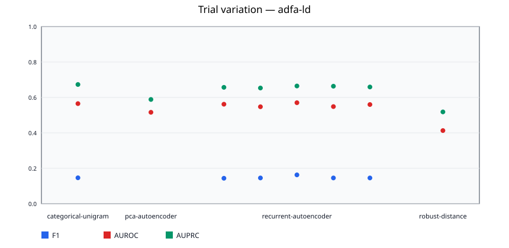

### adfa-ld / categorical-unigram

### adfa-ld / pca-autoencoder

### adfa-ld / recurrent-autoencoder

### adfa-ld / robust-distance

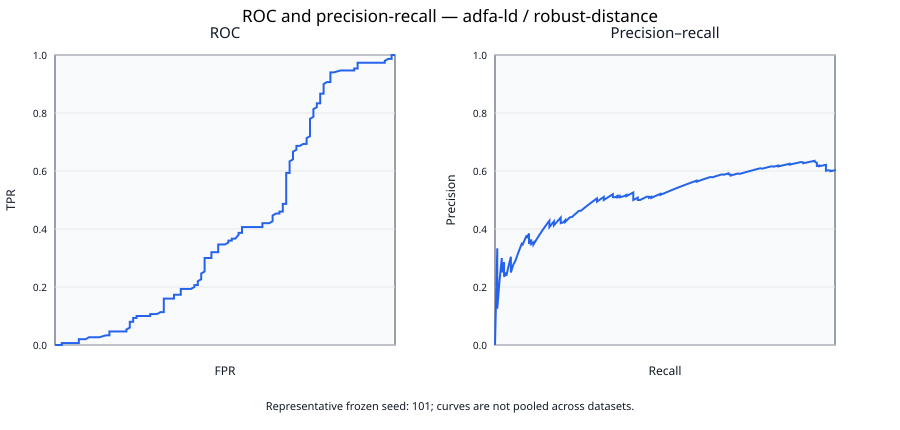

### hai-23.05

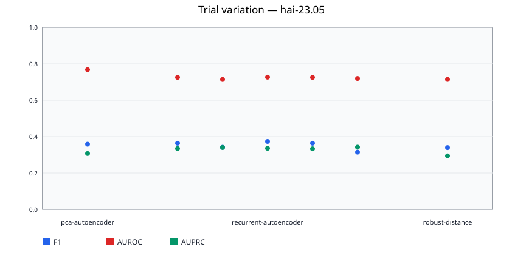

### hai-23.05 / pca-autoencoder

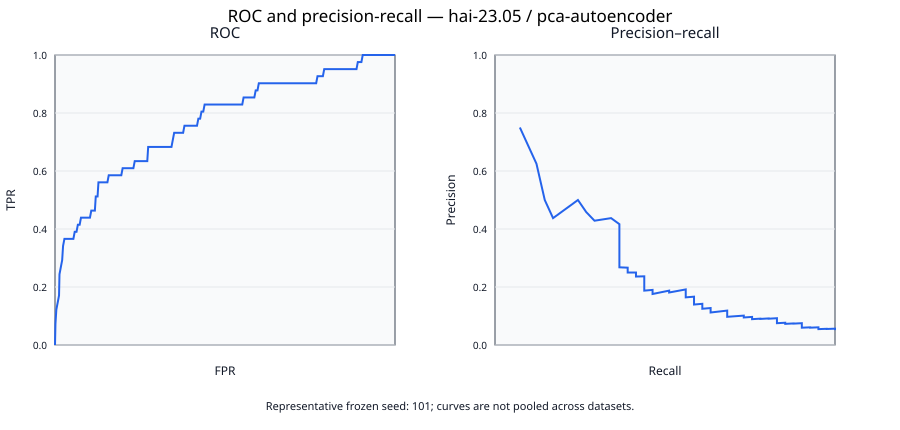

### hai-23.05 / recurrent-autoencoder

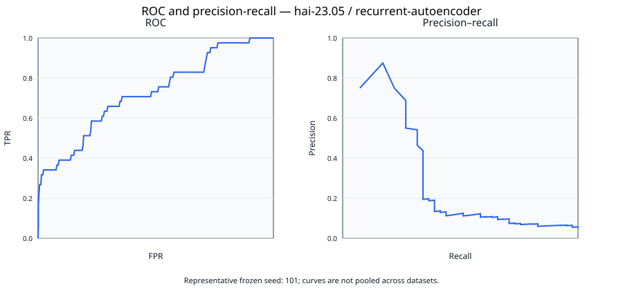

### hai-23.05 / robust-distance

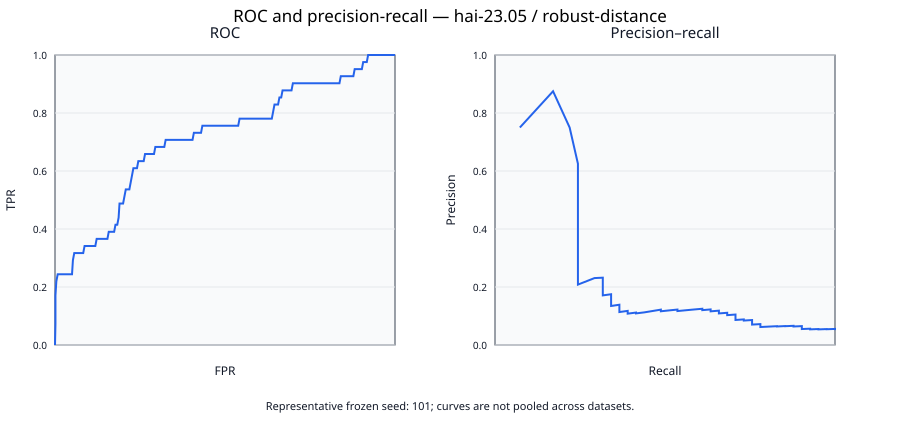

### lid-ds-2021

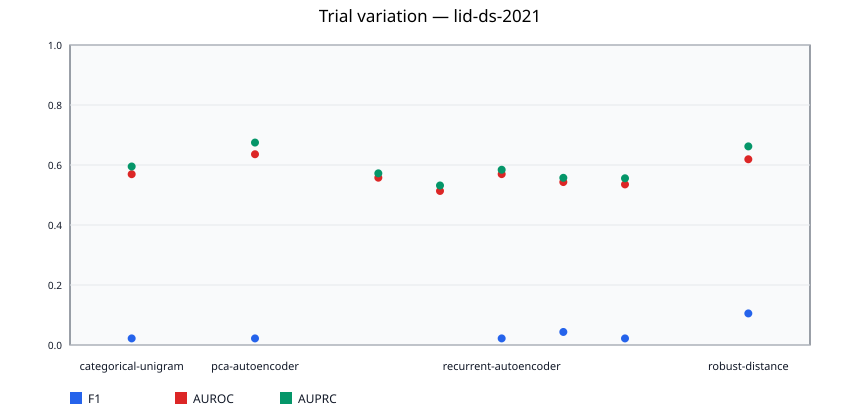

### lid-ds-2021 / categorical-unigram

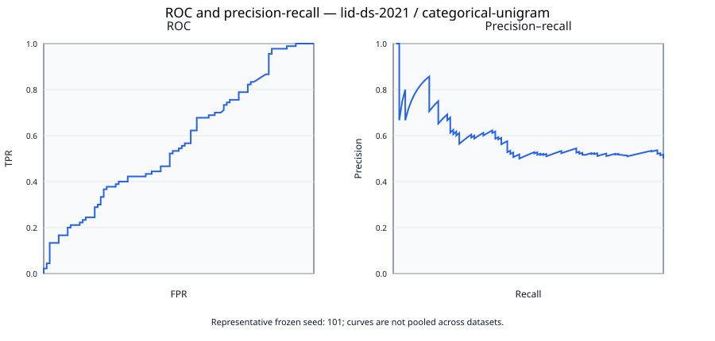

### lid-ds-2021 / pca-autoencoder

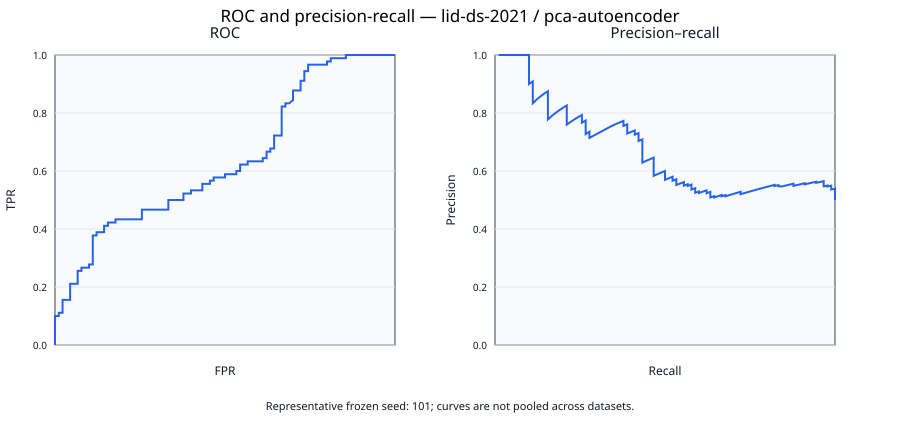

### lid-ds-2021 / recurrent-autoencoder

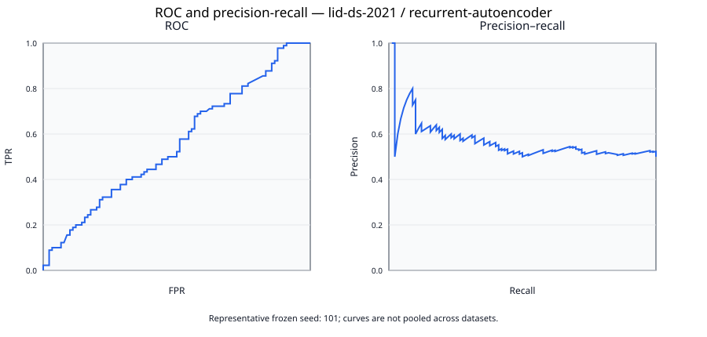

### lid-ds-2021 / robust-distance

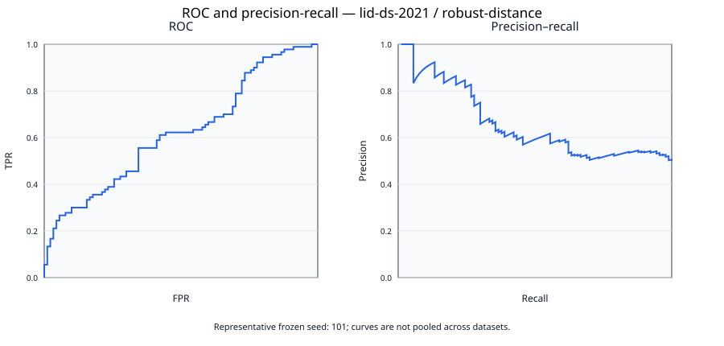

## Paired comparisons

| comparison | paired trials | mean difference | Cohen dz | raw p | Holm p | method | inference status |
| --- | --- | --- | --- | --- | --- | --- | --- |
| adfa-ld/categorical-unigram-vs-pca-autoencoder | 0 | 0.049000 | undefined | undefined | undefined | descriptive difference only | undefined: inferential pairing requires genuine matched stochastic trials on both sides; deterministic estimates are never replicated across seed identifiers |
| adfa-ld/categorical-unigram-vs-recurrent-autoencoder | 0 | 0.007573 | undefined | undefined | undefined | descriptive difference only | undefined: inferential pairing requires genuine matched stochastic trials on both sides; deterministic estimates are never replicated across seed identifiers |
| adfa-ld/categorical-unigram-vs-robust-distance | 0 | 0.152133 | undefined | undefined | undefined | descriptive difference only | undefined: inferential pairing requires genuine matched stochastic trials on both sides; deterministic estimates are never replicated across seed identifiers |
| adfa-ld/pca-autoencoder-vs-recurrent-autoencoder | 0 | -0.041427 | undefined | undefined | undefined | descriptive difference only | undefined: inferential pairing requires genuine matched stochastic trials on both sides; deterministic estimates are never replicated across seed identifiers |
| adfa-ld/pca-autoencoder-vs-robust-distance | 0 | 0.103133 | undefined | undefined | undefined | descriptive difference only | undefined: inferential pairing requires genuine matched stochastic trials on both sides; deterministic estimates are never replicated across seed identifiers |
| adfa-ld/recurrent-autoencoder-vs-robust-distance | 0 | 0.144560 | undefined | undefined | undefined | descriptive difference only | undefined: inferential pairing requires genuine matched stochastic trials on both sides; deterministic estimates are never replicated across seed identifiers |
| hai-23.05/pca-autoencoder-vs-recurrent-autoencoder | 0 | 0.045169 | undefined | undefined | undefined | descriptive difference only | undefined: inferential pairing requires genuine matched stochastic trials on both sides; deterministic estimates are never replicated across seed identifiers |
| hai-23.05/pca-autoencoder-vs-robust-distance | 0 | 0.053151 | undefined | undefined | undefined | descriptive difference only | undefined: inferential pairing requires genuine matched stochastic trials on both sides; deterministic estimates are never replicated across seed identifiers |
| hai-23.05/recurrent-autoencoder-vs-robust-distance | 0 | 0.007982 | undefined | undefined | undefined | descriptive difference only | undefined: inferential pairing requires genuine matched stochastic trials on both sides; deterministic estimates are never replicated across seed identifiers |
| lid-ds-2021/categorical-unigram-vs-pca-autoencoder | 0 | -0.066543 | undefined | undefined | undefined | descriptive difference only | undefined: inferential pairing requires genuine matched stochastic trials on both sides; deterministic estimates are never replicated across seed identifiers |
| lid-ds-2021/categorical-unigram-vs-recurrent-autoencoder | 0 | 0.025481 | undefined | undefined | undefined | descriptive difference only | undefined: inferential pairing requires genuine matched stochastic trials on both sides; deterministic estimates are never replicated across seed identifiers |
| lid-ds-2021/categorical-unigram-vs-robust-distance | 0 | -0.049815 | undefined | undefined | undefined | descriptive difference only | undefined: inferential pairing requires genuine matched stochastic trials on both sides; deterministic estimates are never replicated across seed identifiers |
| lid-ds-2021/pca-autoencoder-vs-recurrent-autoencoder | 0 | 0.092025 | undefined | undefined | undefined | descriptive difference only | undefined: inferential pairing requires genuine matched stochastic trials on both sides; deterministic estimates are never replicated across seed identifiers |
| lid-ds-2021/pca-autoencoder-vs-robust-distance | 0 | 0.016728 | undefined | undefined | undefined | descriptive difference only | undefined: inferential pairing requires genuine matched stochastic trials on both sides; deterministic estimates are never replicated across seed identifiers |
| lid-ds-2021/recurrent-autoencoder-vs-robust-distance | 0 | -0.075296 | undefined | undefined | undefined | descriptive difference only | undefined: inferential pairing requires genuine matched stochastic trials on both sides; deterministic estimates are never replicated across seed identifiers |

Inferential comparisons use the frozen primary metric only when both models have genuine, matched stochastic seeds. Deterministic estimates remain descriptive and are never broadcast across seeds. Undefined comparisons are reported, not converted to zero; Holm adjustment applies only to valid tests.

## Repetition planning

| cell family | planning trials attempted | finite planning outcomes | planning determinate | pilot SD point estimate | target half-width | uncapped theoretical need | fixed execution trials | operational cap | scheduled cap reached | operational cap reached | operational cap evidence | cap binding | projected half-width at cap | target projected met at cap | achieved seed half-width | target observed met | mean fit CPU-s | projected fixed fit CPU-h | reason |
| --- | --- | --- | --- | --- | --- | --- | --- | --- | --- | --- | --- | --- | --- | --- | --- | --- | --- | --- | --- |
| adfa-ld/categorical-unigram | 1 | 1 | None | undefined | 0.025000 | None | 1 | 1 | True | True | the deterministic singleton fit is authenticated | False | undefined | None | undefined | None | 0.000000 | 0.000000 | deterministic fit executed once in this phase; uncertainty is estimated from independent test units or declared clusters |
| adfa-ld/pca-autoencoder | 1 | 1 | None | undefined | 0.025000 | None | 1 | 1 | True | True | the deterministic singleton fit is authenticated | False | undefined | None | undefined | None | 0.062500 | 0.000017 | deterministic fit executed once in this phase; uncertainty is estimated from independent test units or declared clusters |
| adfa-ld/recurrent-autoencoder | 5 | 5 | True | 0.009621 | 0.025000 | 3 | 50 | 50 | True | None | not observable from pilot precision planning; authenticate completed confirmatory trials separately | False | 0.002734 | True | undefined | None | 1218.271875 | 16.920443 | prospective Student-t precision calculation from pilot SD; execution remains fixed |
| adfa-ld/robust-distance | 1 | 1 | None | undefined | 0.025000 | None | 1 | 1 | True | True | the deterministic singleton fit is authenticated | False | undefined | None | undefined | None | 0.062500 | 0.000017 | deterministic fit executed once in this phase; uncertainty is estimated from independent test units or declared clusters |
| hai-23.05/pca-autoencoder | 1 | 1 | None | undefined | 0.025000 | None | 1 | 1 | True | True | the deterministic singleton fit is authenticated | False | undefined | None | undefined | None | 0.328125 | 0.000091 | deterministic fit executed once in this phase; uncertainty is estimated from independent test units or declared clusters |
| hai-23.05/recurrent-autoencoder | 5 | 5 | True | 0.005419 | 0.025000 | 3 | 50 | 50 | True | None | not observable from pilot precision planning; authenticate completed confirmatory trials separately | False | 0.001540 | True | undefined | None | 542.431250 | 7.533767 | prospective Student-t precision calculation from pilot SD; execution remains fixed |
| hai-23.05/robust-distance | 1 | 1 | None | undefined | 0.025000 | None | 1 | 1 | True | True | the deterministic singleton fit is authenticated | False | undefined | None | undefined | None | 0.078125 | 0.000022 | deterministic fit executed once in this phase; uncertainty is estimated from independent test units or declared clusters |
| lid-ds-2021/categorical-unigram | 1 | 1 | None | undefined | 0.025000 | None | 1 | 1 | True | True | the deterministic singleton fit is authenticated | False | undefined | None | undefined | None | 0.000000 | 0.000000 | deterministic fit executed once in this phase; uncertainty is estimated from independent test units or declared clusters |
| lid-ds-2021/pca-autoencoder | 1 | 1 | None | undefined | 0.025000 | None | 1 | 1 | True | True | the deterministic singleton fit is authenticated | False | undefined | None | undefined | None | 0.125000 | 0.000035 | deterministic fit executed once in this phase; uncertainty is estimated from independent test units or declared clusters |
| lid-ds-2021/recurrent-autoencoder | 5 | 5 | True | 0.021511 | 0.025000 | 6 | 50 | 50 | True | None | not observable from pilot precision planning; authenticate completed confirmatory trials separately | False | 0.006113 | True | undefined | None | 1306.050000 | 18.139583 | prospective Student-t precision calculation from pilot SD; execution remains fixed |
| lid-ds-2021/robust-distance | 1 | 1 | None | undefined | 0.025000 | None | 1 | 1 | True | True | the deterministic singleton fit is authenticated | False | undefined | None | undefined | None | 0.031250 | 0.000009 | deterministic fit executed once in this phase; uncertainty is estimated from independent test units or declared clusters |

Epochs, windows, bootstrap replicates, and protocol cycles are not independent trials. Every stochastic family executes the frozen 50-seed schedule regardless of the pilot estimate. The uncapped need and projected half-width at 50 are conditional projections from a fragile five-seed sample-SD point estimate (with no variance upper bound), not a guarantee that 50 is sufficient. If the uncapped need exceeds 50, the cap remains binding and the precision target remains unmet. Seed replication quantifies training variability only and cannot repair too few independent units or recording clusters.

## Reproducibility artifacts

- Machine-readable run table: `pilot-per-run-metrics.csv`
- Machine-readable aggregate table: `pilot-aggregate-metrics.csv`
- Machine-readable class table: `pilot-per-class-metrics.csv`
- Machine-readable threshold sensitivity: `pilot-threshold-sensitivity.csv`
- Machine-readable diagnostics: `pilot-diagnostics.csv`
- Machine-readable artifact audit: `pilot-artifact-integrity.csv`
- Custom-track readiness audit: `pilot-custom-track-readiness.json`
- Frozen configuration: `../frozen-config.json`
- Numerical core hashes: `../numerical-core-manifest.json`
- Each cell JSON records source, window, preprocessing, model, calibration, metric, timing, and artifact identities.
- Each JSONL prediction artifact contains one row per independent test unit with score, threshold, truth, and prediction.

## Interpretation boundary

Pilot results estimate feasibility and variance only; they must not be presented as final confirmatory evidence.
 Cross-dataset averages are intentionally absent because label semantics and sensing modalities differ.

### Dataset-specific limitations

- ADFA-LD: official validation normals are split into validation/test at raw-trace level; byte-identical copies and contradictory label hashes are excluded and counted.
- LID-DS 2021: published truth is recording-level, while a bounded label-blind sample of intact syscall sequences represents each recording; attack localization within a recording is unavailable.
- HAI-23.05: the unit is a fixed non-overlapping temporal block; a block is positive when it overlaps a published attack event, so block-level and row-level metrics are not interchangeable. The available data provide 2 source recordings versus the configured minimum of 5 independent clusters; recording-cluster confidence intervals are therefore undefined with that reason retained. Fifty training seeds do not create three missing independent recordings, so across-seed intervals must not be substituted.
- Controlled custom campaign: the legacy two-instance result remains smoke evidence and is not admitted into this official-benchmark matrix. It requires a separately powered paired campaign.
